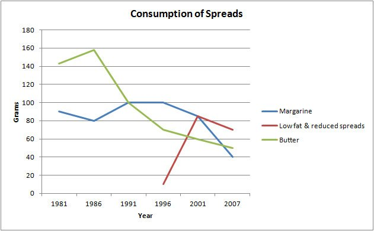

## Topic

The graph below shows the consumption of 3 spreads from 1981 to 2007.

Refer the [link](https://ieltsliz.com/ielts-writing-task-1-line-graph-model-score-9/).

 

## Structure:
1. Paraphase the line graph information for our introduction.

2. Put main trends and any other key features in an overall statement.

3. Make sure each body paragraph sentences has numbers and dates to support it.

 

## Notice point
1. The introduction is always present tense because it it about the piece of paper before you in the present.

    However, the subsequent paragraphs are about the data which is often related to past tense (check the data given and use the appropriate tense).

 

## Our Writing topic

