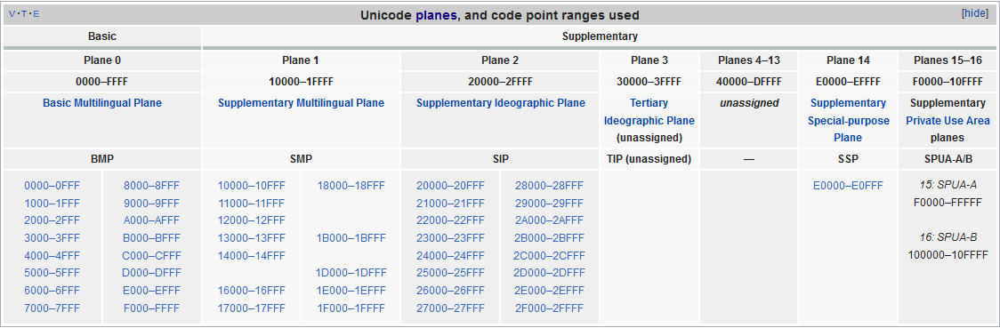

<br>

## Table of content
- [Introduction to Unicode](#introduction-to-unicode)
- [Unicode encodings](#unicode-encodings)
- [Surrogate pair](#surrogate-pair)
- [The relationship between UCS and Unicode](#the-relationship-between-ucs-and-unicode)

<br>

## Introduction to Unicode
- Definition

    According to the [wikipedia.org](https://en.wikipedia.org/wiki/Unicode), we have:

    ```
    Unicode is a computing industry standard for the consistent encoding, representation, and handling of text expressed in most of the world's writing system. The standard is maintained by the Unicode Consortium, and as of March 2019 the most recent version, Unicode 12.0, contains a repertoire of 137,993 characters covering 150 modern and historic scripts, as well as multiple symbol sets and emoji.

    The standard has been implemented in many recent technologies, including modern operating systems, XML, Java (and other programming languages), and the .NET Framework. 
    ```

    Unicode is just a table, which shows glyphs position to encoding system. Encoding takes symbol from table, and tells font what should be painted. But computer can understand binary code only. So, encoding is used number 1 or 0 to represent characters. So, encoding is used number 1 or 0 to represent characters.

- The history of Unicode

    The first version of Unicode was a 16-bit encoding, from 1991 to 1995, but starting with Unicode 2.0 (July, 1996), it has not been a 16-bit encoding. The Unicode Standard encodes characters in the range ```U+0000``` ... ```U+10FFFF```, which amounts to a 21-bit code space.
    
    Depending on the encoding form you choose (UTF-8, UTF-16, or UTF-32), each character will then be represented either as a sequence of one to four 8-bit bytes, one or two 16-bit code units, or a single 32-bit code unit.

- Code space

    Code space is space that contains all code points in Unicode.

- Planes in Unicode

    In the Unicode standard, a plane is a continuous group of 65,536 (2^16) code points. There are 17 planes, identified by the number of 0 to 16, which corresponds with the possible values 00 - 10 (with hexadecimal) of the first position in six position hexadecimal format (U+**hh**hhhh). 

    The very last code point in Unicode is the last code point in plane 16, U+10FFFF. 

    Plane 0 is the Basic Multilingual Plane - BMP, which contains characters for almost all modern languages, and a large number of symbols. A primary objective for the BMP is to support the unification of prior character sets as well as characters for writing. Most of the assigned code points in the BMP are used to encode Chinese, Japanese, and Korean (CJK) characters. 

    As of Unicode 12.0, the BMP comprises 163 blocks.

    The higher planes 1 through 16 are called **supplementary planes**. 

    

    The limit of 17 planes is due to UTF-16, which can encode 220 code points (16 planes) as pairs of words, plus the BMP as a single word.[2]. UTF-8 was designed with a much larger limit of 231 (2,147,483,648) code points (32,768 planes), and can encode 221 (2,097,152) code points (32 planes) even under the current limit of 4 bytes.

    The 17 planes can accommodate 1,114,112 code points. Of these, 2,048 are surrogates (used to make the pairs in UTF-16), 66 are non-characters, and 137,468 are reserved for private use, leaving 974,530 for public assignment.

    Planes are further subdivided into Unicode blocks, which, unlike planes, do not have a fixed size. The 300 blocks defined in Unicode 12.0 cover 25% of the possible code point space, and range in size from a minimum of 16 code points (fourteen blocks) to a maximum of 65,536 code points (Supplementary Private Use Area-A and -B, which constitute the entirety of planes 15 and 16). For future usage, ranges of characters have been tentatively mapped out for most known current and ancient writing systems.

- Code point

    In character terminology, a code point or code position is any of the numerical values that make up the code spaces. Many code points represent single characters but they can also have other meanings, such as for formatting.

    Code point is not related to the representing it in memory. It is only a numerical values in Unicode table.

    For example: Assuming that we have a code point - U+0041. 
    - ```U+``` means ```Unicode```
    - The number part is hexadecimal number.
    - ```00``` means where the number plane that is contained.
    - ```41``` means the position in BMP plane.

    --> U+0041 will represent ```A``` character in Unicode.


    For example: In Unicode, string "hello" is corresponded to the five code points (not 5 bytes):

    ```
    U+0048 U+0065 U+006C U+006C U+006F
    ```

    For example:
    - ASCII comprises 128 code points in the range 0x00 - 0x7F. 
    - Extended ASCII comprises 256 code points in the range 0x00 - 0xFF.
    - Unicode comprises 1,114,112 code points in the range 0x000000 - 0x10FFFF. 

- Code unit

    The code unit is relevant to the encoding method.

    For example: 
    - With UTF-8 encoding, code unit is 1 byte.
    - With UTF-16 encoding, code unit is 2 bytes.
    - With UTF-32 encoding, code unit is 4 bytes.

- Block 

    Block is simply a small set of common traits such as about language or functionality.

    The first block, from U+0000 to U+001F, represents all control characters, and includes 32 characters.

    The second block begins from U+0020 to U+007F, represents all characters in ASCII.

<br>

## Unicode encodings
- UTF-8 use code unit that is 1 byte, and it is a multibyte encoding able to encode the whole Unicode charset. An encoded character takes between 1 and 4 bytes.

    Some advantages of UTF-8 when comparing with UTF-16, UTF-32:
    - represent the whole Unicode code points.
    - It is compatible with ASCII
    - It reduces memory size when compared with UTF-16, UTF-32.
    - UTF-8 do not need to use BOM - Byte Order Mark.
    - Most C byte functions are compatible with UTF-8 encoded string such as strcat(), printf(), ..., whereas they fail with UTF-16 and UTF-32 encoded strings because these encodings encode small codes with null bytes.

    Problem with UTF-8:
    - When we compare it to ASCII or ISO 8859-1, is that it is a multibyte encoding: we cannot access a character by its character index directly, you have to iterate on each character because each character may have a different length in bytes. If getting a character by its index is a common operation in your program, use a character string instead of a UTF-8 encoded string.


<br>

## Surrogate pair
The ```High Surrogate``` (U+D800 – U+DBFF) and ```Low Surrogate``` (U+DC00 – U+DFFF) codes are reserved for encoding non-BMP characters in UTF-16 by using a pair of 16-bit codes: one ```High Surrogate``` and one ```Low Surrogate```. A single surrogate code point will never be assigned a character. 


<br>

## The relationship between UCS and Unicode

Refer to the [link](http://www.programmersought.com/article/933268197/).


<br>

## Wrapping up
- Vietnameses uses multiple different blocks in Unicode such as Basic Latin (only include ASCII - 1 byte), Latin-1 Supplement, Latin Extended-B, and Latin Extended Additional.

    All characters in Vietnamese has the length from 1 byte to 3 bytes.


<br>

Refer: 

[https://viblo.asia/p/tim-hieu-unicode-PwRkgVOXeEd](https://viblo.asia/p/tim-hieu-unicode-PwRkgVOXeEd)

[https://unicodebook.readthedocs.io/unicode_encodings.html](https://unicodebook.readthedocs.io/unicode_encodings.html)

[https://www.unicode.org/faq/utf_bom.html](https://www.unicode.org/faq/utf_bom.html)

[Should UTF-16 be considered harmful?](https://softwareengineering.stackexchange.com/questions/102205/should-utf-16-be-considered-harmful)

[The Absolute Minimum Every Software Developer Absolutely, Positively Must Know About Unicode and Character Sets (No Excuses!)](https://www.joelonsoftware.com/2003/10/08/the-absolute-minimum-every-software-developer-absolutely-positively-must-know-about-unicode-and-character-sets-no-excuses/)

[The difference between UTF-8 and Unicode?](http://www.polylab.dk/utf8-vs-unicode.html)

[UTF-8 Everywhere](http://utf8everywhere.org/)

[https://jonskeet.uk/csharp/unicode.html](https://jonskeet.uk/csharp/unicode.html)

[http://www.programmersought.com/article/7975210414/](http://www.programmersought.com/article/7975210414/)

<br>

**Surrogate Pair**

[https://stackoverflow.com/questions/22121184/difference-between-composite-characters-and-surrogate-pairs](https://stackoverflow.com/questions/22121184/difference-between-composite-characters-and-surrogate-pairs)

[https://docs.microsoft.com/en-us/windows/desktop/intl/surrogates-and-supplementary-characters](https://docs.microsoft.com/en-us/windows/desktop/intl/surrogates-and-supplementary-characters)

<br>

**Get File encoding format**

[http://www.programmersought.com/article/441629448/](http://www.programmersought.com/article/441629448/)

[http://www.programmersought.com/article/9653470343/;jsessionid=CC3DFF8E521F70090E58F7DDD547FF3A](http://www.programmersought.com/article/9653470343/;jsessionid=CC3DFF8E521F70090E58F7DDD547FF3A)

<br>

**Base64 encoding**

[http://www.programmersought.com/article/2537619/](http://www.programmersought.com/article/2537619/)

<br>

**Character encoding**

[http://www.programmersought.com/article/68008542/](http://www.programmersought.com/article/68008542/)

<br>

**Convert Shift-JIS to UTF-8**

[http://www.lab.its55.com/?p=32](http://www.lab.its55.com/?p=32)

[http://www.programmersought.com/article/7975210414/](http://www.programmersought.com/article/7975210414/)

[http://sayahamitt.net/utf8%E3%81%AAstring%E5%85%A5%E3%82%8C%E3%81%9F%E3%82%89shiftjis%E3%81%AAstring%E5%87%BA%E3%81%A6%E3%81%8F%E3%82%8B%E9%96%A2%E6%95%B0%E4%BD%9C%E3%81%A3%E3%81%9F/](http://sayahamitt.net/utf8%E3%81%AAstring%E5%85%A5%E3%82%8C%E3%81%9F%E3%82%89shiftjis%E3%81%AAstring%E5%87%BA%E3%81%A6%E3%81%8F%E3%82%8B%E9%96%A2%E6%95%B0%E4%BD%9C%E3%81%A3%E3%81%9F/)

<br>

**Convert UTF-8 to Shift-JIS**

[http://www.programmersought.com/article/7975210414/](http://www.programmersought.com/article/7975210414/)

[http://sayahamitt.net/utf8%E3%81%AAstring%E5%85%A5%E3%82%8C%E3%81%9F%E3%82%89shiftjis%E3%81%AAstring%E5%87%BA%E3%81%A6%E3%81%8F%E3%82%8B%E9%96%A2%E6%95%B0%E4%BD%9C%E3%81%A3%E3%81%9F/](http://sayahamitt.net/utf8%E3%81%AAstring%E5%85%A5%E3%82%8C%E3%81%9F%E3%82%89shiftjis%E3%81%AAstring%E5%87%BA%E3%81%A6%E3%81%8F%E3%82%8B%E9%96%A2%E6%95%B0%E4%BD%9C%E3%81%A3%E3%81%9F/)

<br>

**All characters in Unicode**

[https://unicode-table.com/en/#cjk-unified-ideographs-extension-a](https://unicode-table.com/en/#cjk-unified-ideographs-extension-a)