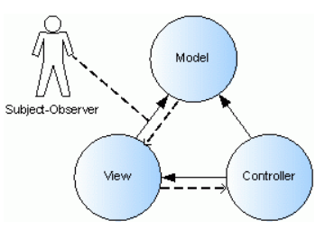

<br>

## Table of contents
- [Given Problem](#given-problem)
- [Analysis Problem](#analysis-problem)
- [Definition of MVC Pattern](#definition-of-mvc-pattern)
- [When to use](#when-to-use)
- [Code C++/Javascript](#code-C++/Javascript)
- [Application & Examples](#application-&-examples)


<br>

## Given Problem 
Back in the 70's, GUI applications or desktop applications is popular. Normally, they have two main responsibilities:
- Screen layout: defining the arrangement of the controls on the screen, together with their hierarchies structure with one other.
- Logic: behavior that cannot be easily programmed into the controls themselves.

So, the View and Logic will be always tightly coupling. We always have to take care everything when we change controls in the View. View and Logic do not develop parallel.

<br>

## Analysis Problem
The root problem is that the View and Logic are always tightly coupling. So, we have to separate between the View and Logic part.

It is called **Separated Presentation**. The idea behind **Separated Presentation** is to make a clear division between domain objects that model our perception of the real world, and presentation objects that are the GUI elements we see on the screen.

So, the presentation part is made of the two remaining elements: View and Controller.

Finally, the logic part or the relavant to domain element is referred to as the Model.

--> MVC was born.


<br>

## Definition of MVC Pattern
According to MVC pattern in [wikipedia.com](https://en.wikipedia.org/wiki/Model%E2%80%93view%E2%80%93controller), we have the definition of it:

```
Model-View-Controller (usually known as MVC) is an architectural pattern commonly used for user interfaces that divides an application into three interconnected parts. This is done to separate internal representations of information from the ways information is presented to and accepted from the user. The MVC design pattern decouples these major components allowing for code reuse and parallel development.
```

Model
- The central of the pattern. It is the application's dynamic data structure, independent of the user interface. It directly manages the data, logic and rules of the application.
- The Model doesn't know anything about Views and Controllers.

View
- The presentation of application that users can interact with it.
- In some variations of MVC, the View does not directly interact with the Model.
- But originally, MVC use ```Observer pattern``` to know all changes from the Model to update the View part. So, the View will contain instance of the Model.

Controller
- The Controller's job is to take the user's input and figure out what to do with it.
- It means that this part is used to receive events from views, and will implement all actions to give data to the Model.
- And the Controller also will take all modifications from the Model, then creates some updates to the View.

This pattern was originally designed by [Trygve Reenskaug](https://en.wikipedia.org/wiki/Trygve_Reenskaug) during his time working on Smalltalk-80 (1979) where it was initially called Model - View - Controller. MVC went on to be described in depth in 1995's **Design Patterns: Elements of Reusable Object-Oriented Software**, which played a role in popularizing its use.

Below is the image about MVC pattern:



The dashed lines represent weakly typed aggregation and the solid lines strongly typed aggregation.

The Model maintains a pointer to the View, which allow it to send the View weakly typed change notifications. Since it is a weakly type relationship, the Model references the View only through a base class that allows it to send notifications to the View.

In contrast, the View knows exactly what kind of model it observers. It has a strongly typed pointer to the model that allows it to call any of the Model's functions. The View also has a weakly typed relationship with the controller. The View is not tied to a specific type of controller, which means that different types of controllers can be used with the same View.

The Controller has pointers to both the Model and the View, knows the type of both. Because the Controller defines the behavior, it needs to know the type of both the Model and the View to translate user input into application response.

<br>

## When to use


<br>

## Benefits & Drawback
1. Benefits

    - Multiple developers can work simultaneously on the model, controller and views. The application developed by using MVC can be three times faster than application developed using other development patterns.

    - MVC enables logical grouping of related actions on a controller together. The views for a specific model are also group together.

    - Models can have multiple views. Code duplication is very limited in MVC because it separates data and business logic from the display.

    - MVC also supports asynchronous technique, which helps developers to develop an application that loads very fast.

    - NVC pattern returns data without applying any formatting. So the same components can be used and called for use with any interface.

2. Drawbacks

    - Increased complexity.
    - Inefficiency of data access in View.
    - Reduce the security because the Model can be embbeded in View.

<br>

## Code C++/Javascript


<br>

## Application & Examples


<br>

## Wrapping up
- The GoF do not refer to MVC as a design pattern, but rather consider it a set of classes to build a user interface. In their view, it's actually a variation of three classical design pattern: the ```Observer pattern```, ```Strategy pattern```, and ```Composite pattern```. Depending on how MVC has been implemented in a framework, it may also use the ```Factory``` and ```Template patterns```.

- Views and controllers have a slightly different relationship. Controllers facilitate views to respond to different user input and are an example of the Strategy pattern.

<br>

Refer:

[https://martinfowler.com/eaaDev/uiArchs.html](https://martinfowler.com/eaaDev/uiArchs.html)

[https://www.oreilly.com/library/view/learning-javascript-design/9781449334840/ch10s04.html](https://www.oreilly.com/library/view/learning-javascript-design/9781449334840/ch10s04.html)

[https://www.tomdalling.com/blog/software-design/model-view-controller-explained/](https://www.tomdalling.com/blog/software-design/model-view-controller-explained/)

[https://martinfowler.com/eaaDev/SeparatedPresentation.html](https://martinfowler.com/eaaDev/SeparatedPresentation.html)

[https://docs.roguewave.com/stingray/11.1/html/sflug/8-2.html](https://docs.roguewave.com/stingray/11.1/html/sflug/8-2.html)