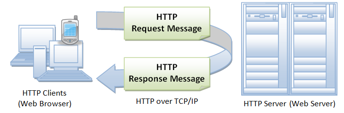
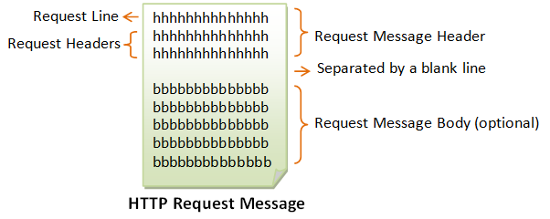

When we are working with website development, especially doing something with form such as login, ..., we have to be curious about how we can push data into the web server. What is something that help us to do these?

So, in this article, we will discuss about HTTP protocol to explain all of things that is relevant to our issues.

<br>

## Table of contents
- [Introduction to HTTP protocol](#introduction-to-http-protocol)
- [Uniform Resource Locator - URL](#uniform-resource-localtor-url)
- [Uniform Resource Idenfifier - URI](#uniform-resource-identifier-uri)
- [HTTP Request Message](#http-request-message)
- [HTTP Response Message](#http-response-message)
- [The brief conversation about how HTTP protocol works](#the-brief-conversation-about-how-http-protocol-works)
- [Wrapping up](#wrapping-up)

<br>

## Introduction to HTTP protocol
HTTP is abbreviation of **Hypertext Transfer Protocol**, and it is perhaps the most popular application protocol used in the Internet.

- HTTP is an asymmetric request-response client-server protocol as illustrated.  An HTTP client sends a request message to an HTTP server.  The server, in turn, returns a response message.  In other words, HTTP is a pull protocol, the client pulls information from the server (instead of server pushes information down to the client). 

- HTTP is a stateless protocol. In other words, the current request does not know what has been done in the previous requests.

- HTTP permits negotiating of data type and representation, so as to allow systems to be built independently of the data being transferred.

- Quoting from the RFC2616: "The Hypertext Transfer Protocol (HTTP) is an application-level protocol for distributed, collaborative, hypermedia information systems. It is a generic, stateless, protocol which can be used for many tasks beyond its use for hypertext, such as name servers and distributed object management systems, through extension of its request methods, error codes and headers."



<br>

## Uniform Resource Locator - URL
A URL is used to uniquely identify a resource over the web. 

URL has the following syntax:

```
protocol://hostname:port/path-and-file-name
```

There are 4 parts in a URL:
- protocol: The application-level protocol used by the client and server. E.g: HTTP, FTP, and telnet.
- hostname: The DNS domain name (E.g: www.techmaster.vn) or IP address (E.g: 192.128.5.2) of the server.
- port: The TCP port number that the server is listening for incoming requests from the clients.
- path-and-file-name: The name and location of the requested resource, under the server document base directory.

For example: 

In the URL https://techmaster.vn/posts/34914/sql-performance-explained-part-1, the communication protocol is HTTPS; the hostname is techmaster.vn. 

The port number was not specified in the URL, and takes on the default number, which is TCP port 80 for HTTP.

The path and file name for the resource to be located is "posts/34914/sql-performance-explained-part-1"

**Encoded URL**

URL can not contain special characters, such as blank or '~'. Special characters are encoded, in the form of ```%xx```, where xx is the ASCII hex code. 

For example, '~' is encoded as %7e; '+' is encoded as %2b. A blank can be encoded as %20 or '+'.

The URL after encoding is called encoded URL.

<br>

## Uniform Resource Idenfifier - URI
URI is more general than URL, which can even locate a fragment within a resource. 

The URI syntax for HTTP protocol is:

```
http://host:port/path?request-parameter#nameAnchor
```

- The request parameters, in the form of name=value pairs, are separated from the URL by a '?'. The name=value pairs are separated by a '&'.
- The #nameAnchor identifies a fragment within the HTML document, defined via the anchor tag \<a name="anchorName"\>...\</a\>.
- URL rewriting for session management, e.g., "...;sessionID=xxxxxx".

<br>

## HTTP Request Message
The format of an HTTP request message is as follow:



- Request Line

    The first line of the header is called the *request line*, followed by optional *request headers*.

    The request line has the following syntax:
    
    ```
    request-method-name request-URI HTTP-version
    ```

    - request-method-name: HTTP protocol defines a set of request methods such as GET, POST, HEAD, and OPTIONS. The client can use one of these methods to send a request to the server.
    - request-URI: specifies the resource requested.
    - HTTP-version: two versions are currently in use HTTP/1.0 and HTTP/1.1.

    For example:

    ```
    GET /test.html HTTP/1.1
    HEAD /query.html HTTP/1.0
    POST /index.html HTTP/1.1
    ```

- Request Headers

    The request headers are in the form of name: value pairs. Multiple values, separated by commas, can be specified.

    ```
    request-header-name: request-header-value1, request-header-value2, ...
    ```

    For example: 

    ```
    Host: www.xyz.com
    Connection: Keep-Alive
    Accept: image/gif, image/jpeg, */*
    Accept-Language: us-en, fr, cn
    ```

    In HTTP/1.1, we will have some conditional request headers:
    - If-Modified-Since (check for response status code "304 Not Modified").
    - If-Unmodified-Since
    - If-Match
    - If-None-Match
    - If-Range

    We will have some of the commonly-used request headers.
    - Host: domain-name - HTTP/1.1 supports virtual hosts. Multiple DNS names (e.g., www.nowhere123.com and www.nowhere456.com) can reside on the same physical server, with their own document root directories. Host header is mandatory in HTTP/1.1 to select one of the hosts.

        The following headers can be used for content negotiation by the client to ask the server to deliver the preferred type of the document (in terms of the media type, e.g. JPEG vs. GIF, or language used e.g. English vs. French) if the server maintain multiple versions for the same document.

    - Accept: mime-type-1, mime-type-2, ... - The client can use the Accept header to tell the server the MIME types it can handle and it prefers. 
        
        If the server has multiple versions of the document requested (e.g., an image in GIF and PNG, or a document in TXT and PDF), it can check this header to decide which version to deliver to the client. 
    
        (E.g., PNG is more advanced more GIF, but not all browser supports PNG.) This process is called content-type negotiation.

    - Accept-Language: language-1, language-2, ... - The client can use the Accept-Language header to tell the server what languages it can handle or it prefers. 
    
        If the server has multiple versions of the requested document (e.g., in English, Chinese, French), it can check this header to decide which version to return. This process is called language negotiation.

    - Accept-Charset: Charset-1, Charset-2, ... - For character set negotiation, the client can use this header to tell the server which character sets it can handle or it prefers. Examples of character sets are ISO-8859-1, ISO-8859-2, ISO-8859-5, BIG5, UCS2, UCS4, UTF8.

    - Accept-Encoding: encoding-method-1, encoding-method-2, ... - The client can use this header to tell the server the type of encoding it supports. If the server has encoded (or compressed) version of the document requested, it can return an encoded version supported by the client. The server can also choose to encode the document before returning to the client to reduce the transmission time. The server must set the response header "Content-Encoding" to inform the client that the returned document is encoded. The common encoding methods are "x-gzip (.gz, .tgz)" and "x-compress (.Z)".

    - Connection: Close|Keep-Alive - The client can use this header to tell the server whether to close the connection after this request, or to keep the connection alive for another request. HTTP/1.1 uses persistent (keep-alive) connection by default. HTTP/1.0 closes the connection by default.

    - Referer: referer-URL - The client can use this header to indicate the referrer of this request. 
    
        If you click a link from web page 1 to visit web page 2, web page 1 is the referrer for request to web page 2. All major browsers set this header, which can be used to track where the request comes from (for web advertising, or content customization). 
        
        Nonetheless, this header is not reliable and can be easily spoofed. Note that Referrer is misspelled as "Referer" (unfortunately, you have to follow too).

    - User-Agent: browser-type - Identify the type of browser used to make the request. Server can use this information to return different document depending on the type of browsers.

    - Content-Length: number-of-bytes - Used by POST request, to inform the server the length of the request body.

    - Content-Type: mime-type - Used by POST request, to inform the server the media type of the request body.

    - Cache-Control: no-cache|... - The client can use this header to specify how the pages are to be cached by proxy server. 
    
        "no-cache" requires proxy to obtain a fresh copy from the original server, even though a local cached copy is available. 
        
        (HTTP/1.0 server does not recognize "Cache-Control: no-cache". Instead, it uses "Pragma: no-cache". Included both request headers if you are not sure about the server’s version.)

    - Authorization: Used by the client to supply its credential (username/password) to access protected resources. (This header will be described in later chapter on authentication.)

    - Cookie: cookie-name-1=cookie-value-1, cookie-name-2=cookie-value-2, ... - The client uses this header to return the cookie(s) back to the server, which was set by this server earlier for state management.

    - If-Modified-Since: date - Tell the server to send the page only if it has been modified after the specific date.
<br>

## HTTP Response Message


<br>

## The brief conversation about how HTTP protocol works


<br>

## Wrapping up


<br>

Thanks for your reading.

<br>

Refer:

[https://www.ntu.edu.sg/home/ehchua/programming/webprogramming/HTTP_Basics.html#http_mesages](https://www.ntu.edu.sg/home/ehchua/programming/webprogramming/HTTP_Basics.html#http_mesages)

[https://www.ntu.edu.sg/home/ehchua/programming/java/JavaServlets.html](https://www.ntu.edu.sg/home/ehchua/programming/java/JavaServlets.html)

[https://www.ntu.edu.sg/home/ehchua/programming/java/JavaServletCaseStudy.html](https://www.ntu.edu.sg/home/ehchua/programming/java/JavaServletCaseStudy.html)

[https://www.ntu.edu.sg/home/ehchua/programming/index.html](https://www.ntu.edu.sg/home/ehchua/programming/index.html)


