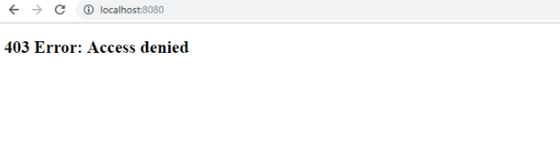

When using Spring security, I always cope with problem about permision of account, regardless of right my account. It's annoyed for me. After digging into this problem, I have some interesting information.

So, in this article, we will discuss some solutions for this permission problem.

<br>

## Table of contents
- [Context's problem](#context's-problem)
- [Solutions](#solutions)
- [What does ROLE_ means?](#what-does-role_-mean)
- [Wrapping up](#wrapping-up)

<br>

## Context's problem
In order to configure Spring Security, we will do all settings in ```configure()``` method in our Web configuration that inherited from ```WebSecurityConfigurerAdapter``` class, and get username, password, authorization from database in ```loadUserByUsername()``` method of ```UserDetailsServiceImpl``` class that inherited from ```UserDetailsService```.

To get more information, we can visit this [link](https://ducmanhphan.github.io/2019-02-09-The-mechanism-of-spring-security).

```java
@Configuration
@EnableWebSecurity
public class WebSecurityConfig extends WebSecurityConfigurerAdapter implements WebMvcConfigurer {

    @Autowired
    private UserDetailsService userDetailService;

    @Bean
    public PasswordEncoder passwordEncoder() {
        return new BCryptPasswordEncoder();
    }

    @Autowired
    public void configureGlobal(AuthenticationManagerBuilder auth) throws Exception {
        auth.userDetailsService(userDetailService).passwordEncoder(passwordEncoder());                
    }

    @Override
    protected void configure(HttpSecurity http) throws Exception {
        http.authorizeRequests()
                .antMatchers("/items/**").permitAll()       // for rest api
                .antMatchers("/").access("hasAnyRole('USER', 'ADMIN')")
                .antMatchers("/admin/**").access("hasRole('ADMIN')")
                .and()
            .formLogin()
                .loginProcessingUrl("/login") // link to submit username-password
                .loginPage("/login")
                .usernameParameter("username")
                .passwordParameter("password")
                .defaultSuccessUrl("/")
                .failureUrl("/login?error")
                .and()
            .logout()
                .logoutRequestMatcher(new AntPathRequestMatcher("/logout"))
                //.logoutUrl("/logout")              
                .logoutSuccessUrl("/login")
                .invalidateHttpSession(true)
                .deleteCookies("JSESSIONID")
                .and()
            .exceptionHandling()
                .accessDeniedPage("/403")
                .and()
            .rememberMe()
                .tokenRepository(this.persistentTokenRepository())
                .tokenValiditySeconds(1*24*60*60);
    }

    @Bean
    public PersistentTokenRepository persistentTokenRepository() {
        JdbcTokenRepositoryImpl db = new JdbcTokenRepositoryImpl();
        db.setDataSource(dataSource);
        
        return db;
    }
}
```

```java
@Service
public class UserDetailsServiceImpl implements UserDetailsService {

    @Autowired
    private UserRepository userRepository;

    @Override
    @Transactional
    public UserDetails loadUserByUsername(String username) throws UsernameNotFoundException {
        com.vietis.smartkids.domain.User user = userRepository.findByUsername(username);
        if (user == null) {
            throw new UsernameNotFoundException("User not found");
        }

        Set<GrantedAuthority> grantedAuthorities = new HashSet<>();
        Set<Role> roles = user.getRoles();
        for (Role role : roles) {
            System.out.println(role.getName());
            grantedAuthorities.add(new SimpleGrantedAuthority(role.getName()));
        }               
        
        UserDetails userDetails = (UserDetails) new org.springframework.security.core.userdetails.User(user.getUsername(), user.getPassword(), grantedAuthorities);
        
        return userDetails;
    }
}
```

And in database, we only save two fields about account's role such as ```ADMIN```, and ```USER```.

So when following these steps, we will have problem like this below image:



Immediately, we will wonder that everything is right, why it has ```403 - Access Denied``` ?

And we will try to do something with code by adding "ROLE_":

```java
http.authorizeRequests()
    .antMatchers("/items/**").permitAll() 
    .antMatchers("/").access("hasAnyRole('ROLE_USER', 'ROLE_ADMIN')")
    .antMatchers("/admin/**").access("hasRole('ROLE_ADMIN')");
```

But we will see the highlight error ```You do not add ROLE_ into above```

At the end, we will think about it is a arduous problem.

<br>

## Solutions
There are two ways to solve this problem. Therefore, we will do each solution step by step.

- First solution

    This solution is very easy to do simply because we only change some roles in database by appending ```ROLE_``` to our text about role such as ```ROLE_USER```, and ```ROLE_ADMIN```.

- Second solution

    Assume that in database, we have roles without ```ROLE_``` at beginning of text such as ```USER```, and ```ADMIN```.

    So, we will add ```ROLE_``` before ```role.getName()```:

    ```java
    Set<GrantedAuthority> grantedAuthorities = new HashSet<>();
        Set<Role> roles = user.getRoles();
        for (Role role : roles) {
            System.out.println(role.getName());
            grantedAuthorities.add(new SimpleGrantedAuthority("ROLE_" + role.getName()));
    }    
    ```

The two solution is easy to do, but we have to wonder why can we use ```ROLE_``` so?

We will continue to find out about ```ROLE_```.

<br>

## What does ROLE_ means
This information is referenced from [documenentation](https://docs.spring.io/spring-security/site/docs/4.2.1.RELEASE/reference/htmlsingle/#appendix-faq-role-prefix).

```
Spring Security has a voter-based architecture which means that an access decision is made by a series of AccessDecisionVoters. The voters act on the "configuration attributes" which are specified for a secured resource (such as a method invocation). With this approach, not all attributes may be relevant to all voters and a voter needs to know when it should ignore an attribute (abstain) and when it should vote to grant or deny access based on the attribute value. The most common voter is the RoleVoter which by default votes whenever it finds an attribute with the "ROLE_" prefix. It makes a simple comparison of the attribute (such as "ROLE_USER") with the names of the authorities which the current user has been assigned. If it finds a match (they have an authority called "ROLE_USER"), it votes to grant access, otherwise it votes to deny access.

The prefix can be changed by setting the rolePrefix property of RoleVoter. If you only need to use roles in your application and have no need for other custom voters, then you can set the prefix to a blank string, in which case the RoleVoter will treat all attributes as roles.
```


<br>

## Wrapping up


<br>

Thanks for your reading.

<br>

Refer:

[https://stackoverflow.com/questions/42180028/spring-security-always-return-the-403-accessdeniedpage-after-login?rq=1](https://stackoverflow.com/questions/42180028/spring-security-always-return-the-403-accessdeniedpage-after-login?rq=1)

[https://docs.spring.io/spring-security/site/docs/4.2.1.RELEASE/reference/htmlsingle/#appendix-faq-role-prefix](https://docs.spring.io/spring-security/site/docs/4.2.1.RELEASE/reference/htmlsingle/#appendix-faq-role-prefix)

[https://www.baeldung.com/spring-security-custom-voter](https://www.baeldung.com/spring-security-custom-voter)

[https://javadeveloperzone.com/spring-boot/spring-security-custom-rolevoter-example/](https://javadeveloperzone.com/spring-boot/spring-security-custom-rolevoter-example/)

[https://javadeveloperzone.com/spring-boot/spring-security-custom-rolevoter-example/](https://javadeveloperzone.com/spring-boot/spring-security-custom-rolevoter-example/)

[https://stackoverflow.com/questions/19525380/difference-between-role-and-grantedauthority-in-spring-security](https://stackoverflow.com/questions/19525380/difference-between-role-and-grantedauthority-in-spring-security)

[https://stackoverflow.com/questions/33205236/spring-security-added-prefix-role-to-all-roles-name](https://stackoverflow.com/questions/33205236/spring-security-added-prefix-role-to-all-roles-name)

[https://webdevchoices.wordpress.com/2009/07/01/accessdecisionvoter-based-on-content-related-roles/](https://webdevchoices.wordpress.com/2009/07/01/accessdecisionvoter-based-on-content-related-roles/)

[https://www.journaldev.com/2736/spring-security-example-userdetailsservice](https://www.journaldev.com/2736/spring-security-example-userdetailsservice)

[https://www.javacodegeeks.com/2013/11/spring-security-behind-the-scenes.html](https://www.javacodegeeks.com/2013/11/spring-security-behind-the-scenes.html)