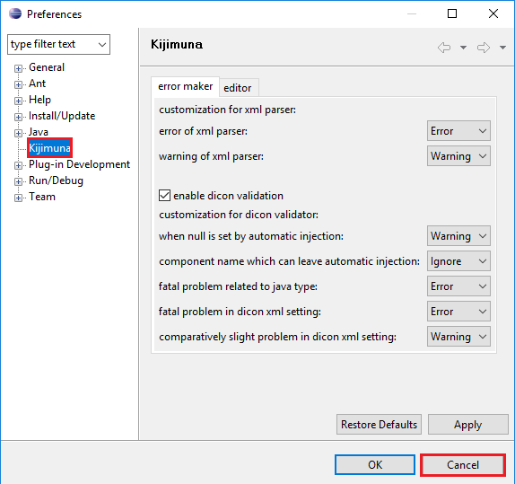

Seasar is the most popular open source framework in Japan. It is created simply because the authors see that dependency injection is really bad thing and they want to free us from such annoyance of DI.

So, in this article, we will discuss about seasar framework and we have to answer some question by ourself.
- How to use seasar framework in NetBeans / Eclipse.
- How to make our project easier breath without using DI.
- How to interact with database.

<br>

## Table of contents
- [Introduction to Seasar](#introduction-to-seasar)
- [Environment and Configuration](#environment-and-configuration)
- [Kijimuna](#kijimuna)
- 
- [Wrapping up](#wrapping-up)


<br>

## Introduction to Seasar


<br>

## Environment and Configuration
The first thing to remember is that Eclipse is used to develop Seasar and most Seasar packages use eclipse as a development platform. Then, they highly recommended us that we should use eclipse.

To configure seasar framework successfully, we can visit their [website](http://www.seasar.org/en/tutorial/index.html).

Some steps to setup for using Seasar with Eclipse:
- Setup eclipse 3.1.1 for 32-bit windows.
    
    We can refer to the [https://archive.eclipse.org](https://archive.eclipse.org/eclipse/downloads/drops/R-3.1.1-200509290840/).

    When we can run into a error such as ```Can't load IA 32-bit .dll on a AMD 64-bit platform```. It means that version 32-bit of eclipse does not run in 64-bit JVM, simply because our windows is 64-bit, so, we are installing 64-bit version JVM.

    We can two ways to solve this error:
    - Switch to a 32-bit JVM. We can refer this [link for JDK 8](https://www.oracle.com/technetwork/java/javase/downloads/jdk8-downloads-2133151.html) to download JDK.
    - Turn into 32-bit computer to load the DLL.

    Then, we have an interesting information about this error. We can install multiple versions of both 32-bit and 64-bit Java at the same time on the same machine.

- Before creating project with seasar framework, we need to change our workspace folder for seasar framework. 

    Go to ```File``` -> ```Switch Workspace```. 

- Setting up Omondo UML Eclipse plugin.


- Setting Kijimuna Plugin installation

    Kijimuna is an Eclipse plugin to validate against Seasar syntax. Without Kijimuna, we should have to look at Java compilation errors to find syntactical errors.

    - In Eclipse 3.1.1 32-bit windows, select ```Help```, next ```Software Updates``` --> ```Find and Install```.

    - At ```Install/Update``` dialog, choose ```Search for new features to install``` checkbox, then, click to ```Next``` button.

    - At ```Install``` dialog, select the ```New Remote Site ...``` button.

    - Next, in ```New Update Site``` dialog, enter ```Kijimuna``` for ```Name``` field, and enter ``` http://www.seasar.org/eclipse/updates/3.1/``` as the URL. Then, select the ```OK``` button.

    - Return to ```Install``` dialog, conduct whether ```Kijimuna``` checkbox is checked or not. If right, choose ```Finish``` button.

    - In ```Updates``` dialog, check ```Kijimuna``` checkbox as feature to install and select the ```Next``` button. Select the ```I accepte the terms in the license agreement``` and select the ```Next``` button.

    - Make sure the directory Eclipse is installed in displayed as the ```Install Location```. If it is different, select the ```Change Location...``` button to select the folder where Eclipse was installed. Select the ```Finish``` button.

    - In ```Update Manager``` dialog, necessary files will be downloaded. Do not select any buttons in this dialog box.

    - In ```Verification``` dialog, choose the ```Install All``` button.

    - At ```Install/Update``` dialog, select the ```Yes``` to restart Eclipse.

    - After Eclipse is restarted, let's check if Kijimuna was properly installed. Select ```Windows - Preferences...```.

    - Verify that Kijimuna is listed. 
    Select the ```Cancel``` button. This completes Kijimuna plugin installation

    

- Setting Tomcat 5.5.9

    We can download ```jakarta-tomcat-5.0.26.zip.``` from this [link about Tomcat](https://archive.apache.org/dist/tomcat/tomcat-5/archive/v5.0.26-beta/bin/).

<b>

## Kijimuna
Kijimuna is an Eclipse plugin that supports application development using Seasar.

It has the following features:
- Dicon Editor
    - Syntax highlighting.
    - Content Assistant for XML-tags, class name, OGNL and more.
    - Hyperlink by Ctrl + Click.
    - DTD based validation.

- Outline
    - Display of a component tree. 
    - 


<br>

## Wrapping up


<br>

Thanks for your reading.

<br>

Refer:

[http://www.seasar.org/en/index.html](http://www.seasar.org/en/index.html)

[https://www.fiorano.com/documentation/display/MQ1020/31.9+Integration+with+Seasar+Framework](https://www.fiorano.com/documentation/display/MQ1020/31.9+Integration+with+Seasar+Framework)

[http://s2container.seasar.org/2.3/en/DIContainer.html](http://s2container.seasar.org/2.3/en/DIContainer.html)

[http://www.seasar.org/en/tutorial/eclipse/kijimuna/index.html](http://www.seasar.org/en/tutorial/eclipse/kijimuna/index.html)