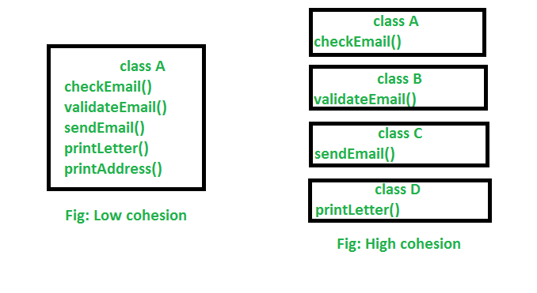

<br>

## Table of contents
- [cohesion](#cohesion)
- [Coupling](#Coupling)
- [Wrapping up](#wrapping-up)


<br>

## cohesion
- Definition of cohesion

    According to [wikipedia.org](https://en.wikipedia.org/wiki/Cohesion_(computer_science)), we have definition of cohesion:

    ```
    In computer programming, cohesion refers to the degree to which the elements inside a module belong together. In one sense, it is a measure of the strength of relationship between the methods and data of a class and some unifying purpose or concept served by that class. In another sense, it is a measure of the strength of relationship between the class's method and data themselves.
    ```

    Or we have the other definition:

    ```
    Cohesion represents the clarity of the responsibilities of a module.
    ```

    --> So, cohesion focuses on how single class is designed. Higher the cohensiveness of the class, better is the OO design.

    If our module performs one task and nothing else or has a clear purpose, our module has high cohesion. On the other hand, if our module tries to encapsulate more than one purpose or has an unclear purpose, our module has low cohesion.

    Modules with high cohesion tend to be preferable, simple because high cohesion is associated with several desirable traits of software including **robustness**, **reliability**, and **understandability**.

    Low cohesion is associated with undesirable traits such as being **difficult to maintain, test, reuse, or even understand**.

    Cohesion is often contrasted with coupling. High cohesion often correlates with loose coupling, and vice versa.

    **Single Responsibility Principle** aims at creating highly cohesive classes.

    Cohesion is increased if:
    - The functionalities embedded in a class, accessed through its methods, have much in common.
    - Methods carry out a small number of related activities, by avoiding coarsely grained or unrelated sets of data.

- The history of Cohesion concept

    The coupling and cohesion were invented by **Larry Constantine** in the late **1960s** as part of Structured Design, based on characteristics of good programming practices that reduced maintainenance and modification costs. 
    
    Structured Design, cohesion and coupling were published in the article Stevens, Myers & Constantine (1974) and the book Yourdon & Constantine (1979), the latter two subsequently became standard terms in software engineering.

- Advantages of high cohesion

    - Reduced module complexity (they are simpler, having fewer operations).
    - Increased system maintainability, because logical changes in the domain affect fewer modules, and because changes in one module require fewer changes in other modules.
    - Increased module reusability, because application developers will find the component they need more easily among the cohesive set of operations provided by the module.

- For example about cohesion

    

    We can see that in low cohesion, only one class is responsible for executing a lot of jobs which are not in common. It will reduce the chance of reusability and maintaince. 

    In high cohesion, there is a separate class for all the jobs to execute a specific job, which result better usability and maintaince.

    --> So, we have:
    - High cohesion is when we have a class that does a well defined job. Low cohesion is when a class does a lot of jobs that don’t have much in common.
    - High cohesion gives us better maintaining facility and Low cohesion results in monolithic classes that are difficult to maintain, understand and reduces re-usability

    For example:

    ```java
    public class Person {
        private int     age;
        private String  name;

        // getter, setter properties.

        // method
        public void readInfor();

        public void writeInfor();
    }
    ```

    The ```Person``` class has tightly cohesion, simply because Person's responsibilities is relevant to save information about people. It do not relate to functionalities about read/write to file. So, to reduce tightly cohension, we should separate the implementation about read/write file into other class such as File, ...

- Types of cohesion

    There are some types of cohesion that we need to know:
    - Coincidental cohesion (worst)

        


<br>

## Coupling


- Some properties that need to consider in coupling

    - Degree 

        Degree is the number of connections between the module and others. With coupling, we want to keep the degree small. For instance, if the module needed to connect to other modules through a few parameters or narrow interfaces, then the degree would be small, and coupling would be loose. 

    - Ease

        Ease is how obvious are the connections between the module and others. With coupling, we want the connections to be easy to make without needing to understand the implementations of the other modules.

    - Flexibility

        Flexibility is how interchangeable the other modules are for this module. With coupling, we want the other modules easily replaceable for something better in the future.

<br>

## Difference between cohesion and coupling
Below is a table that depict about difference between cohesion and coupling

|           Cohesion          |                  Coupling                |
| --------------------------- | ---------------------------------------- |
| Cohesion is the indication of the relationship within module | Coupling is the indication of the relationships between modules |
| Cohesion shows the module's relative functional strength | Coupling shows the relative independence among the modules |
| Cohesion is a degree (quality) to which a component / module focuses on the single thing | Coupling is a degree to which a component / module is connected to the other modules |
| While designing we should strive for high cohesion. Ex: cohesive component/module focus on a single task with little interaction with other modules of the system | While designing we should strive for low coupling. Ex: dependency between modules should be less |
| Cohesion is the kind of natural extension of data hiding, for example, class having all members visible with a package having default visibility | Making private fields, private methods and non public classes provides loose coupling |
| Cohesion is Intra – Module Concept | Coupling is Inter -Module Concept |

<br>

## Refactoring our code with loose coupling and high cohesion


<br>

## Wrapping up


<br>


Refer:

[https://gravitymodel.net/core-software-principles/](https://gravitymodel.net/core-software-principles/)

[https://en.wikipedia.org/wiki/Cohesion_(computer_science)](https://en.wikipedia.org/wiki/Cohesion_(computer_science))

[https://freefeast.info/difference-between/difference-between-cohesion-and-coupling-cohesion-vs-coupling/](https://freefeast.info/difference-between/difference-between-cohesion-and-coupling-cohesion-vs-coupling/)

[https://sanaulla.info/2008/06/26/cohesion-and-coupling-two-oo-design-principles/](https://sanaulla.info/2008/06/26/cohesion-and-coupling-two-oo-design-principles/)

[https://www.infoworld.com/article/2949579/design-for-change-coupling-and-cohesion-in-object-oriented-systems.html](https://www.infoworld.com/article/2949579/design-for-change-coupling-and-cohesion-in-object-oriented-systems.html)

[https://www.geeksforgeeks.org/cohesion-in-java/](https://www.geeksforgeeks.org/cohesion-in-java/)

[https://freefeast.info/difference-between/difference-between-cohesion-and-coupling-cohesion-vs-coupling/](https://freefeast.info/difference-between/difference-between-cohesion-and-coupling-cohesion-vs-coupling/)

[http://www.cems.uwe.ac.uk/~jsa/UMLJavaShortCourse09/CGOutput/Unit3/unit3(0809)/page_16.htm](http://www.cems.uwe.ac.uk/~jsa/UMLJavaShortCourse09/CGOutput/Unit3/unit3(0809)/page_16.htm)

[https://www.decodejava.com/coupling-cohesion-java.htm](https://www.decodejava.com/coupling-cohesion-java.htm)