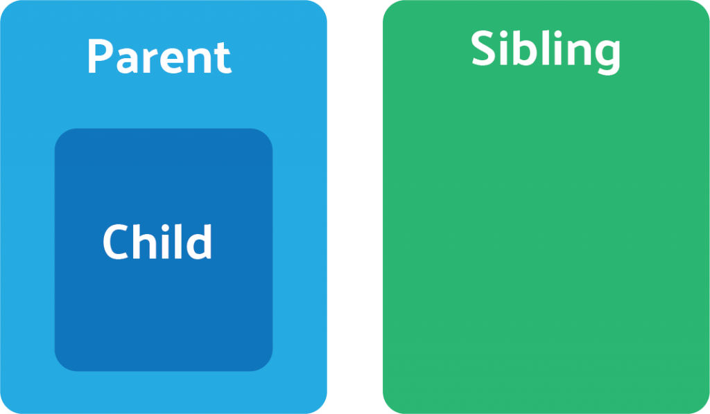

When we're working with Angular, we need to learn how to divide UI into many components, and learn how to communicate between components. 

The first problem, how to split UI into components, it will be talked at the other article. 

So, in this article, we will focus on the communication among components in Angular. There are four different methods for sharing data between Angular components.



<br>

## Table of contents
- [Parent to Child: Sharing Data via ```@Input```](#parent-to-child-sharing-data-via-@input)
- [Child to Parent: Sharing Data via ```@ViewChild```](#child-to-parent-sharing-data-via-@viewchild)
- [Child to Parent: Sharing Data via ```@Output``` and EventEmitter](#child-to-parent-sharing-data-via-@output-and-eventemitter)
- [Unrelated Components: Sharing Data with a Service](#unrelated-components-sharing-data-with-a-service)
- [Wrapping up](#wrapping-up)


<br>

## Parent to Child: Sharing Data via ```@Input```


<br>

## Child to Parent: Sharing Data via ```@ViewChild```


<br>

## Child to Parent: Sharing Data via ```@Output``` and EventEmitter


<br>

## Unrelated Components: Sharing Data with a Service


<br>

## Wrapping up


<br>

Thanks for your reading.

<br>

Refer: 

[https://angularfirebase.com/lessons/sharing-data-between-angular-components-four-methods/](https://angularfirebase.com/lessons/sharing-data-between-angular-components-four-methods/)

[https://medium.com/@pandukamuditha/angular-5-share-data-between-sibling-components-using-eventemitter-8ebb49b64a0a](https://medium.com/@pandukamuditha/angular-5-share-data-between-sibling-components-using-eventemitter-8ebb49b64a0a)

[https://angular.io/guide/component-interaction](https://angular.io/guide/component-interaction)