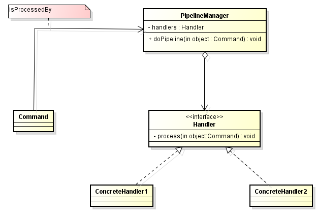

In this article, we will talk about Pipeline pattern, and some interesting information about it such as applying it in which real problems, when to use, how to use, the disadvantages and advantages.

<br>

## Table of contents
- [Given Problem](#given-problem)
- [Solution of Pipeline Pattern](#solution-of-pipeline-pattern)
- [When to use](#when-to-use)
- [Benefits & Drawback](#benefits-&-drawback)
- [Code C++ /Java / Javascript](#code-c++-java-javascript)
- [Application & Examples](#application-&-examples)
- [Wrapping up](#wrapping-up)


<br>

## Given Problem 
In ```Chain of Responsibility``` pattern, when we have a new handler, 3 operations are required: 
- unlinking an existing handler
- relinking the new handler with its successor
- relinking the existing predecessor to the new handler

So, in some applications, these operations is quite error-prone indeed.

Then, ```Pipeline``` pattern was born to solve this problem.

<br>

## Solution of Pipeline Pattern


The major difference with the **Chain Of Responsibility** pattern is the introduction of the ```PipelineManager``` actor. The flexibility of the **Pipeline** pattern comes from the fact that at any time, a new ```Handler``` can be injected into the pipeline through the ```PipelineManager```.



<br>

## When to use


<br>

## Benefits & Drawback


<br>

## Code C++ /Java / Javascript


<br>

## Application & Examples


<br>

## Wrapping up


<br>

Thanks for your reading.

<br>

Refer:

[https://doanduyhai.wordpress.com/2012/07/08/design-pattern-the-pipeline/](https://doanduyhai.wordpress.com/2012/07/08/design-pattern-the-pipeline/)

[https://matthewdaly.co.uk/blog/2018/10/05/understanding-the-pipeline-pattern/](https://matthewdaly.co.uk/blog/2018/10/05/understanding-the-pipeline-pattern/)

[http://ipcc.cs.uoregon.edu/lectures/lecture-10-pipeline.pdf](http://ipcc.cs.uoregon.edu/lectures/lecture-10-pipeline.pdf)