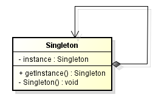

<br>

## Table of contents
- [Given Problem](#given-problem)
- [Solution of Singleton Pattern](#solution-of-singleton-pattern)
- [When to use](#when-to-use)
- [Why not to use](#why-not-to-use)
- [Benefits & Drawback](#benefits-&-drawback)
- [Replace singleton pattern with single instance](#replace-singleton-pattern-with-single-instance)
- [Code C++ /Java / Javascript](#code-c++-java-javascript)
- [Application & Examples](#application-&-examples)
- [Wrapping up](#wrapping-up)


<br>

## Given Problem 
When we only need one instance for a class and global access for this instance, simply because this class is responsible for managing one state, or single functionality, ... So we do not need to make many instances for their case. 

For example: setting part in programming software, logging, ...

<br>

## Solution of Singleton Pattern
Singleton pattern is a creational design pattern that restricts the instantiation of a class to one object.

In Singleton, there are two ways to create instance.
- pre-initialized - it means that this instance will be instantiate before somecone call the method ```getInstance()```.
- lazy-initialized - it means that this instance will be instantiate during the first call of the method ```getInstance()```.




In this UML diagram, Singleton pattern has some parts:
- ```instance: Singleton```: Singleton class has the unique instance.
- ```getInstance(): Singleton```: This is a public method to provide the only way to get the unique instance of Singleton. This method can be called from anywhere since it's a class method.
- ```Singleton()```: It is a private constructor to prevent someone creating additional an object of this Singleton class.
- In Singleton, there are some methods to implement business logic.


<br>

## When to use
- When we need only one resources (a database connection, a socket connection, ...)
- To avoid multiple instances of a stateless class to avoid memory waste.
- For business reasons.


<br>

## Why not to use
- Singleton hides the dependencies between classes instead of exposing them through the interface. This means we need to read the code of each method to know if a class is using another class.

- Singleton violates the ```Single Responsibility Principle```, they control their own creation and lifecycle (using lazy initialization, the Singleton chose when it is created). A class should only focus on what it is used to do.

    If we have Singleton that manages people, it should only manage people and not how/when it is created. 

- They inherently cause code to be tightly coupled. This makes faking or mocking them for unit testing very difficult.

- They carry states around for the lifetime of the application (for stateful singletons).
    - It makes unit testing difficult since we can end up with a situation where tests need to be ordered which is a piece of nonsence. By definition, each unit test should be independent from each other. 
    - Moreover, it makes the code less predictable. 

- We should not use singleton for sharing variables / data between different objects since it produces a very tight coupling.

To replace the usage of Singleton, we can [use a single instance](#replace-singleton-pattern-with-single-instance).

<br>

## Benefits & Drawback
- Benefits


- Drawback


<br>

## Replace singleton pattern with single instance


<br>

## Code C++ /Java / Javascript
- C++

    Version 1: pre-initialize instance

    ```C++
    class Singleton 
    {
    public:
        static Singleton& getInstance() 
        {
            static Singleton instance;

            return instance;
        }

    }

    private:
        Singleton() {}

        // C++ 03
        // ========
        // Don't forget to declare these two. You want to make sure they
        // are unacceptable otherwise you may accidentally get copies of
        // your singleton appearing.
        Singleton(Singleton const&);                // Don't Implement
        void operator=(Singleton const&);           // Don't implement

    public:
        // C++ 11
        // =======
        // We can use the better technique of deleting the methods
        // we don't want.
        S(S const&)               = delete;
        void operator=(S const&)  = delete;

        // Note: Scott Meyers mentions in his Effective Modern
        //       C++ book, that deleted functions should generally
        //       be public as it results in better error messages
        //       due to the compilers behavior to check accessibility
        //       before deleted status
    ```

    Version 2: 

- Java


<br>

## Relations with other Patterns
    - 


<br>

## Some thoughts about Singleton
- In defense of Singleton:
    - **They are not as bad as globals** because globals have no standard-enforced initialization order, and you could easily see non-deterministic bugs due to naive or unexpected dependency orders. Singleton (assuming they're allocated on the heap) are created after all globals, and in a very predictable place in the code.

    - **They're very useful for resource-lazy / -caching systems** such as an interface to a slow I/O device. If you intelligently build a singleton interface to a slow device, and no one ever calls it, you won't waste any time. If another piece of code calls it from multiple places, your singleton can optimize caching for both simultaneously, and avoid any double look-ups. You can also easily avoid any deadlock condition on the singleton-controlled resource.

- Against singletons:
    - **In C++, there's no nice way to auto-clean-up after singletons.** There are work-arounds, and slightly hacky ways to do it, but there's just no simple, universal way to make sure your singleton's destructor is always called. This isn't so terrible memory-wise -- just think of it as more global variables, for this purpose. But it can be bad if your singleton allocates other resources (e.g. locks some files) and doesn't release them.

<br>

## Application & Examples
- Good situations to use Singleton:
    - Logging framework
    - Thread recycling pools.

<br>

## Wrapping up
- Writing a Singleton is easier than writing a single instance using Dependency Injection.

- For a quick and dirty solution, we should use a Singleton. For a long and durable solution, we should use a single instance.

- Singleton pattern has two important properties:
    - single instance
    - global access

<br>

Thanks for your reading.

<br>

Refer: 

[http://www.yolinux.com/TUTORIALS/C++Singleton.html](http://www.yolinux.com/TUTORIALS/C++Singleton.html)

[https://stackoverflow.com/questions/1008019/c-singleton-design-pattern](https://stackoverflow.com/questions/1008019/c-singleton-design-pattern)

[https://stackoverflow.com/questions/11831/singletons-good-design-or-a-crutch](https://stackoverflow.com/questions/11831/singletons-good-design-or-a-crutch)

[https://testing.googleblog.com/2008/08/by-miko-hevery-so-you-join-new-project.html](https://testing.googleblog.com/2008/08/by-miko-hevery-so-you-join-new-project.html)

[https://testing.googleblog.com/2008/08/where-have-all-singletons-gone.html](https://testing.googleblog.com/2008/08/where-have-all-singletons-gone.html)

[https://testing.googleblog.com/2008/08/root-cause-of-singletons.html](https://testing.googleblog.com/2008/08/root-cause-of-singletons.html)

<br>

**When to use Singleton**

[https://stackoverflow.com/questions/86582/singleton-how-should-it-be-used](https://stackoverflow.com/questions/86582/singleton-how-should-it-be-used)

<br>

**Initialization order and how to cope**

[https://stackoverflow.com/questions/211237/static-variables-initialisation-order/211307#211307](https://stackoverflow.com/questions/211237/static-variables-initialisation-order/211307#211307)

[https://stackoverflow.com/questions/335369/finding-c-static-initialization-order-problems/335746#335746](https://stackoverflow.com/questions/335369/finding-c-static-initialization-order-problems/335746#335746)

<br>

**Lifetime of static variable**

[https://stackoverflow.com/questions/246564/what-is-the-lifetime-of-a-static-variable-in-a-c-function](https://stackoverflow.com/questions/246564/what-is-the-lifetime-of-a-static-variable-in-a-c-function)

<br>

**Some threading implications to Singleton**

[https://stackoverflow.com/questions/449436/singleton-instance-declared-as-static-variable-of-getinstance-method-is-it-thre/449823#449823](https://stackoverflow.com/questions/449436/singleton-instance-declared-as-static-variable-of-getinstance-method-is-it-thre/449823#449823)

<br>

**Explain why double checked locking will not work on C++**

[https://stackoverflow.com/questions/367633/what-are-all-the-common-undefined-behaviours-that-a-c-programmer-should-know-a/367690#367690](https://stackoverflow.com/questions/367633/what-are-all-the-common-undefined-behaviours-that-a-c-programmer-should-know-a/367690#367690)

[http://www.drdobbs.com/cpp/c-and-the-perils-of-double-checked-locki/184405726](http://www.drdobbs.com/cpp/c-and-the-perils-of-double-checked-locki/184405726)