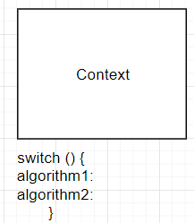
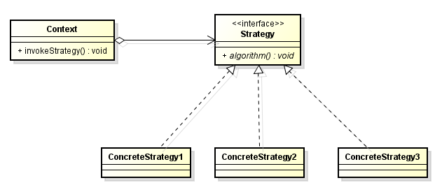

<br>

## Table of contents
- [Given Problem](#given-problem)
- [Solution of Strategy Pattern](#solution-of-strategy-pattern)
- [When to use](#when-to-use)
- [Benefits & Drawback](#benefits-&-drawback)
- [Code C++ / Java](#code-c++-/-java)
- [Application & Examples](#application-&-examples)
- [Wrapping up](#wrapping-up)


<br>

## Given Problem 



Normally, when we have a set of algorithms that we need to perform in the Context class. They will be acted that depends on a condition in switch or if-else statement.

When the amount of values of a condition in switch or if-else statement increases, it makes our code very long. On the other hand, algorithms are often extended, optimized, and replaced during development and reuse, so our code will be illegal the Single Responsibility Principle of SOLID because with switch statement we have multiple reasons to change.

The changes always make Context class more complex, our code do not reuse for other situations.

At the moment, the Context class is coupling with particular algorithm at compile-time, and makes it impossible to change an algorithm later independently from the class. Because we know that some specific algorithms in Context class, at run-time, we do not exchange to the other algorithm by mocking into our code. 

So, we have some problems:
- How can a class be configured with an algorithm at run-time instead of implementing an algorithm directly?
- How can an alogrithm be selected an exchanged at run-time?

<br>

## Solution of Strategy Pattern



To solve the above problems, we will do some following steps:
- Defines separate Strategy object.

    - For all supported algorithms, define a common interface - Strategy for performing an algorithm.

    - Define classes - Strategy1, Strategy2, ... that implements the Strategy interface (encapsulate the algorithm).

    - This enables compile-time flexibility (via inheritance).

        New algorithm can be added and existing ones can be changed independently by defining new subclasses.

- A Context class delegates responsibility for performing an algorithm to a Strategy object --> ```strategy.algorithm();```

    - This enables run-time flexibility (via object composition).

        A class can be configured with a Strategy object, which it uses to perform an algorithm, and the Strategy object can be exchanged dynamically.

<br>

## When to use
- When we want to choose algorithm at run-time.


<br>

## Benefits & Drawback
1. Benefits

    - Reduce the [cyclomatic complexity](https://en.wikipedia.org/wiki/Cyclomatic_complexity) when we do not use if-else or switch statement.

    - Makes our code testable, maintainable, reusable.

2. Drawbacks


<br>

## Code C++ / Java

To refer this pattern's code, we can read this [link](https://github.com/DucManhPhan/Design-Pattern/tree/master/Behavioral-Pattern/strategy-pattern/src/Java).

<br>

## Application & Examples


<br>

## Wrapping up
- The key idea of this pattern is to implement algorithms in a separate inheritance hierarchy, so that we can vary independently.

- The strategy pattern defines a family of algorithms, encapsulating each one, and makes them interchangeable.


<br>

Thanks for your reading.

<br>

Refer: 
