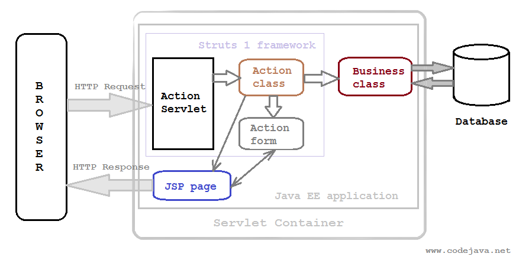

Before diving deeper into how to understand Struts 1 framework works, we need to be aware of how to configure Struts 1 framework with ```struts-config.xml``` file, and ```web.xml``` file. It is very important for the first step simply because when we do not configure our project to run smoothly, we do not do something with it.

So, in this article, we will discuss about configuration in ```struts-config.xml``` file, ```web.xml``` file in Struts 1 framework.

<br>

## Table of contents
- [Background of Struts 1 framework's parts](#background-of-struts-1-framework's-parts)
- [Configuring in web.xml file](#configuring-in-web.xml)
- [Configuring in struts-config.xml file](#configuring-in-struts-config.xml-file)
- [Wrapping up](#wrapping-up)

<br>

## Background of Struts 2 framework's parts
Before to be enable to use Struts 1 framework, we need to understand some parts in this framework. The below image describes these flows:



So, we have some interesting information about the above image:
- Struts 1 handles HTTP requests by its own controller servlet called ```ActionServlet```. Therefore, we need define Struts action servlet and its initialization parameters.

- Specify servlet mapping for the action servlet. There are two types of mapping which delegate the matching URLs to be processed by Struts container.
    - Prefix matching. 
    - Extension matching.

## Configuring in web.xml file
- First step: declare ```org.apache.struts.action.ActionServlet``` in ```web.xml``` file

    In Struts 1 framework, the ```org.apache.struts.action.ActionServlet``` class is the Struts controller servlet. So, in ```web.xml```, we can configure something like this.

    ```xml
    <servlet>
        <servlet-name>StrutsController</servlet-name>
        <servlet-class>org.apache.struts.action.ActionServlet</servlet-class>

        <init-param>
            <param-name>config</param-name>
            <param-value>/WEB-INF/struts-config.xml</param-value>
        </init-param>

        <load-on-startup>1</load-on-startup>
    </servlet>
    ```

    We also declare an initialization parameter named ```config–``` which points to the location of Struts configuration files. Multiple configuration files can be used, and they must be separated by comma, for example:

    ```xml
    <init-param>
        <param-name>config</param-name>
        <param-value>/WEB-INF/struts-config1.xml, /WEB-INF/struts-config2.xml</param-value>
    </init-param>
    ```

    Beside the commonly used parameter config, Struts also defines several parameters for configuring its controller: ```chainConfig```, ```config/${module}```, ```configFactory```, ```convertNull```, ```rulesets```, ```validating```.

    The ```load-on-startup``` tag tells the container to load the servlet upon server starts up, instead of loading when invoked as usual convention. The value of ```1``` means this servlet has highest priority loading. This is necessary for the framework initializes its resources before serving client’s requests.

- Second step: We need to specify with Servlet container that how to map the kind of incoming URLs will be processed by Struts action servlet. Using ```<servlet-mapping>``` element in ```web.xml``` file.

    ```xml
    <servlet-mapping>
        <servlet-name>StrutsController</servlet-name>
        <url-pattern>/services/*</url-pattern>
    </servlet-mapping>
    ```

    The URL pattern /services/*is called prefix matching which means that all URLs start with the prefix will be processed by the action servlet. For example, the following URLs will match the pattern:

    ```http://localhost/webapp/services/deposit```

    ```http://localhost/webapp/services/widthdraw```

    The second pattern is called extension matching which means that all URLs end with the extension will be processed by the action servlet, for example:

    ```xml
    <servlet-mapping>
        <servlet-name>StrutsController</servlet-name>
        <url-pattern>*.do</url-pattern>
    </servlet-mapping>
    ```

    The following example URLs will match the extension matching pattern:

    ```http://localhost/webapp/login.do```

    ```http://localhost/webapp/listProduct.do```

So far a typical configuration for Struts 1 framework in web.xml file looks like this:

```xml
<?xml version="1.0" encoding="UTF-8"?>
<web-app id="WebApp_ID" version="2.4"
    xmlns="http://java.sun.com/xml/ns/j2ee" xmlns:xsi="http://www.w3.org/2001/XMLSchema-instance"
    xsi:schemaLocation="http://java.sun.com/xml/ns/j2ee http://java.sun.com/xml/ns/j2ee/web-app_2_4.xsd">
    <display-name>Struts1Application</display-name>
    <!-- Begin Struts 1 config -->
    <servlet>
        <servlet-name>StrutsController</servlet-name>
        <servlet-class>org.apache.struts.action.ActionServlet</servlet-class>
        <init-param>
            <param-name>config</param-name>
            <param-value>/WEB-INF/struts-config.xml</param-value>
        </init-param>
        <load-on-startup>1</load-on-startup>
    </servlet>
    <servlet-mapping>
        <servlet-name>StrutsController</servlet-name>
        <url-pattern>*.do</url-pattern>
    </servlet-mapping>
    <!-- End Struts 1 config -->     
</web-app>
```

<br>

## Configuring in struts-config.xml file


<br>

## Wrapping up


<br>


Refer:

[https://www.codejava.net/frameworks/struts/how-to-configure-struts-framework-in-webxml](https://www.codejava.net/frameworks/struts/how-to-configure-struts-framework-in-webxml)

[https://www.java-samples.com/showtutorial.php?tutorialid=576](https://www.java-samples.com/showtutorial.php?tutorialid=576)