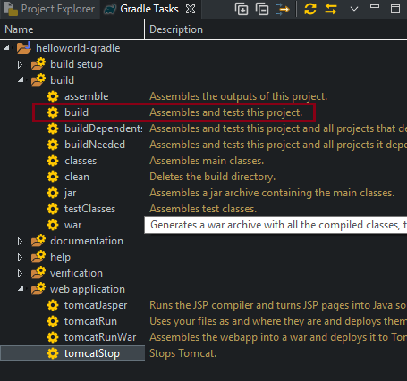
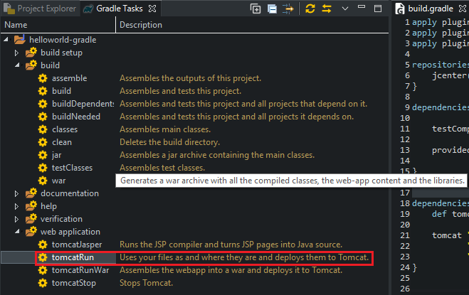
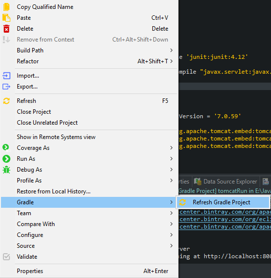

<br>

## Table of contents


<br>

## Introduction to gradle


<br>

## Setup gradle in our project
- First way: Download Gradle

    We can download the lastest version of Gradle at [link](https://gradle.org/releases/). After downloaded, we have ```gradle-5.2.1-all.zip``` file.

    Next, we need to create some environment variable for Gradle.
    - Let's pretend that we put gradle folder in ```C:\gradle```.
    - Create system variables ```GRADLE_HOME``` with ```C:\gradle```, and add ```C:\gradle\bin``` to ```PATH```.

- Second way: Setup Buildship for Gradle plugin in Eclipse

    Select ```Help``` --> ```Install New Software...```.

    Select ```Add``` button --> fill in some information:
    - Name: Buildship
    - Location: http://download.eclipse.org/buildship/updates/e46/releases/1.0/1.0.19.v20160830-1454

    Next, we can setup Buildship in eclipse.

<br>

## Some tasks in Gradle

|          Tasks           |                        Description                    |
| ------------------------ | ----------------------------------------------------- |
| assemble                 | Assembles the outputs of this project.                |
| build                    | Assembles and tests this project.                     |
| buildDependents          | Assembles and tests this project and all projects that depend on it. |
| buildNeeded              | Assembles and tests this project and all projects it depends on. |
| classes                  | Assembles main classes. |
| jar                      | Assembles a jar archive containing the main classes. |
| testClasses              | Assembles test classes. |
| war                      | Generate a war archive with all the compile classes, the web-app content and the libraries. |
| tomcatJasper             | Runs the JSP compiler and turns JSP pages into Java sources. |
| tomcatRun                | Uses our files and where they are and deploys them to Tomcat. |
| tomcatRunWar             | Assembles the webapp into a war and deploys it to Tomcat. |
| tomcatStop               | Stops Tomcat. |

<br>

## Understanding build.gradle file


<br>

## Build project with Gradle
- First way: Use Gradle Tasks View

    If you do not see the ```Gradle Tasks``` View, you can get it from ```Window``` --> ```Show View``` --> ```Other``` --> Search ```gradle``` --> Select ```Gradle Tasks```.

    In ```Gradle Tasks``` View, select ```build``` tasks in folder ```build```, right click --> ```Run Gradle Tasks```.

    

<br>

## Run project with Gradle
In ```Gradle Tasks``` View, select our current project --> select ```web application``` folder --> select ```tomcatRun``` tasks --> right click --> ```Run Gradle Tasks```.




<br>

## Updating claspath with the latest changes in build.gradle file
Eclipse does not automatically update the ```classpath```, if the ```build.gradle``` file is updated. Select ```Gradle``` --> ```Refresh Gradle Project``` from the context menu of the project or from your ```build.gradle``` file for that.



<br>

Refer:

[https://www.vogella.com/tutorials/EclipseGradle/article.html](https://www.vogella.com/tutorials/EclipseGradle/article.html)

[https://www.tutorialspoint.com/gradle/gradle_eclipse_integration.htm](https://www.tutorialspoint.com/gradle/gradle_eclipse_integration.htm)

[https://www.journaldev.com/7971/gradle](https://www.journaldev.com/7971/gradle)