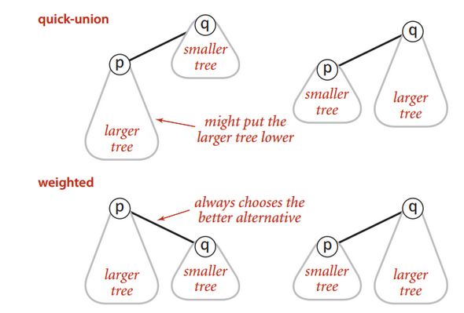

<br>

## Table of contents
- [Introduction to Quick Union](#introduction-to-quick-union)
- [Source code](#source-code)
- [Drawbacks of Quick Union](#drawbacks-of-quick-union)
- [Application of Quick Union](#application-of-quick-union)

<br>

## Introduction to Quick Union


<br>

## Source code
- Data structure

    - Integer array id[] of size N.
    - Interpretation: id[i] is parent of i.
    - Root of i is: id[id[id[...id[i]...]]]

- Find operation: check if p and q have the same root.

    

- Union operation: to merge components containing p and q, change all entries whose id equals id[p] and id[q]. So, we have a problem: many values can be changed.

    

```java
public class QuickUnionUF {
    
    private int[] id; 
       
    // set id for each object to itself 
    // (N array accesses)
    public QuickUnionUF(int N) {
        id = new int[N];
        for (int i = 0; i < N; ++i) {
            id[i] = i;
        }
    }
       
    // chase parent pointers until reach root 
    // (depth of i array accesses)
    private int root(int i) {
        while (i != id[i]) {
            i = id[i];
        }
        
        return i;
    }
    
    // check if p and q have same root
    // (depth of p and q array accesses)
    public boolean connected(int p, int q) {
        return root(p) == root(q);
    }
    
    // change root of p to point to root of q (depth of p and q array acceses)
    public void union(int p, int q) {
        int i = root(p);
        int j = root(q);
        
        id[i] = j;
    }
}
```


<br>

## Drawbacks of Quick Union
- Cost model: number of array access (for read and write)

    |   algorithm    |  initialize  | union  |  find   |
    | -------------- | ------------ | ------ | ------- |
    | quick-find     | N            | N      | 1       |
    | quick-union    | N            | N (*)     | N (worst case) | 

    ```*``` : includes cost of finding roots. 

- Quick-find defect
    - Union too expensive (N array accesses)
    - Trees are flat, but too expensive to keep them flat

- Quick-union defect 
    - Trees can get tall
    - Find operation is too expensive (could be N array accesses)

    SO, we could wind up with a long skinny tree. Of each object just pointing to next and then to do a find operation for object at the bottom would involve going all the way through the tree. 

    Costing involving in the array accesses is just to do the find operation and that's going to be slow if we have a lot of operations.
    
    Finally, the maximum number of array accesses during a find operation when using the quick-union on n elements is linear.

<br>

## Quick-Union Improvements
- Weighted quick-union

    - How to improve:
        - Modify quick-union to avoid tall trees.
        - Keep track of size of each tree (number of object)
        - Balance by linking root of smaller tree to root of larger tree (reasonable alternatives: union by height or rank).

    

    - Source code
        - Data structure: same as quick-union, but maintain extra array sz[i] to count number of objects in the tree rooted at i.
        - Find operation: 
            - Identical to quick-union.
            - Takes time proportional to depth of p and q.

            ```java
            return root(p) == root(q);
            ```
        - Union operation: Modify quick-union to:
            - Link root of smaller tree to root of larger tree.
            - Update the sz[] array.
            - Takes constant time, given roots.

                ```java
                int i = root(p);
                int j = root(q);

                if (i == j) return;

                if (sz[i] < sz[j]) {
                    id[i] = j;
                    sz[j] += sz[i];
                } else {
                    id[j] = i;
                    sz[i] += sz[j];
                }
                ```

        - Proposition: Depth of any node x is at most ```lgN```.

            lg = base-2 logarithm.

            

            Pf. When does depth of x increase?

            Increases by 1 when tree T1 containing x is merged into another tree T2.
            - The size of the tree containing x at least doubles since |T2| >= |T1|.
            - Size of tree containing x can double at most lgN times. 

                
<br>

## Application of Quick Union


<br>

Refer:

