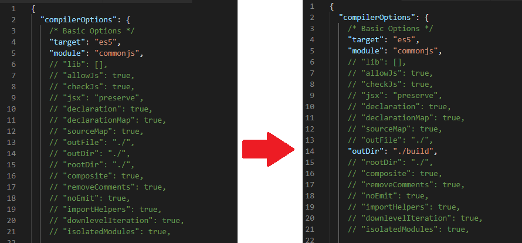

<br>

## Table of contents
- [Why do we need to integrate Typescript into Node.js project](#why-do-we-need-to-integrate-typescript-into-node.js-project)
- [Some modules of Typescript that need to add in Node.js project](#some-modules-of-typescript-that-need-to-add-in-node.js-project)
- [Create some scripts for compiling and run Node.js project with Typescript](#create-some-scripts-for-compiling-and-run-node.js-project-with-typescript)
- [Wrapping up](#wrapping-up)

<br>

## Why do we need to integrate Typescript into Node.js project
Here are some reasons that we think that we should use Typescript into Node.js project:
- When we are working with large project, use common syntax in Javscript make us confused because we do not know about parameters of javascript.


<br>

## Some modules of Typescript that need to add in Node.js project
- Use ```typescript``` package

    Simply, to use Typescript in our Node.js project, we need to install ```typescript``` package.

    ```npm install typescript --save-dev```

    In ```package.json``` file, we have:

    ```json
    ...
    "devDependencies": {
        ...
        "typescript": "^3.4.2"
    }
    ```

    Node.js is an engine that runs Javascript and not Typescript. The node Typescript package allows us to transpile our ```.ts``` file to ```.js``` scripts. Babel can also be used to transpile Typescript, however the market standard is to use the official Microsoft package.

    Inside our ```package.json```, we will put a script called ```tsc```:

    ```json
    "scripts": {
        "tsc": "tsc"
    }
    ```

    This modification allows us to call typescript functions from the command line in the project's folder. So, we can use the following command:

    ```npm run tsc -- --init```

    This command initializes the typescript project by creating the ```tsconfig.json``` file. Within this file, we will uncomment the outDir option and choose a location for the transpiled .js files to be delivered

    

- Use ```@types/express``` package

    Assuming that we were installed the ```express``` package for managing server with template engine ejs.

    ```npm install express ejs --save```

    Because Express and Typescript packages are independent. The consequence of this is that Typescript does not know types of Express classes. There is a specific npm package for the Typescript to recognize the Express types. Therefore, ```@types/express``` is an type declaration package for Express.

    ```npm install @types/express --save-dev```

- Use ```@types/node``` package

    To assist Typescript developers, library authors and community contributors publish companion libraries called [Typescript declaration files](http://www.typescriptlang.org/docs/handbook/declaration-files/consumption.html). 

    So, ```@types/node``` package is an type declaration package for Node.js, it has the same name as the package on npm, but prefixed with ```@types/```, but if we need, we can check out ```https://aka.ms/types``` to find the package for our favorite library.

    ```npm install @types/node --save-dev```

- Use ```@types/passport```, ```@types/passport-jwt``` and ```@types/bcryptjs``` packages

    Similiarly, with the ```@types/express``` and ```@types/node``` packages that are type declaration packages for Node.js and Express, ```@types/passport```, ```@types/passport-jwt``` and ```@types/bcryptjs``` packages are also type declaration packages for passport, passport-jwt, and bcryptjs, when we want passport, passport-jwt, and bcryptjs packages that are compatible with Typescript version of these packages.

- Use ```ts-node``` and ```ts-node-dev``` packages

    |     package    |                Description              |
    | -------------- | --------------------------------------- |
    | ts-node        | Use to run Typescript files directly    |
    | ts-node-dev    | Running Typescript without transpiling  |

    The ```ts-node``` package is recommended for development only. ```ts-node``` which we will use for live compile + run in node.

    ```npm install ts-node --save-dev```
    
    To make the final deploy in production, always use the javascript version of our project.

    The ```ts-node``` package is already included as a dependency on another package - ```ts-node-dev``` package. After installing ```ts-node-dev```, we can run commands that restarts the server whenever a project file changes.

    ```npm install ts-node-dev --save-dev```

    Inside our ```package.json```, we will add two more scripts:

    ```json
    "scripts": {
        "start": "npm run start:prod",
        "dev": "npm run start:dev",
        "tsc": "tsc",
        "start:dev": "ts-node-dev --respawn --transpileOnly ./server.ts",
        "start:prod": "tsc && node ./dist/server.js",
        "build": "tsc"
    }
    ```

    To start the development environment:

    ```npm run dev```

    To run the server in production mode:

    ```npm start```

<br>

## Create some scripts for compiling and run Node.js project with Typescript
After adding some scripts into ```package.json``` file such as:

```json
"scripts": {
    "start": "npm run start:prod",
    "dev": "npm run start:dev",
    "tsc": "tsc",
    "start:dev": "ts-node-dev --respawn --transpileOnly ./server.ts",
    "start:prod": "tsc && node ./dist/server.js",
    "build": "tsc"
}
```

Use some command:

```javascript
npm run dev
npm start
```

<br>

## Wrapping up
- Typescript prefers to use the ```import``` module syntax over ```require```, so we'll start by changing:

    ```const express = require('express');```

    to:

    ```import express from "express";```


<br>

Thanks for your reading.

<br>

Refer:

[https://developer.okta.com/blog/2018/11/15/node-express-typescript](https://developer.okta.com/blog/2018/11/15/node-express-typescript)

[https://basarat.gitbooks.io/typescript/content/docs/quick/nodejs.html](https://basarat.gitbooks.io/typescript/content/docs/quick/nodejs.html)

[https://developer.okta.com/blog/2018/11/15/node-express-typescript](https://developer.okta.com/blog/2018/11/15/node-express-typescript)

[https://blog.risingstack.com/building-a-node-js-app-with-typescript-tutorial/](https://blog.risingstack.com/building-a-node-js-app-with-typescript-tutorial/)

[https://github.com/DefinitelyTyped/DefinitelyTyped](https://github.com/DefinitelyTyped/DefinitelyTyped)