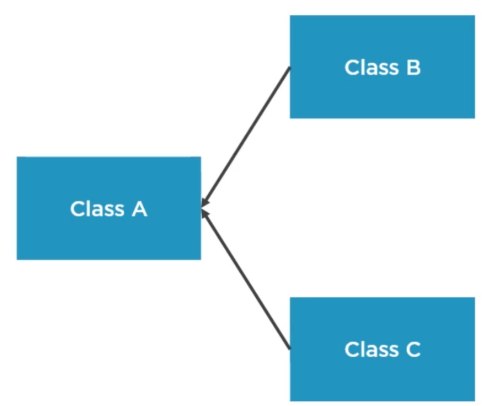
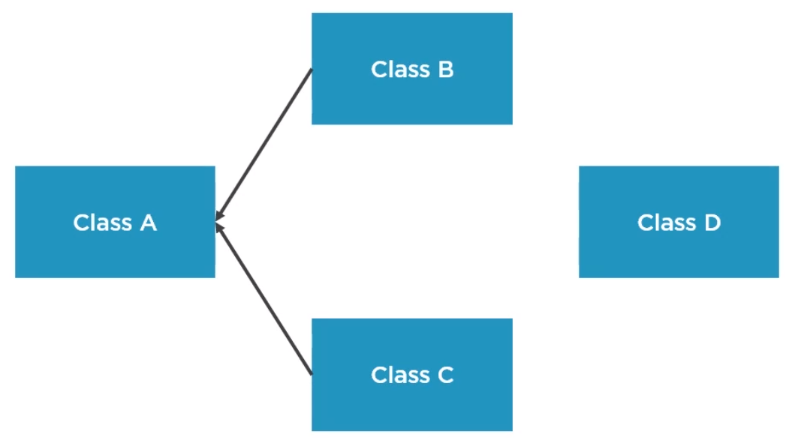

<br>

## Table of contents
- [Open Closed Principle](#open-closed-principle)

- [Wrapping up](#wrapping-up)


<br>

## Open Closed Principle
The Open Closed Principle states that:

```
Classes, functions, and modules should be closed for modification, but open for extension.
```

But what does closed for modification and open for extension really mean?
- Well, a class is closed for modification if for each feature that we need to add, we do not touch an existing source code. The source code basically becomes immutable.

- At the same time, a component is open for extension if it allows us to make it behave in new ways by creating or writing new code. And the open closed principle tries to re-conciliate these two mantras.

Assume that we have a system with three classes, A, B and C.



We want to implement a new feature, and we go ahead and do that by modifying code in Class A. Do notice that Classes B and C depend upon Class A. When we modified Class A by mistake, we also broke Class B because Class B was dependent on it. That's the main problem with modifying existing source code. There is a high risk of breaking other components, and this is just a very simple example.

In a real application, the dependency graph is much more complex, and changes to particular components can have ripple effects in various parts of the system. Again, this is fragility. A better approach would have been to implement that change and put it in a new component. Let's call it as Class D.



If we do this, then we implement our feature, but we do not touch the existing system. Therefore, we have a very low risk of introducing regression bugs.

Why we should apply the OCP
- New features can be added easily and with minimal cost.

    Even in applications that are very tangled and old and complex, each time we need to make a change, the best way is to put that change in a separate component, write a unit test for it.

    So, we can use the OCP in every application.

- Minimizes the risk of regression bugs.

- Enforces decoupling by isolating changes in specific components, works along with the SRP.

<br>

## OCP Implementation Strategies


<br>

## Wrapping up

Refer:

[https://thinkinginobjects.com/2012/09/24/open-closed-principle/](https://thinkinginobjects.com/2012/09/24/open-closed-principle/)