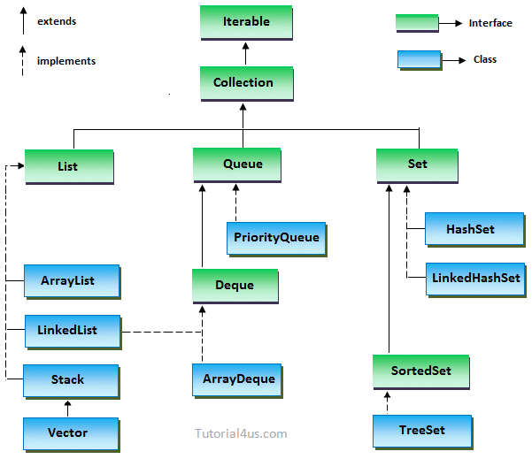

When we are working with Java from a newbie, we're always to think about some common tasks such as convert list to array, ... In order to reduce the time of these problems, we can sum up all solutions to this article. It is convenient that we can see them again.

Let's start.

<br>

## Table of contents
- [Convert List to Array](#convert-list-to-array)
- [Convert List to Set](#convert-list-to-set)
- [Convert List to Map](#convert-list-to-map)
- [Convert Map to List](#convert-map-to-list)
- [Convert String to Int](#convert-string-to-int)
- [Sort integer values that is appeared in String data type](#sort-integer-values-that-is-appeared-in-String-data-type)
- [Find max/min value from an array](#find-max/min-from-an-array)
- [Check whether an object is instance of which class](#check-whether-an-object-is-instance-of-which-class)
- [Wrapping up](#wrapping-up)

<br>

## Initialize List / ArrayList
1. Initialization with List interface

    - Use the factory methods of Stream.

        ```java
        Student obama =new Student(12,"Bill Gate");
		Student billgate = new Student(22, "Obama");

        List<Student> list = Stream.of(obama, billgate).collect(Collectors.toList());		
		System.out.println(list);
        ```

    - Use with Array.

        ```java
        List<String> list = Arrays.asList("Obama", "Bill Gate");
        ```

    - Use List.of() method

        ```java
        List<String> lst = new ArrayList<>(
            List.of("Hello", "World", "!")
        );
        ```

    - Use another collection

        ```java
        List<String> names = new ArrayList<>(lst);
        ```

<br>

## Convert List to Array
- First way - Use ```List.toArray()```.

    ```java
    @Data
    @NoArgsConstructor
    @AllArgsConstructor
    public class Student {

        private int age;

        private String name;
    }

    // This way that we need to know about the size of array.
    List<Student> lst = new ArrayList<Student>();
    Student[] arr = lst.toArray(new Student[lst.size()]);

    // But we can not exactly be aware of this size of list. JVM can support with us.
    Student[] arrStudent=lst.toArray(new Student[0]);
    ```

- Second way: Use Stream API to convert list to array.
    
    - convert List to Stream using ```List.stream()```.
    - use ```Stream.toArray()``` method to return an array that contains the elements of the stream.

    ```java
    // Use method reference
    Student[] arr = lst.stream.toArray(Student[]::new);
    ```


<br>

## Convert List to Set


<br>

## Convert List to Map


<br>

## Convert Map to List
- Convert ```Map<String, Double>``` to ```List<Pair<String, Double>>```

    It means that we need to map ```Stream<Map.Entry<String, Double>>``` into a ```Stream<Pair<String, Double>>```.

    ```java
    List<Pair<String, Double>> mostRelevantTitles = 
                            implicitDataSum.entrySet()
                                        .stream()
                                        .sorted(Comparator.comparing(e -> -e.getValue()))
                                        .map(e -> new Pair<>(e.getKey(), e.getValue()))
                                        .collect(Collectors.toList());
    ```

    We can replace the comparator ```Comparator.comparing(e -> -e.getValue())``` by ```Map.Entry.comparingByValue(Comparator.reverseOrder())```.

- Convert ```Map<String, Double>``` to ```List<String>``` or ```List<Double>```

    There are some ways to convert them such as:
    
    ```java
    Map<String, Double> map = new HashMap<>();

    List<String> lstKeys = new ArrayList(map.keySet());
    List<Double> lstValues = new ArrayList(map.values);
    ```

    ```java
    List<String> lstKeys = map.keySet().stream().collect(Collectors.toList());
    List<Double> lstValues = map.values().stream().collect(Collectors.toList());
    ```

<br>

## Convert String to Int


<br>

## Sort integer values that is appeared in String data type


<br>

## Find max/min value from an array
1. Find max 

    - With integer: 

        ```java
        List<Integer> listOfIntegers = Arrays.asList(1, 2, 3, 4, 56, 7, 89, 10);
        Integer expectedResult = 89;
    
        Integer maxItem = listOfIntegers
                        .stream()
                        .mapToInt(v -> v)
                        .max().orElseThrow(NoSuchElementException::new);

        // Or we can specify the natural order comparator
        Optional<Integer> maxItem = listOfIntegers.stream().max(Comparator.naturalOrder());
        ```

    - With Objects:

        ```java
        @Data
        @AllArgsConstructor
        public class Student {

            private String name;

            private int score;
        }

        List<Student> students = new ArrayList<>(
            List.of(new Student("Mark", 8), 
                    new Student("Bill Gate", 10), 
                    new Student("Obama", 7), 
                    new Student("Johnson", 9))
        );

        students.stream()
                .max(Comparator.comparing(Student::getScore))
                .orElseThrow(NoSuchElementException::new);
        ```

    - Use ```reduce``` operation:

        ```java
        Optional<Integer> maxItem = listOfIntegers.stream().reduce(Integer::max);
        ```
    - Use Collector:

        ```java
        Optional<Integer> maxItem = listOfIntegers.stream().collect(Collectors.maxBy(Comparator.naturalOrder()));
        ```
    
    - Use IntSummaryStatistics:

        ```java
        int maxItem = listOfIntegers.collect(Collectors.summarizingInt(Integer::intValue)).getMax();
        ```

2. Find min

    With Integer: convert the stream to ```IntStream```.

    ```java
    List<Integer> listOfIntegers = Arrays.asList(1, 2, 3, 4, 56, 7, 89, 10);
    Integer expectedResult = 89;
 
    Integer minItem = listOfIntegers
                    .stream()
                    .mapToInt(v -> v)
                    .min().orElseThrow(NoSuchElementException::new);
    ```

    With Objects:

    ```java
    students.stream()
            .min(Comparator.comparing(Student::getScore))
            .orElseThrow(NoSuchElementException::new);
    ```

<br>

## Check whether an object is instance of which class


<br>

## Wrapping up
- The background of data structure in Java

    


<br>

Refer:

[https://www.techiedelight.com/convert-list-to-array-java/](https://www.techiedelight.com/convert-list-to-array-java/)

[https://dzone.com/articles/how-to-convert-list-to-map-in-java](https://dzone.com/articles/how-to-convert-list-to-map-in-java)

[https://www.geeksforgeeks.org/bigdecimal-intvalue-method-in-java/](https://www.geeksforgeeks.org/bigdecimal-intvalue-method-in-java/)

[https://stackoverflow.com/questions/541749/how-to-determine-an-objects-class](https://stackoverflow.com/questions/541749/how-to-determine-an-objects-class)

[https://www.webucator.com/how-to/how-check-object-type-java.cfm](https://www.webucator.com/how-to/how-check-object-type-java.cfm)

[https://www.mkyong.com/java8/java-8-convert-list-to-map/](https://www.mkyong.com/java8/java-8-convert-list-to-map/)

[https://dzone.com/articles/java-8-optional-handling-nulls-properly](https://dzone.com/articles/java-8-optional-handling-nulls-properly)

[https://dzone.com/articles/10-tips-to-handle-null-effectively?fromrel=true](https://dzone.com/articles/10-tips-to-handle-null-effectively?fromrel=true)

[https://stackoverflow.com/questions/900745/java-compareto-for-string-and-integer-arguments](https://stackoverflow.com/questions/900745/java-compareto-for-string-and-integer-arguments)