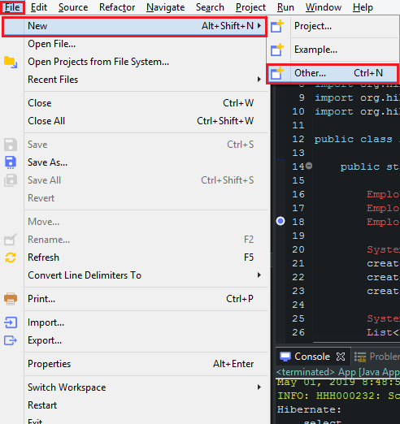
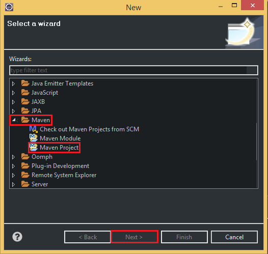
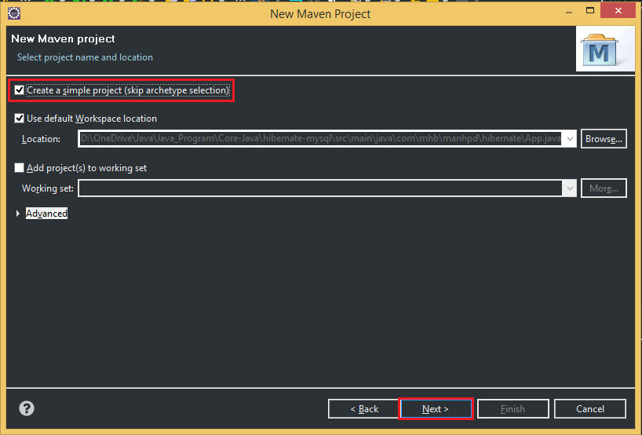
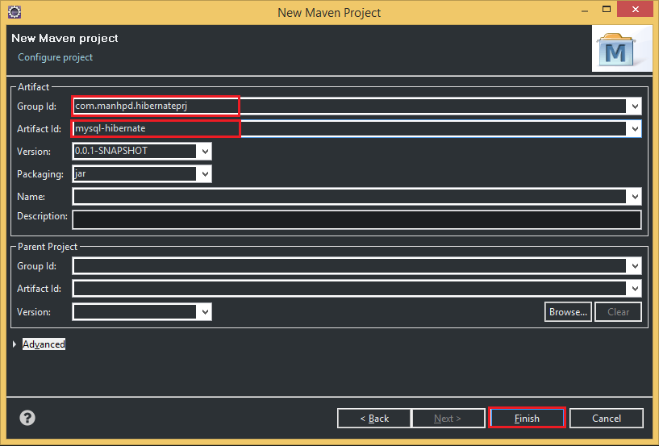
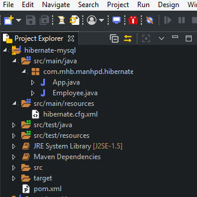

<br>

## Table of content
- [Creating project using Maven](#creating-project-using-maven)
- [Preparing database in MySQL](#preparing-database-in-MySQL)
- [Configuring xml file for Hibernate](#configuring-xml-file-for-Hibernate)
- [Creating entity that is corresponding to a table in MySQL](#creating-entity-that-is-corresponding-to-a-table-in-mysql)
- [Creating CRUD operations to MySQL](#creating-crud-operations-to-mysql) 
- [Fix some problems](#fix-some-problems)
- [Wrapping up](#wrapping-up)


<br>

## Creating project using Maven
Belows are some steps that we need to create project with Maven:









So, after passing all above steps, we have a project that is managed by Maven. When we want to add libraries, we can fill in ```pom.xml``` file.

Finally, we will have the structure of Maven project like the below image:




<br>

## Preparing database in MySQL
In order to implement the communication between MySQL and Hibernate, we need to create our own database in MySQL. The following is the content of sql file that is used to create database and table ```Employee```.

```sql
CREATE DATABASE java_sql;

USE java_sql;

CREATE TABLE `EMPLOYEE` (
    ID INT NOT NULL AUTO_INCREMENT, 
    FULL_NAME VARCHAR(20) DEFAULT NULL,
    AGE INT DEFAULT NULL,

    PRIMARY KEY (ID)
);

INSERT INTO `employee` (ID, FULL_NAME, AGE) 
VALUES 
    (1, "John", 56), 
    (2, "Bill Adam", 45), 
    (3, "Mary Smith", 78);

SELECT * FROM `employee`;
```

<br>

## Configuring xml file for Hibernate
All information about configurations of Hibernate is contained in a standard Java properties file called ```hibernate.properties```, or an XML file named ```hibernate.cfg.xml```.

In this article, we will use the ```hibernate.cfg.xml``` file. It is located in ```src/main/resouces``` folder.

The content of ```hibernate.cfg.xml``` file like that:

```java


```

<br>

## Creating entity that is corresponding to a table in MySQL


<br>

## Creating CRUD operations to MySQL


<br>

## Fix some problems


<br>

## Wrapping up


<br>

Refer: 

[https://examples.javacodegeeks.com/enterprise-java/hibernate/hibernate-annotations-example/](https://examples.javacodegeeks.com/enterprise-java/hibernate/hibernate-annotations-example/)

[https://stackoverflow.com/questions/44248528/what-is-the-maven-dependency-for-java-ee7-and-cdi-2-0](https://stackoverflow.com/questions/44248528/what-is-the-maven-dependency-for-java-ee7-and-cdi-2-0)

[https://www.baeldung.com/ejb-session-beans](https://www.baeldung.com/ejb-session-beans)

[https://dzone.com/articles/in-practice-dependency-injection-with-java-ee](https://dzone.com/articles/in-practice-dependency-injection-with-java-ee)

[https://stackoverflow.com/questions/7297565/javassist-what-is-the-main-idea-and-where-real-use](https://stackoverflow.com/questions/7297565/javassist-what-is-the-main-idea-and-where-real-use)