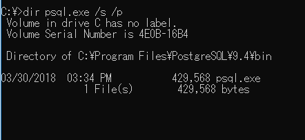

 

## Table of content

 

## Connect to Postgre SQL through command line

 

## The meaning of file postgresql.conf, pg_hba.conf, pgpass.conf

 

## Wrapping up

 

Refer:

[http://www.postgresqltutorial.com/install-postgresql/](http://www.postgresqltutorial.com/install-postgresql/)

[http://www.postgresqltutorial.com/psql-commands/](http://www.postgresqltutorial.com/psql-commands/)