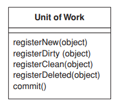

<br>

## Table of content


<br>

## Introduction to Unit of Work
According to website [https://martinfowler.com](https://martinfowler.com/eaaCatalog/unitOfWork.html), we have a definition of it:

```
Maintains a list of objects affected by a business transaction and coordinatess the writing out of changes and the resolution of concurrency problems.
```

And if we want to know about the position of ```Unit of Work``` pattern, we can refer to the following image:


Some operations in ```Unit of Work``` pattern are:




<br>

## The problem of Repository Pattern
When we want to have some CRUD operations with domain model, we will have to use Repository pattern to interact with database. Then, obviously, we always have a lots of small database calls.

So, the cost of interacting with database is very high, because we have to create session for each user,

<br>

## When to use
- Used in Domain Driven Design


<br>

## Source code Java


<br>

## Benefits & Drawback


<br>

## Wrapping up


<br>

Refer:

[https://martinfowler.com/eaaCatalog/unitOfWork.html](https://martinfowler.com/eaaCatalog/unitOfWork.html)