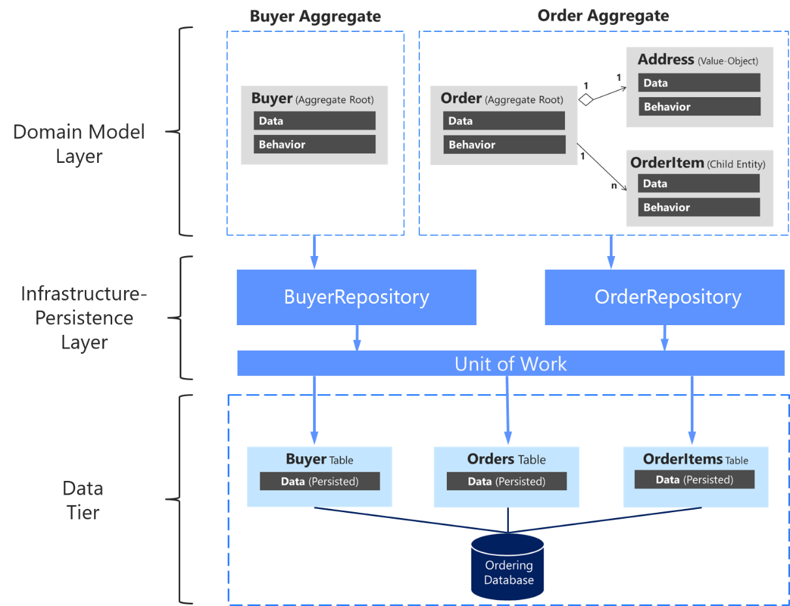

<br>

## Table of content


<br>

## Introduction to Unit of Work
According to website [https://martinfowler.com](https://martinfowler.com/eaaCatalog/unitOfWork.html), we have a definition of it:

```
Maintains a list of objects affected by a business transaction and coordinatess the writing out of changes and the resolution of concurrency problems.
```

And if we want to know about the position of ```Unit of Work``` pattern, we can refer to the following image:




Some operations in ```Unit of Work``` pattern are:


<br>

## The problem of Repository Pattern
When we want to have some CRUD operations with domain model, we will have to use Repository pattern to interact with database. Then, obviously, we always have a lot of small database calls.

So, the cost of interacting with database is very high, because we have to create session for each user, and the time to access database in HDD. It takes so much time.

The main reason to use Unit of Work is that be consistency property of database when we have all requests that are relevant together. So, they must 


<br>

## When to use
- Used in Domain Driven Design
- When we have a set of requests and we want all requests that have to be completed in one transaction. If one request is failed, all the rest of requests will be disactive.

<br>

## Source code Java


<br>

## Benefits & Drawback
1. 


<br>

## Wrapping up
- Examples of Unit of Work pattern are: 
    - ```DbContext``` class represents a combination of the Unit of Work and Repository patterns such that it can be used to query from a database and group together changes that will then be written back to the store as a unit. And ```DbSet``` represents a Repository pattern.

    - ```ITransaction``` interface in ```NHibernate```

    - ```DataContext``` class in ```LINQ to SQL```

    - ```ObjectContext``` class in the ```Entity Framework```.

    - EclipseLink Transactions 


<br>

Refer:

[https://martinfowler.com/eaaCatalog/unitOfWork.html](https://martinfowler.com/eaaCatalog/unitOfWork.html)

[https://www.codeproject.com/Articles/581487/Unit-of-Work-Design-Pattern](https://www.codeproject.com/Articles/581487/Unit-of-Work-Design-Pattern)

[https://www.programmingwithwolfgang.com/repository-and-unit-of-work-pattern/](https://www.programmingwithwolfgang.com/repository-and-unit-of-work-pattern/)

**Patterns in Practice - The Unit Of Work Pattern And Persistence Ignorance**

[https://msdn.microsoft.com/en-us/magazine/dd882510.aspx](https://msdn.microsoft.com/en-us/magazine/dd882510.aspx)

[https://tedu.com.vn/lap-trinh-aspnet/ket-hop-unit-of-work-va-repository-pattern-trong-aspnet-mvc-37.html](https://tedu.com.vn/lap-trinh-aspnet/ket-hop-unit-of-work-va-repository-pattern-trong-aspnet-mvc-37.html)

[https://coding4food.net/2018/07/10/repository-va-unit-of-work-pattern/](https://coding4food.net/2018/07/10/repository-va-unit-of-work-pattern/)

[https://docs.microsoft.com/en-us/dotnet/api/system.data.entity.dbcontext?redirectedfrom=MSDN&view=entity-framework-6.2.0](https://docs.microsoft.com/en-us/dotnet/api/system.data.entity.dbcontext?redirectedfrom=MSDN&view=entity-framework-6.2.0)