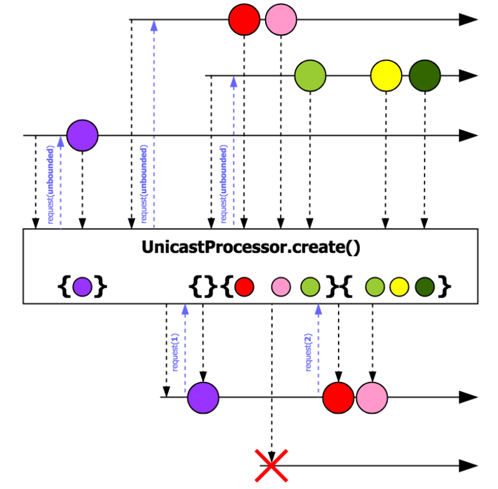
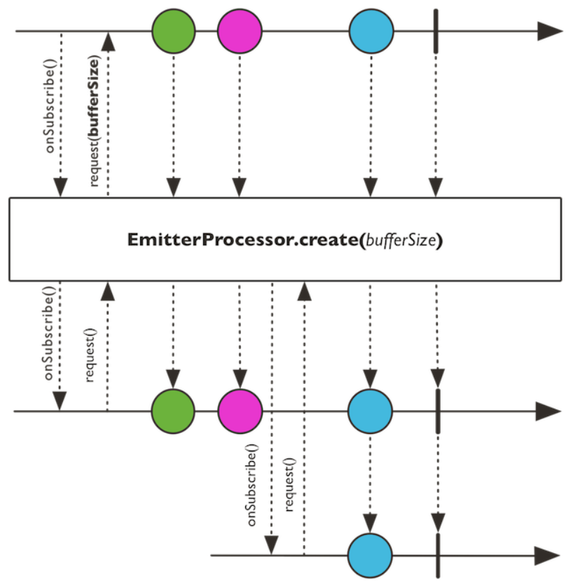
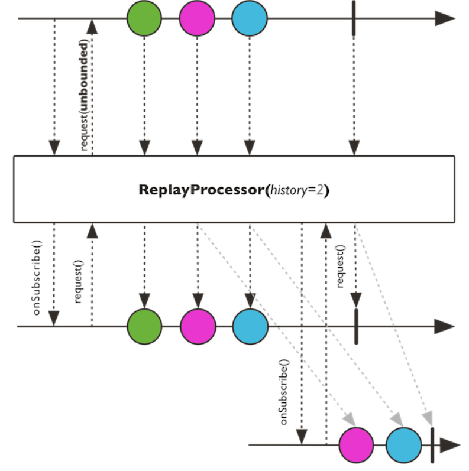

<br>

## Table of contents
- [DirectProcessor](#directprocessor)
- [UnicastProcessor](#unicastprocessor)
- [EmitterProcessor](#emitterprocessor)
- [ReplayProcessor](#replayprocessor)
- [TopicProcessor](#topicprocessor)
- [WorkQueueProcessor](#workqueueprocessor)

<br>

## The background about Processor


<br>

## DirectProcessor

- DirectProcessor connects a processor to a subscriber, and then directly invokes the Subscriber.onNext() method. The processor does not offer any backpressure handling.

    ```java
    public final class DirectProcessor<T> extends FluxProcessor<T, T> {

        // static method
        static <E> DirectProcessor create();

        // other methods
        ...

    }
    ```

    

- DirectProcessor can have multiple consumers, and supports multiple producers. However, all producers must produce messages on the same Thread.

<br>

## UnicastProcessor

- UnicastProcessor has the backpressure functionality. Internally, it creates a queue to hold undelivered events. We can provide an optional queue to buffer the events. After the buffer is full, the processor starts to reject elements. The processor also makes it possible to perform cleanup for every rejected element.

    ```java
    public final class UnicastProcessor extends FluxProcessor<T, T> implements Fuseable.QueueSubscription<T>, Fuseable{
        
        // static methods
        static <E> UnicastProcessor<E> create();

        static <E> UnicastProcessor<E> create(Queue<T> queue);

        static <E> UnicastProcessor<E> create(Queue<T> queue, Consumer<? super T> onOverflow, Disposable endCallback);

        static <E> UnicastProcessor<E> create(Queue<T> queue, Disposable endCallback);

        void onComplete();

        void onError(Throwable t);

        void onNext(T t);

        // ...

    }
    ```

    

- UnicastProcessor allows multiplexing of the events which means that it supports multiple producers

- UnicastProcessor accepts only one subscriber that will work with it. If we add one more subscriber to UnicastProcessor, program will throw an exception.

<br>

## EmitterProcessor

- EmitterProcessor is a processor that can be used with several subscribers.
    
    Multiple subscribers can ask for the next value event, based on their individual rate of consumption.

    The processor provides the necessary backpressure support for each subscriber.

    

- The processor is also capable of publishing events from an external publisher. It consumes an event from the injected publisher and synchronously passes it to the subscribers.

<br>

## ReplayProcessor

- ReplayProcessor is a special-purpose processor, capable of caching and replaying events to its subscribers.

    The processor also has the capability of publishing events from an external publisher.
    
    It consumes an event from the injected publisher and synchronously passes it to the subscribers.

    

- ReplayProcessor can cache events for some scenarios:

    - All events
    - A limited count of events
    - Events bounded by a specified time period
    - Events bounded by a count and a specified time period
    - The last event only

- Once cached, all events are replayed when a subscriber is added.

<br>

## TopicProcessor


<br>

## WorkQueueProcessor


<br>

## The difference between a hot publisher and a cold publisher
- In a hot publisher, it publishes old data for every new subscriber.
- In a cold publisher, it keeps emitting data, when a new subscriber arrives, it receives only newly emitted data.

<br>

## Wrapping up


<br>

Thanks for your reading.

<br>

Refer:

[Hands on Reactive Programming with Reactor](https://subscription.packtpub.com/book/application_development/9781789135794)

[https://www.reactive-streams.org/](https://www.reactive-streams.org/)

