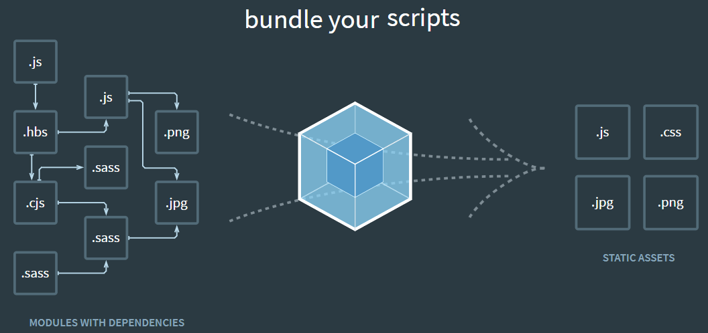

<br>

## Table of contents
- []()


<br>

## What is Webpack ?
- Definition of Webpack

  Webpack is a ```Module bundle```. It takes a bunch of assets such as source, images, css, ... to turn them into something that we will send to client. It means that it will package all dependencies into bundles that browser can understand.

  By default, Webpack only knows how to process ```.js``` or ```.json``` files. To do with other format files, we need to use ```Loader``` such as ```HtmlWebPackPlugin``` for html file, ...

  

- Some functionalities in webpack

  - Hot module reloading: updates React component without refresh website.
  - Lazy loading
  - Bundle splitting
  - Hashing
  - Source maps: debug minified version.

- Folder structure of Js application that use Webpack and Babel

  ```js
  - node_modules
  - dist/
  - index.html
  - src/
  - index.js
  - package.json
  - webpack.config.js
  ```

- Below is the content of webpack.config.js file that we need to know:

  ```js
  const webpack = require("webpack");

  module.exports = {
    // Where to start bundling
    entry: {
      app: "./src/index.js",
    },

    // Where to output
    output: {
      // Output to the same directory
      path: __dirname,    // or path.resolve(__dirname, 'dist'),

      // Capture name from the entry using a pattern
      filename: "[name].js",
    },

    // How to resolve encountered imports
    module: {
      rules: [
        {
          test: /\.css$/,
          use: ["style-loader", "css-loader"],
        },
        {
          test: /\.js$/,
          use: "babel-loader",
          exclude: /node_modules/,
        },
        {
            test: /\.html$/,
            use: [
                {
                    loader: "html-loader"
                }
            ]
        }
      ],
    },

    // What extra processing to perform
    plugins: [
      new webpack.DefinePlugin({ ... }),
      new HtmlWebPackPlugin({
          template: "./src/index.html",
          filename: "./index.html"
      })
    ],

    // Adjust module resolution algorithm
    resolve: {
      alias: { ... },
    },
  };
  ```


- Some modes in Webpack

  There are two modes:
  - development: This mode will remain the structure of file, so, we can easily read source code.

    In order to use development mode, we can configure in package.json file:

    ```json
    "scripts": {
      "start": "webpack-dev-server --mode development --open --hot",
      "build": "webpack --mode development"
    }
    ```

  - production: 

  

<br>

## What is babel ?


<br>

## Setup some packages Webpack and Babel
1. For webpack

    - 


2. For Babel


<br>

## Some notice about using Webpack


<br>

## Wrapping up


<br>

Refer:

[https://levelup.gitconnected.com/what-is-webpack-4fdb624597ae](https://levelup.gitconnected.com/what-is-webpack-4fdb624597ae)

[https://tech.3si.vn/2017/11/24/meo-toi-uu-hoa-webpack-bundle/](https://tech.3si.vn/2017/11/24/meo-toi-uu-hoa-webpack-bundle/)

[https://www.robinwieruch.de/webpack-setup-tutorial](https://www.robinwieruch.de/webpack-setup-tutorial)

[https://survivejs.com/webpack/what-is-webpack/](https://survivejs.com/webpack/what-is-webpack/)


[https://www.robinwieruch.de/minimal-react-webpack-babel-setup](https://www.robinwieruch.de/minimal-react-webpack-babel-setup)

[https://www.robinwieruch.de/minimal-react-webpack-babel-setup#react-webpack](https://www.robinwieruch.de/minimal-react-webpack-babel-setup#react-webpack)

[https://www.robinwieruch.de/webpack-babel-setup-tutorial](https://www.robinwieruch.de/webpack-babel-setup-tutorial)

[http://vuilaptrinh.com/2018-05-25-huong-dan-viet-code-javascript-tot-hon-voi-webpack/](http://vuilaptrinh.com/2018-05-25-huong-dan-viet-code-javascript-tot-hon-voi-webpack/)