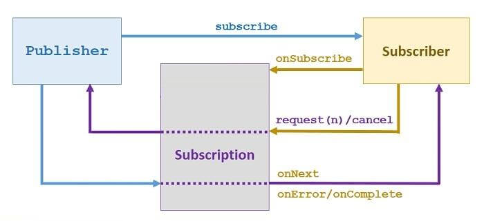

<br>

## Table of contents
- [What is Reactive programming ?](#what-is-reactive-programming-?)
- [Reactive architecture](#reactive-architecture)
- [How does Java implement Reactive programming ?](#how-does-java-implement-reactive-programming-?)
- [Benefits and Drawbacks](#benefits-and-drawbacks)
- [Applications of Reactive programming](#application-of-reactive-programming)
- [Wrapping up](#wrapping-up)

<br>

## What is Reactive programming ?
In a modern web application, response speed or the latency proprety is an important property to make user come back with your website, beside UI - User Interface, UX - User Experience.

When a user send a request to server such as get all cell phones's information for specific type, we have two ways to deal with it:
- Synchronous approach: Keep the user waiting util the result has not been processed to find the list of the cell phones that will be fetched from the database.

- Asynchronous approach: Allow the user to proceed further and use other stuff in the application, such as finding cell phone details, availability of items, and so on.

So, easily our reactive programming will be using asynchronous approach.

<br>

## Reactive architecture

[https://dzone.com/articles/reactive-streams-in-java-9](https://dzone.com/articles/reactive-streams-in-java-9)


<br>

## How does Java implement Reactive programming ?
In Reactive programming, Reactive Stream is a center concept, it completely boosts the performance of the stream of java.

There are many libraries that implement the Reactive Stream specification. They support Reactive programming such as:
- Akka
- Reactor
- RxJava
- Streams
- Ratpack
- Vert.x.

Because of Spring that is utilizing Reactor library to implement reactive streams, so, we will see Reactor will contain which elements in it.

Below is some parts of Reactor library:



- Publisher

    According to [http://www.reactive-streams.org](http://www.reactive-streams.org/reactive-streams-1.0.0-javadoc/org/reactivestreams/Publisher.html) about Publisher, we have:
    - A Publisher is a provider of a potentially unbounded number of sequenced elements, publishing them according to the demand received from its Subscribers.
    - A Publisher can serve multiple Subscribers subscribed 

    ```Java
    public interface Publisher<T> {
        // request Publisher to start streaming data
        // This is a factory method, and can be called multiple times, each time starting a new Subscription.
        // Each Subscription will work for only a single Subscriber.
        void subscribe(Subscriber<? super T> s);
    }
    ```

- Subscriber

    According to [http://www.reactive-streams.org](http://www.reactive-streams.org/reactive-streams-1.0.0-javadoc/org/reactivestreams/Subscriber.html) about Subscriber, we have:
    -  Will receive call to ```onSubscribe(Subscription)``` once after passing an instance of Subscriber to ```Publisher.subscribe(Subscriber)```.
    - No further notifications will be received until ```Subscription.request(long)``` is called.

    ```Java
    public interface Subscriber<T> {
        // successful terminal state
        void onComplete();

        // failed terminal state
        void onError(Throwable t);

        // data notification sent by the Publisher in response to requests to Subscription.request(long)
        void onNext(T t);

        // invoked after calling Publisher.subscribe(Subscriber)
        void onSubscribe(Subscription s);
    }
    ```

- Subscription

    According to [http://www.reactive-streams.org](http://www.reactive-streams.org/reactive-streams-1.0.0-javadoc/org/reactivestreams/Subscription.html#request-long-), we have:
    - A Subscription represents a one-to-one lifecycle of a Subscriber subscribing to a Publisher.
    - It can only be used once by a single Subscriber.
    - It is used to both signal desire for data and cancel demand (and allow resource cleanup).


    ```Java
    public interface Subscription {
        // request the Publisher to stop sending data and clean up resources
        void cancel();

        // no events will be sent by a Publisher until demand is signaled via this method
        void request(long n);
    }
    ```

<br>

## Benefits and Drawbacks
1. Benefits

    - It increases the performance of the application.
    - It increases the utilization of computing resources on a multicore.
    - It provides a more maintainable approach to deal with asynchronous programming.
    - It includes back pressure, which plays a vital role to avoid over-utilization of the resources.

    Because:
    - Reactive system supports parallel programming to avoid blocking of the resources in order to utilize the hardware to its fullest.

<br>

## Applications of Reactive programming


<br>

## Wrapping up
- Before Java 8, asynchronous non-blocking behavior was not obvious to implement for at least two reasons.

    - Callback based API required verbose anonymous classes and are not easy to chain.
    - ```Future``` type is asynchronous but blocks the current thread until the computation completes when we try to get the result with the ```get()``` method.

- Netty server

    - Monolithic: 200-300 requests/sec/host
    - Reactive: 10-20k requests/sec/host

<br>

[https://www.lightbend.com/blog/understand-reactive-architecture-design-and-programming-in-less-than-12-minutes](https://www.lightbend.com/blog/understand-reactive-architecture-design-and-programming-in-less-than-12-minutes)