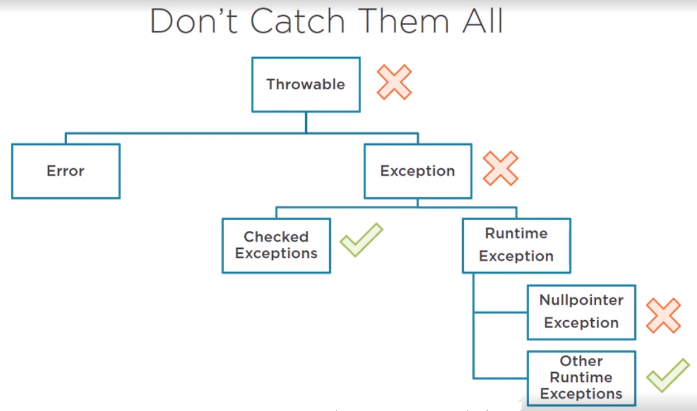

<br>

## Table of contents
- [Catch specific exceptions](#catch-specific-exceptions)
- [Catch block](#catch-block)
- [Finally block](#finally-block)

 
<br>

## Catch specific exceptions
In Java, we have a lot of exceptions, 
- First we should not catch the top-level ```Throwable``` because when encountering exception, we do not know the meanings of this exception. It's hard to fix bug. Instead, we can catch out of memory error or internal error.

- Next, try to avoid catching the general exception as well, at least 90% of the time. We might catch some runtime exception that shouldn't be caught. 

    We should not catch ```NullPointerException```. ```NullPointers``` are not supposed to be caught because they are usually the result of programming errors. So, if we catch and handle ```NullPointers```, then we essentially cover up our own programming mistakes, a bit like sweeping problems under the carpet. That's not a good thing.

    Instead, try our best to prevent nulls as much as possible especially if it's in our own code. But sometimes we have no control whether we get a null from third-party software, so then the second best thing we can do is check for null with an if statement.

    Look at our example:

    ```java
    public static void main(String[] args) {

        // too long
        // We are catching so much exceptions here.
        try {
            readFile();
            executeSqlQuery();
        } catch (FileNotFoundException ex) {
            // handle it
        } catch (IOException e) {
            // handle it
        } catch (SQLException e) {
            // handle it
        }
    }
    ```

    So, to refactor the above code, we can catch only one ```Exception```. but it is not good idea.

    ```java
    // NO!
    // This code just catches one single general exception.
    // As we can see, this is much less code, so it looks like clean code
    // However, it is not advised to do this.
    // Problem: we might end up catching unwanted runtime exception, such as NullPointer
    try {
        readFile();
        executeSqlQuery();
    } catch (Exception ex) {
        // one exception to rule them all
    }
    ```

    So, we can squeeze all exceptions in one single line. But it has downside - we can not tailor our exception message for each. We have to write a more generic message that fits them all.

    ```java
    // Java 7 or latter provides a way to declare all of exceptions in a single line
    // Benefits: fewer lines of code.
    // Downside: we can not tailor our exception message for each. We have to write a more generic message that fits them all.
    try {
        readFile();
        executeSqlQuery();
    } catch (IOException | SQLException ex) {
        // balance - handle in Java 7 way
    }
    ```

    In order to improve above case, we should do not start branching code with if statement like below. Because, that does not bring any benefit compared to the original way of doing it. If we are tempted to do this, because we want to have a specific message for each exception, then we might as well just have a long catch list.

    ```java
    // NO!
    try {
        readFile();
        executeSqlQuery();
    } catch (IOException | SQLException ex) {
        if (ex instanceof IOException) {
            // do something
        }

        if (ex instanceof SQLException) {
            // do something
        }
    }
    ```




<br>

## Catch block


<br>

## Finally block


<br>

## Wrapping up


<br>

Thanks for your reading.

<br>

Refer:

[https://dzone.com/articles/using-java-enums?fromrel=true](https://dzone.com/articles/using-java-enums?fromrel=true)

[https://dzone.com/articles/reasons-why-the-constant-interface-pattern-is-disc?fromrel=true](https://dzone.com/articles/reasons-why-the-constant-interface-pattern-is-disc?fromrel=true)

[https://dzone.com/articles/java-enums-how-to-make-much-more-useful?fromrel=true](https://dzone.com/articles/java-enums-how-to-make-much-more-useful?fromrel=true)