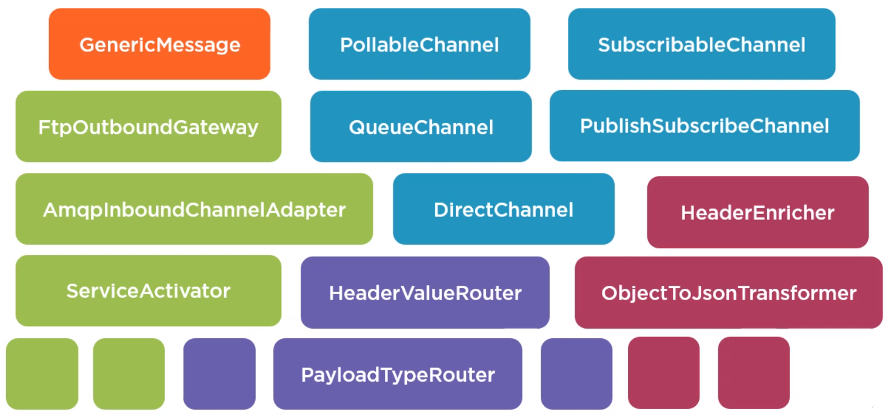

 

## Table of Contents
- [Given problem](#given-problem)
- 
- 
- 
- [Wrapping up](#wrapping-up)

 

## Given problem

 

## Solution of Spring Integration

1. Introduction to Spring Integration

    Spring Integration is an implementation of the Enterprise Integration Patterns based on the Spring framework. It contains many ready to use implementations of the concepts of the Enterprise Integration patterns in the form of interfaces and classes that are designed with the main principles of the Spring framework in mind.

    

    It has interfaces and classes of messages, different kinds of message channels, many different kinds of endpoints, and transformers and Routers.

    We can use these components with the standard Spring framework programming techniques such as dependency injection, which helps us to maintain separation of concerns between business logic and integration logic.

    If we are familiar with the Spring framework, we know that we can configure Spring Beans in the application context using XML or with annotations in Java code. So Spring Integration also can be configure by using XML namespace and annotations. Besides the usual XML and annotation to configure our application context, Spring Integration also provides a Domain-Specific Config Language to configure components.

    Using these Domain-Specific Language, we can configure Spring Integration components in a readable way.

 

## 

 

## 

 

## 

 

## Wrapping up

 

Refer:

