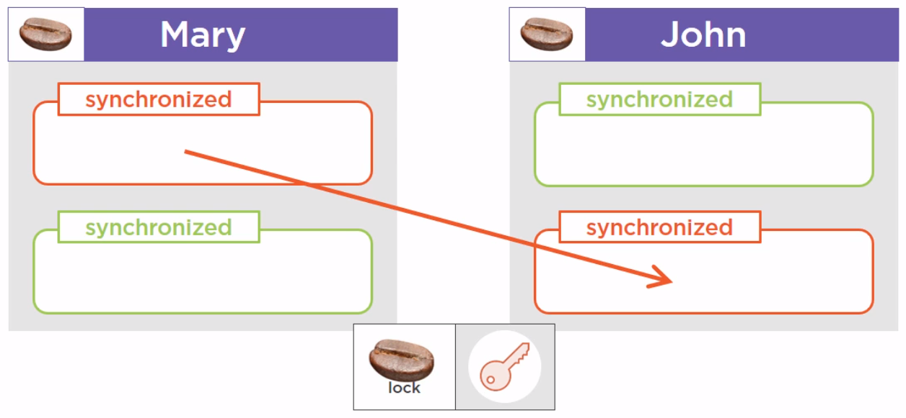
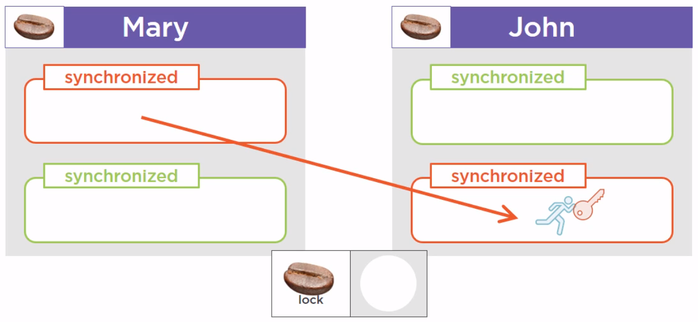
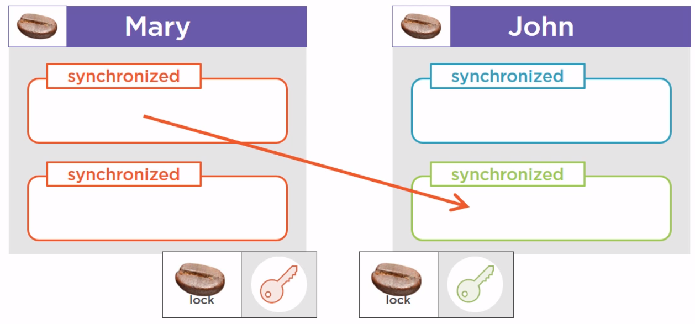
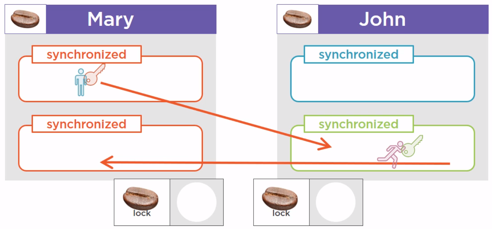

<br>

## Table of contents
- [Reentrant lock](#reentrant-lock)
- [Deadlock](#deadlock)
- [When to use Reentrant lock](#when-to-use-reentrant-lock)
- [Different between Reentrant lock and synchronized keyword](#different-between-reentrant-lock-and-synchronized-keyword)
- [Wrapping up](#wrapping-up)

<br>

## Reentrant lock
Assuming that we have two instances of Person class - Mary and John, and we have a bunch of synchronized method in those instances. Now it turns out that the first synchronized method from the Mary instance, calls another synchronized method of the John instance, that happens to be synchronized with the same lock object.



Here our methods are guarded with red fences, and to enter this method, we need the red key. So, a thread that is running this method from the Mary object will take the key, and at some point will need to enter the synchronized method from the John instance. The red key needs to be available for this thread enter this method. It turns out that this key is not available. But the thread holding that key is precisely the thread that is asking for it. So this is an exception to the rule called reentrance. And this thread, since it is already holding the right key, will be allowed to run the other method.



This rule is quite natural to understand, but it still has to be stated.

```
When a thread holds a lock, it can enter a block synchronized on the lock it is holding.
```

<br>

## Deadlock

We still have two Mary and John instances of Person class. And we have a synchronized method that is calling another synchronized method. Now we are not in the same case as the previous [Reentrant lock](#reentrant-lock) section that is the first method is synchronized using a red key, and the method called by this method is synchronized using a green key.



And for some reasons, this green protected method calls another method, the third one, protected also by the red key. What is going to happen in this case?



The blue thread is going to take the red key and begin to run the first method. And at the same time, the purple thread is going to take the green key, and to run the other method. 

At some point, the blue thread will need the green key to enter the green method, but the purple thread has it. 

So this blue thread has to wait. And the purple thread will arrive at the point of code where it needs the red key to continue to run. And unfortunately the red key is available, because it is held by the blue thread. And this case is a deadlock, that is, the green key will never be released by the purple thread.

So because of that, the blue thread is blocked. And since it is holding the red key needed by the purple thread, the purple thread will never continue to advance, nor the blue thread.

--> A deadlock is a situation where a thread T1 holds a key needed by a thread T2, and T2 holds the key needed by T1.

So as long as no thread releases its key, the situation is blocked, and called a deadlock.

Fortunately, the JVM is able to detect deadlock situations, and can log information to help debug the application.

But there is not much we can do if a deadlock situation occurs, beside rebooting the JVM.

<br>

## Some methods of Reentrant lock


<br>

## When to use Reentrant lock
- 


<br>

## Benefits and drawbacks 


<br>

## Different between Reentrant lock and synchronized keyword


<br>

## Wrapping up
- ```ReentrantLock``` is mutual exclusive lock, similar to implicit locking provided by synchronized keyword in Java, with extended feature like fairness, which can be used to provide lock to longest waiting thread.

- ```ReentrantLock``` is a concrete implementation of Lock interface in concurrency package of Java 1.5.

<br>

Refer:

Appying Concurrency and Multithreading to Common Java patterns in [pluralsight.com](pluralsight.com)