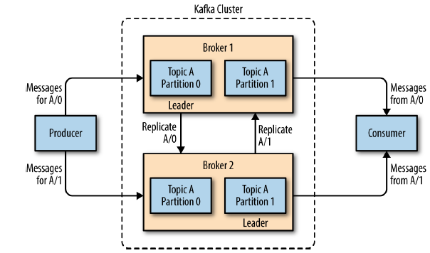

<br>

## Table of contents
- [Given problem](#given-problem)
- [Solution of using Kafka](#solution-of-using-kafka)
- [Concepts in Kafka](#concepts-in-kafka)
- [The architecture of Kafka](#the-architecture-of-kafka)
- [Wrapping up](#wrapping-up)

<br>

## Given problem

Assuming that we create an application that needs to send monitoring information somewhere, so we write in a direct connection from our application to an app that displays our metrics on a dashboard, and push metrics over that connections. Then we have our system looks like this:


But in our system, we need to analyze our metrics over a longer terms. So we will create a new service that can receive metrics, store them, and analyze them. And other systems also want to get individual metrics and use them for various purposes. So, our system's architecture will be described in the below image:


We can easily find some drawbacks of this architecture:
- it's hard to trace connections between systems.
- in the future, our system's complexity increases, it takes so much time to understand it because it becomes mess.
- tightly coupling between producers and consumers.

<br>

## Solution of using Kafka

Our problems is as same as the problems of [Mediator pattern](https://ducmanhphan.github.io/2020-01-29-Mediator-pattern/). So, to deal with them, we will create a single application that receives metrics from all the applications and provide a server to query those metrics for any system that needs them. It's called **Metrics Pub/Sub** for queuing data.


When we need to do similar work with log messages, because we have to track user behavior on the front-end website to collect data for working on machine learning or some reports for management, we also will create other queue system that is similar **Metrics Pub/Sub**.


All above systems are called a publish/subscribe messaging system. This publish/subscribe messaging system can be described with the following information:
- Publish/subscribe messaging is a pattern that is characterized by the sender (publisher) of a piece of data (message) not specifically directing it to a receiver.

- The publisher classifies the message somehow, and that receiver (subscriber) subscribes to receive certain classes of messages.

- Pub/Sub system often have a broker, a central point where messages are published, to facilitate this.

To implement this publish/subscribe messaging system, we have Apache Kafka.

According to [wikipedia.com](https://en.wikipedia.org/wiki/Apache_Kafka), we have:

```
Apache Kafka is an open-source stream processing software platform developed by Linkedln and donated to the Apache Software Foundation, written in Scala and Java. The project aims to provide a unified, high-throughput, low-latency platform for handling real-time data feeds. Kafka can connect to external systems (for data import/export) via Kafka Connect and provides Kafka Streams, a Java stream processing library. Kafka uses a binary TCP-based protocol that is optimized for efficiency and relies on a "message set" abstraction that naturally groups messages together to reduce the overhead of the network roundtrip.
```

<br>

## Concepts in Kafka

1. Message

    The unit of data within Kafka is called a *message*. In database, we can consider it as a row or a record. A *message* is simply an array of bytes, so it does not have a specific format or meaning.

    A message can have an optional bit of metadata, which is referred to as a *key*. Keys are used when messages are to be written to partitions in a more controlled manner. This key is generated by using **consistent hashing**.

2. Cluster and Broker

    A single Kafka server is called a *broker*. The broker receives messages from producers, assigns *offsets* to them, and commits the messages to storage on disk. It also services consumers, responding to fetch requests for partitions and responding with the messages that have been committed to disk. Depending on the specific hardware and its performance characteristics, a single broker can easily handle thousands of partitions and millions of messages per second.

    Kafka broker leader election can be done by Zookeeper. Means in case of data loss, Zookeeper decide which broker to make a master and which broker to make a slave.

    Kafka brokers are designed to operate as a part of a *cluster*. Within a cluster of brokers, one broker will also function as the cluster controller (elected automatically from the live members of the cluster). The controller is responsible for administrative operations, including assigning partitions to brokers and and monitoring for broker failures. A partition is owned by a single broker in the cluster, and that broker is called the leader of the partition. A partition may be assigned to multiple brokers, which will result in the partition being replicated as seen in the below image. This provides redundancy of messages in the partition, such that another broker can take over leadership if there is a broker failure. However, all consumers and producers operating on that partition must connect to the leader.

    


3. Producer and Consumer

    Producers create new messages. By default, the producer does not care what partition a specific message is written to and will balance messages over all partitions of a topic evenly. In some cases, the producer will direct messages to specific partitions. This is typically done using the message key and a partitioner that will generate a hash of the key and map it to a specific partition. This assures that all messages produced with a given key will get written to the same partition. The producer could also use a custom partitioner that follows other business rules for mapping messages to partitions.

    When the new broker is started, all the producers search it and automatically sends a message to that new broker. Kafka producer doesn't wait for acknowledgments from the broker and sends messages as fast as the broker can handle.

    Consumers read messages. The consumer subscribes to one or more topics and reads the messages in the order in which they were produced. Consumers work as a part of a *Consumer Group*, which is one or more consumers that work together to consume a topic. The group assures that each partition is only consumed by one member. In this way, consumers can horizontally scale to consume topics with a large number of messages. Additionally, **if a single consumer fails, the remaining members of the group will rebalance the partitions being consumed to take over for the missing member**.

4. Topic, Partition and Offset

    - Topic

        

        Messages in Kafka are categorized into *topics*. We can think of topic as database table or a folder in a filesystem.

    - Partition

        Topics are additional broken down into a number of *partitions*. Partitions allow us to parallelize a topic by splitting the data in a particular topic across multiple brokers — each partition can be placed on a separate machine to allow for multiple consumers to read from a topic in parallel. Consumers can also be parallelized so that multiple consumers can read from multiple partitions in a topic allowing for very high message processing throughput.

        Partitions are the way that Kafka provides redundancy and scalability. Each partition can be hosted on the different server, which means that a single topic can be scaled horizontally across multiple servers to provide performance far beyond the ability of a single server.

        The number of partitions can be configured when we create a new topic.

        ```python
        # create test topic
        bin/kafka-topics.sh --create
                            --zookeeper localhost:2181
                            --replication-factor <num_brokers_replicate>
                            --partitions <num_partitions_per_topic>
                            --topic <name_topic>
        ```

        Benefits of having multiple partitions in a topic:
        - allows for multiple consumers to read from a topic in parallel.

    - Offset

        Each message within a partition has an identifier called its *offset*. The *offset* is another bit of metadata, an integer value that continually increases - that Kafka adds to each message as it is produced. So, we can find that Kafka brokers are stateless.
        
        The *offset* the ordering of messages as an immutable sequence. Kafka maintains this message ordering for us. Consumers can read messages starting from a specific offset and are allowed to read from any offset point they choose, allowing consumers to join the cluster at any point in time they see fit. Given these constraints, each specific message in a Kafka cluster can be uniquely identified by a tuple consisting of the message's topic, partition, and offset within the partition. By storing the offset of the last consumed message for each partition, either in Zookeeper or in Kafka itself, a consumer can stop and restart without losing its place.

        Why we need offset in partitions for each consumer?

        --> Because we have multiple producers, consumers on one topic, each producer push messages into topic's partition. Then each consumer need to keep track which messages it has already consumed by keeping track of the offset of messages.

5. Zookeeper

    It's used to manage and coordinate with the broker. *ZooKeeper* service is mainly used to notify producer and consumer about the presence or failure of any new broker in the Kafka system. As per the notification received by the Zookeeper regarding presence or failure of the broker then producer and consumer take a decision and starts coordinating their task with some other broker.

<br>

## The architecture of Kafka


<br>

## Wrapping up


<br>

Refer:

[Kafka: The definitive guide book](https://www.amazon.com/Kafka-Definitive-Real-Time-Stream-Processing/dp/1491936169)

[Apache Kafka cookbook](https://www.amazon.com/Apache-Kafka-Cookbook-Saurabh-Minni-ebook/dp/B015EHCTES)

[Learning Apache Kafka, 2nd Edition](https://www.amazon.com/Learning-Apache-Kafka-Nishant-Garg-ebook/dp/B00U2MI8MI)

[Apache Kafka - Packpub]()

[https://blog.scottlogic.com/2018/04/17/comparing-big-data-messaging.html](https://blog.scottlogic.com/2018/04/17/comparing-big-data-messaging.html)

[https://sookocheff.com/post/kafka/kafka-in-a-nutshell/](https://sookocheff.com/post/kafka/kafka-in-a-nutshell/)

[https://data-flair.training/blogs/kafka-architecture/](https://data-flair.training/blogs/kafka-architecture/)

[https://linuxhint.com/install-apache-kafka-ubuntu/](https://linuxhint.com/install-apache-kafka-ubuntu/)

[https://www.coretechnologies.com/products/AlwaysUp/Apps/RunApacheKafkaAsAWindowsService.html](https://www.coretechnologies.com/products/AlwaysUp/Apps/RunApacheKafkaAsAWindowsService.html)

[https://kafka.apache.org/quickstart](https://kafka.apache.org/quickstart)

[http://kafka.apache.org/intro](http://kafka.apache.org/intro)

[https://chrzaszcz.dev/2019/05/26/kafka-101/](https://chrzaszcz.dev/2019/05/26/kafka-101/)

[https://blog.scottlogic.com/2018/04/17/comparing-big-data-messaging.html](https://blog.scottlogic.com/2018/04/17/comparing-big-data-messaging.html)

<br>

**Architecture of Kafka**

[https://blog.usejournal.com/understanding-apache-kafka-the-messaging-technology-for-modern-applications-4fbc18f220d3](https://blog.usejournal.com/understanding-apache-kafka-the-messaging-technology-for-modern-applications-4fbc18f220d3)