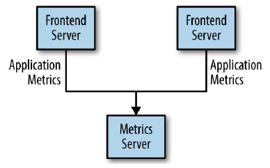
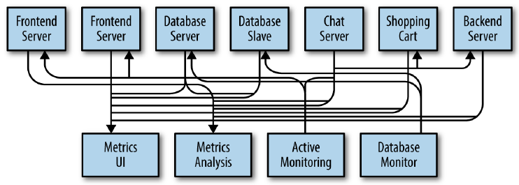
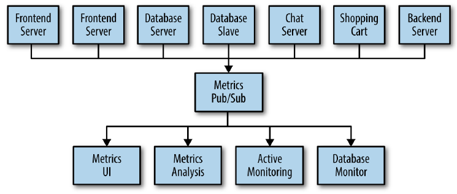
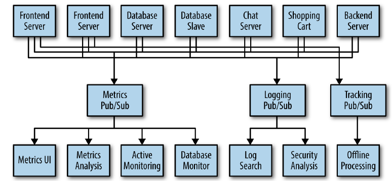

<br>

## Table of contents
- [Given problem](#given-problem)
- [Solution of using Kafka](#solution-of-using-kafka)
- [Concepts in Kafka](#concepts-in-kafka)
- [The architecture of Kafka](#the-architecture-of-kafka)
- [Coordinator in Kafka](#coordination-in-kafka)
- [Rebalancing in kafka](#rebalancing-in-kafka)
- [Heartbeat thread in Kafka](#heartbeat-thread-in-kafka)
- [Some problems when running kafka](#some-problems-when-using-kafka)
- [Wrapping up](#wrapping-up)

<br>

## Given problem

Assuming that we create an application that needs to send monitoring information somewhere, so we write in a direct connection from our application to an app that displays our metrics on a dashboard, and push metrics over that connections. Then we have our system looks like this:



But in our system, we need to analyze our metrics over a longer terms. So we will create a new service that can receive metrics, store them, and analyze them. And other systems also want to get individual metrics and use them for various purposes. So, our system's architecture will be described in the below image:



We can easily find some drawbacks of this architecture:
- it's hard to trace connections between systems.
- in the future, our system's complexity increases, it takes so much time to understand it because it becomes mess.
- tightly coupling between producers and consumers.

<br>

## Solution of using Kafka

Our problems is as same as the problems of [Mediator pattern](https://ducmanhphan.github.io/2020-01-29-Mediator-pattern/). So, to deal with them, we will create a single application that receives metrics from all the applications and provide a server to query those metrics for any system that needs them. It's called **Metrics Pub/Sub** for queuing data.



When we need to do similar work with log messages, because we have to track user behavior on the front-end website to collect data for working on machine learning or some reports for management, we also will create other queue system that is similar **Metrics Pub/Sub**.



All above systems are called a publish/subscribe messaging system. This publish/subscribe messaging system can be described with the following information:
- Publish/subscribe messaging is a pattern that is characterized by the sender (publisher) of a piece of data (message) not specifically directing it to a receiver.

- The publisher classifies the message somehow, and that receiver (subscriber) subscribes to receive certain classes of messages.

- Pub/Sub system often have a broker, a central point where messages are published, to facilitate this.

To implement this publish/subscribe messaging system, we have Apache Kafka.

According to [wikipedia.com](https://en.wikipedia.org/wiki/Apache_Kafka), we have:

```
Apache Kafka is an open-source stream processing software platform developed by Linkedln and donated to the Apache Software Foundation, written in Scala and Java. The project aims to provide a unified, high-throughput, low-latency platform for handling real-time data feeds. Kafka can connect to external systems (for data import/export) via Kafka Connect and provides Kafka Streams, a Java stream processing library. Kafka uses a binary TCP-based protocol that is optimized for efficiency and relies on a "message set" abstraction that naturally groups messages together to reduce the overhead of the network roundtrip.
```

<br>

## Concepts in Kafka

1. Message

    The unit of data within Kafka is called a *message*. In database, we can consider it as a row or a record. A *message* is simply an array of bytes, so it does not have a specific format or meaning.

    A message can have an optional bit of metadata, which is referred to as a *key*. Keys are used when messages are to be written to partitions in a more controlled manner. This key is generated by using **consistent hashing**.

2. Cluster and Broker


3. Producer and Consumer


4. Topic and Partition

    

    Messages in Kafka are categorized into *topics*. We can think of topic as database table or a folder in a filesystem.
    
    Topics are additional broken down into a number of *partitions*. Partitions allow us to parallelize a topic by splitting the data in a particular topic across multiple brokers — each partition can be placed on a separate machine to allow for multiple consumers to read from a topic in parallel. Consumers can also be parallelized so that multiple consumers can read from multiple partitions in a topic allowing for very high message processing throughput.

    Each message within a partition has an identifier called its *offset*. The *offset* the ordering of messages as an immutable sequence. Kafka maintains this message ordering for us. Consumers can read messages starting from a specific offset and are allowed to read from any offset point they choose, allowing consumers to join the cluster at any point in time they see fit. Given these constraints, each specific message in a Kafka cluster can be uniquely identified by a tuple consisting of the message's topic, partition, and offset within the partition.

    Partitions are the way that Kafka provides redundancy and scalability. Each partition can be hosted on the different server, which means that a single topic can be scaled horizontally across multiple servers to provide performance far beyond the ability of a single server.


<br>

## The architecture of Kafka


<br>

## Coordinator in Kafka

[https://jaceklaskowski.gitbooks.io/apache-kafka/kafka-consumer-internals-ConsumerCoordinator.html](https://jaceklaskowski.gitbooks.io/apache-kafka/kafka-consumer-internals-ConsumerCoordinator.html)


<br>

## Rebalancing in kafka


<br>

## Heartbeat thread in Kafka


<br>

## Thread-safty with consumer
According to [https://www.oreilly.com/library/view/kafka-the-definitive/9781491936153/ch04.html](https://www.oreilly.com/library/view/kafka-the-definitive/9781491936153/ch04.html), we have:

```
You can't have multiple consumers that belong to the same group in one thread and you can't have multiple threads safely use the same consumer. One consumer per thread is the rule. To run multiple consumers in the same group in one application, you will need to run each in its own thread. It is useful to wrap the consumer logic in its own object and then use Java's ExecutorService to start multiple threads each with its own consumer. The Confluent blog has a tutorial that shows how to do just that.
```


<br>

## Some problems when running kafka
1. ```attempt to heartbeat failed since group is rebalancing```

[https://stackoverflow.com/questions/40162370/heartbeat-failed-for-group-because-its-rebalancing](https://stackoverflow.com/questions/40162370/heartbeat-failed-for-group-because-its-rebalancing)


<br>

## Wrapping up


<br>

Refer:

[Kafka: The definitive guide book]()

[https://sookocheff.com/post/kafka/kafka-in-a-nutshell/](https://sookocheff.com/post/kafka/kafka-in-a-nutshell/)

[https://linuxhint.com/install-apache-kafka-ubuntu/](https://linuxhint.com/install-apache-kafka-ubuntu/)

[https://www.coretechnologies.com/products/AlwaysUp/Apps/RunApacheKafkaAsAWindowsService.html](https://www.coretechnologies.com/products/AlwaysUp/Apps/RunApacheKafkaAsAWindowsService.html)

[https://kafka.apache.org/quickstart](https://kafka.apache.org/quickstart)

[http://kafka.apache.org/intro](http://kafka.apache.org/intro)

[https://chrzaszcz.dev/2019/05/26/kafka-101/](https://chrzaszcz.dev/2019/05/26/kafka-101/)

<br>

**Hearbeat thread**

[http://javierholguera.com/2018/01/01/timeouts-in-kafka-clients-and-kafka-streams/](http://javierholguera.com/2018/01/01/timeouts-in-kafka-clients-and-kafka-streams/)

[https://stackoverflow.com/questions/39730126/difference-between-session-timeout-ms-and-max-poll-interval-ms-for-kafka-0-10-0/39759329#39759329](https://stackoverflow.com/questions/39730126/difference-between-session-timeout-ms-and-max-poll-interval-ms-for-kafka-0-10-0/39759329#39759329)

[https://devguli.com/heartbeat-thread-in-kafka-consumer/](https://devguli.com/heartbeat-thread-in-kafka-consumer/)

[https://cwiki.apache.org/confluence/display/KAFKA/KIP-62%3A+Allow+consumer+to+send+heartbeats+from+a+background+thread](https://cwiki.apache.org/confluence/display/KAFKA/KIP-62%3A+Allow+consumer+to+send+heartbeats+from+a+background+thread)

[https://chrzaszcz.dev/2019/06/kafka-heartbeat-thread/](https://chrzaszcz.dev/2019/06/kafka-heartbeat-thread/)

[https://stackoverflow.com/questions/40162370/heartbeat-failed-for-group-because-its-rebalancing](https://stackoverflow.com/questions/40162370/heartbeat-failed-for-group-because-its-rebalancing)

<br>

**Rebalancing**

[https://stackoverflow.com/questions/43991845/kafka10-1-heartbeat-interval-ms-session-timeout-ms-and-max-poll-interval-ms](https://stackoverflow.com/questions/43991845/kafka10-1-heartbeat-interval-ms-session-timeout-ms-and-max-poll-interval-ms)

[https://www.slideshare.net/ConfluentInc/everything-you-always-wanted-to-know-about-kafkas-rebalance-protocol-but-were-afraid-to-ask-matthias-j-sax-confluent-kafka-summit-london-2019](https://www.slideshare.net/ConfluentInc/everything-you-always-wanted-to-know-about-kafkas-rebalance-protocol-but-were-afraid-to-ask-matthias-j-sax-confluent-kafka-summit-london-2019)

<br>

**Multithreading with Kafka's consumer**

[https://howtoprogram.xyz/2016/05/29/create-multi-threaded-apache-kafka-consumer/](https://howtoprogram.xyz/2016/05/29/create-multi-threaded-apache-kafka-consumer/)

[https://www.reactiveprogramming.be/an-introduction-to-apache-kafka/](https://www.reactiveprogramming.be/an-introduction-to-apache-kafka/)

[https://www.reactiveprogramming.be/an-introduction-to-reactor-kafka/](https://www.reactiveprogramming.be/an-introduction-to-reactor-kafka/)