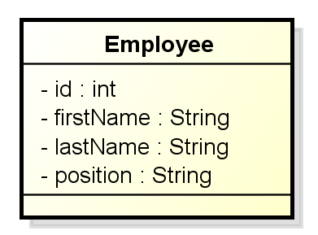

<br>

## Table of contents
- [Given Problem](#given-problem)
- [Solution of Builder Pattern](#solution-of-builder-pattern)
- [When to use](#when-to-use)
- [Benefits & Drawback](#benefits-&-drawback)
- [Code C++ /Java / Javascript](#code-c++-java-javascript)
- [Application & Examples](#application-&-examples)
- [Wrapping up](#wrapping-up)


<br>

## Given Problem 


<br>

## Solution of Builder Pattern


<br>

## When to use
- When we have to define multiple constructor with different arguments dynamically.
- When we create a complex object, so we need to separate large steps into smaller steps

<br>

## Benefits & Drawback
1. Benefits


2. Drawbacks
- Objects with the Builder pattern is typically designed to immutable.

- The pattern itself is also implemented with a static inner class.

- Designed first because unlike Protorype pattern, it is not something that is usually refactored in after the fact.

- It does add a little bit more complexity to our implementing class over what could've been done with just a constructor, but without some of the nice features of the builder patterns.

<br>

## Code C++ /Java / Javascript
In order to get example about this pattern, we can see the object in the following image - that we need to apply:



About source code, we can go to this [link](https://github.com/DucManhPhan/Design-Pattern/tree/master/Creational-Pattern/builder-pattern/src/Java/Builder-Pattern).

<br>

## Application & Examples
- StringBuilder in Java

    The good thing about it is it is really performant, and it gives us a nicer way to build strings rather than using plus sign or the concat operator inside the string object.

    It is also a lot more performant than the StringBuffer object. The StringBuffer object does some locking much like the old vector object did compared to an array list, and this will result in faster performance for our application.


<br>

## Relations with other patterns
- Compare Buider pattern and Prototype pattern

    |             Builder            |                 Prototype                |
    | ------------------------------ | ---------------------------------------- |
    | - handles complex constructors | - implemented around a clone             |
    | - no interface required        | - avoid calling complex constructors     |
    | - can be a separate class      | - difficult to implement in legacy code  |


<br>

## Subclasses with Builder pattern
It is very easy to apply builder pattern for one class, but when we have inheritance between multiple classes, the implementation is a difficult challenage.

So, in this section, we will do some other ways to solve a problem about subclasses with builder pattern by giving the same ```this``` reference of builder object.

Assuming that we have two class Shape and Rectangle, Rectangle is a child class of Shape.

- First way

    In ```Shape.java``` file, we have:

    ```java
    public abstract class Shape {
        private final double opacity;

        protected static abstract class Builder<T extends Shape, B extends Builder<T, B>> {
            protected T objShape;

            protected B thisBuilderObj;

            public Builder() {
                this.objShape = this.createObjShape();
                this.thisBuilderObj = this.getThisBuilder();
            }

            public B withOpacity(double opacity) {
                this.objShape.opacity = opacity;
                return this.thisBuilderObj;
            }

            public T build() {
                return this.objShape;
            }

            protected abstract T createObjShape();

            protected abstract  B getThisBuilder();
        }

        protected Shape() {
            // nothing to do
        }

        public double getOpacity() {
            return this.opacity;
        }
    }
    ```

    In ```Rectangle.java``` file, we have:

    ```java
    public class Rectangle extends Shape {
        private double height;
        private double width;

        public static class Builder extends Shape.Builder<Rectangle, Rectangle.Builder> {
            public Builder withHeight(double height) {
                this.objShape.height = height;
                return this.thisBuilderObj;
            }

            public Builder withWidth(double width) {
                this.objShape.width = width;
                return this.this.BuilderObj;
            }

            protected Y createObjShape() {
                return new Rectangle();
            }

            protected Builder getThisBuilder() {
                return this;
            }
        }

        protected Rectangle() {
            // nothing to do
        }

        public double getHeight() {
            return this.height;
        }

        public double getWidth() {
            return this.width;
        }
    }
    ```

    In ```Main.java``` file, we have

    ```java
    Rectangle rectangle = new Rectangle.Builder()
                                        .withOpacity(1)
                                        .withHeight(2)
                                        .withWidth(5)
                                        .build();
    System.out.println(rectangle.getOpacity() + " - " + rectangle.getHeight() + " - " + rectangle.getWidth());
    ```


- Second way

    In ```Shape.java``` file, we have:

    ```java
    public class Shape {

        private final double opacity;

        public static abstract class Builder<T extends Shape.Builder<T>> {
            private double opacity;

            protected abstract T self();

            public T opacity(double opacity) {
                this.opacity = opacity;
                return this.self();
            }

            public Shape build() {
                return new Shape(this);
            }
        }

        private static class DefaultShapeBuilder extends Builder<DefaultShapeBuilder> {

            @Override
            protected DefaultShapeBuilder self() {
                return this;
            }
        }

        public static Builder<?> builder() {
            return new DefaultShapeBuilder();
        }

        protected Shape(Builder<?> builder) {
            this.opacity = builder.opacity;
        }

        public double getOpacity() {
            return this.opacity;
        }

    }
    ```

    In ```Rectangle.java``` file, we have:

    ```java
    public class Rectangle extends Shape {

        private final double height;

        public static abstract class Builder<T extends Rectangle.Builder<T>> extends Shape.Builder<T> {
            private double height;

            public T height(double height) {
                this.height = height;
                return self();
            }

            public Rectangle build() {
                return new Rectangle(this);
            }
        }

        private static class DefaultRectangleBuilder extends Rectangle.Builder<DefaultRectangleBuilder> {

            @Override
            protected DefaultRectangleBuilder self() {
                return this;
            }
        }

        public static Builder<?> builder() {
            return new DefaultRectangleBuilder();
        }

        protected Rectangle(Builder<?> builder) {
            super(builder);
            this.height = builder.height;
        }

        public double getHeight() {
            return this.height;
        }
    }
    ```

    In main() method, we have:

    ```java
    Rectangle rectangle = Rectangle.builder().opacity(0.10).height(500).build();
    System.out.println(rectangle.getOpacity() + " - " + rectangle.getHeight());
    ```


<br>

## Optimize with Builder pattern


<br>

## Wrapping up


<br>

Thanks for your reading.

<br>

Refer:

**Subclass with builder pattern**

[https://community.oracle.com/blogs/emcmanus/2010/10/24/using-builder-pattern-subclasses](https://community.oracle.com/blogs/emcmanus/2010/10/24/using-builder-pattern-subclasses)

[http://egalluzzo.blogspot.com/2010/06/using-inheritance-with-fluent.html](http://egalluzzo.blogspot.com/2010/06/using-inheritance-with-fluent.html)

<br>

**Immutability with builder pattern**

[https://chrononaut.org/2013/06/07/favor-immutability/](https://chrononaut.org/2013/06/07/favor-immutability/)

[http://rdafbn.blogspot.com/2014/10/java-8-its-easy-higher-order-function.html](http://rdafbn.blogspot.com/2014/10/java-8-its-easy-higher-order-function.html)

<br>

[https://stackoverflow.com/questions/44204129/extending-builder-in-typescript](https://stackoverflow.com/questions/44204129/extending-builder-in-typescript)

[https://www.artima.com/weblogs/viewpost.jsp?thread=133275](https://www.artima.com/weblogs/viewpost.jsp?thread=133275)

[http://egalluzzo.blogspot.com/2010/06/turning-functional-code-into-great-code_27.html](http://egalluzzo.blogspot.com/2010/06/turning-functional-code-into-great-code_27.html)