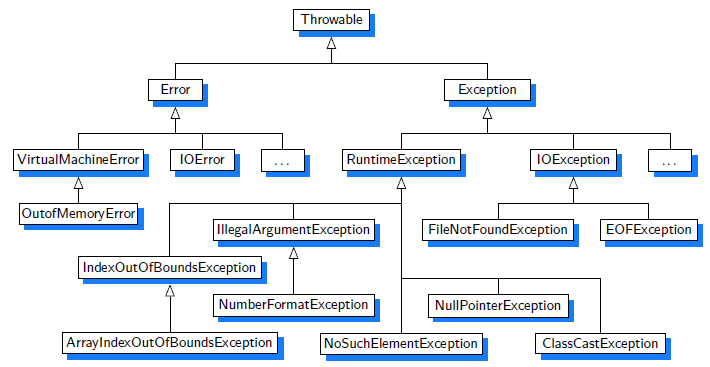

<br>

## Table of contents
- [Introduction to Exception Handling](#introduction-to-exception-handling)
- [How exception handling works](#how-exception-handling-works)
- [try-catch block and throw(s) statement](#try-catch-block-and-throw(s)-statement)
- [finally block](#finally-block)
- [When to use](#when-to-use)
- [Benefits and Drawbacks](#benefits-and-drawbacks)
- [Common problems with exception handling](#common-problems-with-exception-handling)
- [How to use functional programming with Exception Handling](#how-to-use-functional-programming-with-exception-handling)
- [Wrapping up](#wrapping-up)


<br>

## Introduction to Exception Handling

1. Definition of Exception handling


2. The hierarchy of Exception handling

    

    Some types of Exceptions in Java:
    - Checked exceptions


    - Unchecked exceptions


<br>

## How exception handling works


<br>

## try-catch block and throw(s) statement

1. try block

    - Java uses a **try** statement to seperate the logic that might throw an exception from the logic to handle that exception.
    - The code in the **try** block is run normally. If any of the statements throw an exception that can be caught by the exception type listed in the **catch** block, the **try** block stops running and execution goes to the **catch** statement.
    - **try** statements are like methods in the curly braces are required even if there is only one statement inside the code blocks.
    - **try** keyword must be accompanied with **catch** blocks. Without using any catch blocks, our code does not compile.

    Syntax: 

    ```java
    try {
        // statements
        // ...
    } catch(exception_type identifier) {
        // do something
    }
    ```

2. catch block

    - 

3. throw(s) statement


<br>

## finally block

```finally``` block will be called after the execution of the ```try``` or ```catch``` code blocks. Normally, **finally** block is typically used to close resources such as files or databases.

The only times ```finally``` won't be called are:
- If you invoke ```System.exit()```.

- If you invoke ```Runtime.getRuntime().halt(exitStatus)```.

- If the JVM crashes first.

- If the JVM reaches an infinite loop (or some other non-interruptable, non-terminating statement) in the ```try``` or ```catch``` block.

- If the OS forcibly terminates the JVM process; e.g., ```kill -9 <pid>``` on UNIX.

- If the host system dies; e.g., power failure, hardware error, OS panic, et cetera.

- If the ``finally`` block is going to be executed by a daemon thread and all other non-daemon threads exit before ```finally``` is called.

Syntax:

```java
try {
    // statements
    // ...
} catch(exception_type identifier) {
    // do something
} finally {
    // do something
}
```

<br>

## When to use

- 

- 

<br>

## Benefits and Drawbacks

1. Benefits

    - Using exceptions makes our code easy to read, and tracking.

2. Drawbacks


<br>

## Common problems with exception handling

1. Why is ```exception.printStackTrace()``` considered bad practice?

    [https://stackoverflow.com/questions/7469316/why-is-exception-printstacktrace-considered-bad-practice](https://stackoverflow.com/questions/7469316/why-is-exception-printstacktrace-considered-bad-practice)

    [https://stackoverflow.com/questions/10477607/avoid-printstacktrace-use-a-logger-call-instead](https://stackoverflow.com/questions/10477607/avoid-printstacktrace-use-a-logger-call-instead)

<br>

## How to use functional programming with Exception Handling


<br>

## Wrapping up


<br>

Refer:

[OCA - Oracle Certified Associate Java SE 8 Programmer I - Study Guide ebook]()

[Data structure and Algorithms in Java, 6th Edition ebook]()

[Functional programming in Java - How functional techniques improve ebook]()

[https://stackoverflow.com/questions/2190161/difference-between-java-lang-runtimeexception-and-java-lang-exception](https://stackoverflow.com/questions/2190161/difference-between-java-lang-runtimeexception-and-java-lang-exception)

[https://www.mkyong.com/java/java-custom-exception-examples/?utm_source=mkyong.com&utm_medium=Referral&utm_campaign=afterpost-related&utm_content=link9](https://www.mkyong.com/java/java-custom-exception-examples/?utm_source=mkyong.com&utm_medium=Referral&utm_campaign=afterpost-related&utm_content=link9)

[https://stackoverflow.com/questions/65035/does-a-finally-block-always-get-executed-in-java](https://stackoverflow.com/questions/65035/does-a-finally-block-always-get-executed-in-java)

[https://docs.oracle.com/javase/specs/jls/se8/html/jls-14.html#jls-14.17](https://docs.oracle.com/javase/specs/jls/se8/html/jls-14.html#jls-14.17)

[http://www.informit.com/articles/article.aspx?p=1216151&seqNum=7](http://www.informit.com/articles/article.aspx?p=1216151&seqNum=7)

<br>

**Exception handling with functional programming**

[https://pawelwlodarski.gitbooks.io/functional-programming/content/side_effects_in_fp.html](https://pawelwlodarski.gitbooks.io/functional-programming/content/side_effects_in_fp.html)

[https://www.ibm.com/developerworks/library/j-ft13/index.html](https://www.ibm.com/developerworks/library/j-ft13/index.html)

[https://medium.com/techtron/functional-errors-handling-1d1b4688769d](https://medium.com/techtron/functional-errors-handling-1d1b4688769d)

[https://belief-driven-design.com/functional-programming-with-java-exception-handling-e69997c11d3/](https://belief-driven-design.com/functional-programming-with-java-exception-handling-e69997c11d3/)

[https://dzone.com/articles/exception-free-code-using-functional-approach](https://dzone.com/articles/exception-free-code-using-functional-approach)