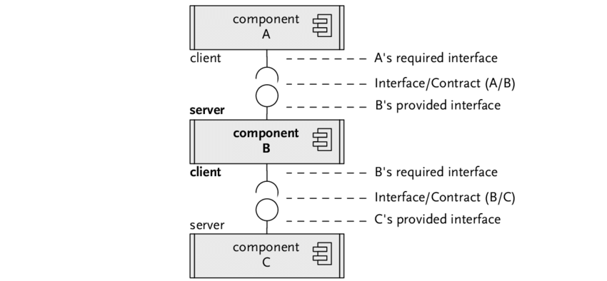
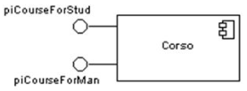
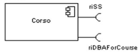

<br>

## Table of contents
- [Definition of interface in diagram](#definition-of-interface-in-diagram)
- [Provided interface](#provided-interface)
- [Required interface](#required-interface)

<br>

## Definition of interface in diagram
According to [ibm.com](https://www.ibm.com/support/knowledgecenter/SS8PJ7_9.6.1/com.ibm.xtools.modeler.doc/topics/cinterfc.html) website, we have:

```
In UML modeling, interfaces are model elements that define sets of operations that other model elements, such as classes, or components must implement. An implementing model element realizes an interface by overriding each of the operations that the interface declares.
```

We can use interfaces in ```class diagrams``` and ```component diagrams``` to specify a contract between the interface and the classifier that realizes the interface. Each interface specifies a well-defined set of operations that have public visibility. The operation signatures tell the implementing classifiers what kind of behavior to invoke, but not how they should invoke that behavior. Many classifiers can implement a single interface, each one providing a unique implementation.

Interfaces support the hiding of information and protect client code by publicly declaring certain behavior or services. Classes or components that realize the interfaces by implementing this behavior simplify the development of applications because developers who write client code need to know only about the interfaces, not about the details of the implementation. If we replace classes, or components that implement interfaces, in our model, we do not need to redesign our application if the new model elements implement the same interfaces.

We can specify the following types of interfaces:
- Provided interface
- Required interface



<br>

## Provided interface

They are these interfaces describe the services that instances of a classifier (supplier) offer to their clients.
- Characterize services that the component offers to its environment.
- Is modeled using a ball (lollipop) symbol, labelled with the name, attached by a solid line to the component.



<br>

## Required interface

They are these interfaces specify the services that a classifier needs to perform its functions and to fulfill its own obligations to its clients.
- Characterize services that the component expects from its environment.
- Is modeled using a socket symbol, labelled with the name, attached by a solid line to the component.



<br>

## When to use


<br>

## Example about interfaces


<br>

## Wrapping up


<br>

Refer:

[https://stackoverflow.com/questions/23456112/what-is-the-difference-between-required-and-provided-interfaces](https://stackoverflow.com/questions/23456112/what-is-the-difference-between-required-and-provided-interfaces)

[https://www.uml-diagrams.org/component-diagrams.html](https://www.uml-diagrams.org/component-diagrams.html)

[https://www.ibm.com/support/knowledgecenter/SS8PJ7_9.6.1/com.ibm.xtools.modeler.doc/topics/cinterfc.html](https://www.ibm.com/support/knowledgecenter/SS8PJ7_9.6.1/com.ibm.xtools.modeler.doc/topics/cinterfc.html)

[https://martinfowler.com/bliki/RequiredInterface.html](https://martinfowler.com/bliki/RequiredInterface.html)

