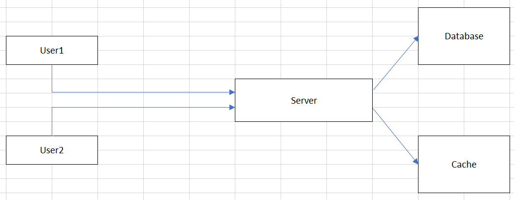

 

## Table of contents
- [Given problem](#given-problem)
- [Solution of using Caching](#solution-of-using-caching)
- [Some types of caching](#some-types-of-caching)
- [Some caching writing policies](#some-caching-writing-policies)
- [Some caching replacement policies](#some-caching-replacement-policies)
- [When to use](#when-to-use)
- [Benefits and Drawbacks](#benefits-and-drawbacks)
- [Wrapping up](#wrapping-up)

 

## Given problem

Assuming that we have our distributed system can be looked like the below image:

From the above image, we can find that we have:
- When a User1 want to retrieve information from our Server, User1 sends that request to Server, then Server will take so much time to calculate, and access to Database to find records that satisfy User1's conditions.

- Then, a User2 also want to get the same information, our Server also need to process again, and access to Database.

Belows are some drawbacks of the above system design:
- If there are many users that require the same information that is calculated for a long time, it makes us recomputation.
- Otherwise, we also need to access the other external system, so it will increases the round-trip of network calls and the database load.

Therefore, how do we deal with it?

 

## Solution of using Caching

1. Introduction to Caching

2. Cache hit, Cache miss

3. Thrashing concept of Caching

 

## Some types of caching

1. Local cache

    A local cache means that we will use available memory in our current application server to store data.

    For example:
    - JCache
    - EhCache
    - Guava Cache
    - Spring Caching

    In local cache, there are two common types:
    - On-heap local cache

        On-heap caching refers to storing data in a Java heap, where it's managed automatically by GC.

    - Off-heap local cache

        Off-heap caching refers to storing the data outside the heap. This data is not automatically handled by GC. Since it's stored outside the Java heap, the data needs to be stored as an array of bytes. Hence, there's an additional overhead of serializing and de-serializing the data.

2. Remote cache

    A remote cache is a seperated server that uses in-memory stores.

    Belows are some remote caches that we can usually use to design a system.
    - Redis

    - Memcached

 

## Some caching writing policies

1. Write-through cache

    A write-through cache means that updating data on both cache and database at the same time.

    Some trade-off characteristics of Write-through cache:
    1. Benefits
    
        - This policy will improve the data consistency between cache and database.
        - It's easy to recover data when the cache and database cope with problems accidently such as crash, power failure, ...

    2. Drawbacks

        - It's time-consuming task when we need to wait for the updating cache and database completely.

2. Write-back cache

    A write-back cache means that to hit the database directly and once we hit the database, make sure to make an entry in the cache, so either database can tell the cache that this entry is no longer valid or we hit the cache, we find that entry is evicted. Then, if there will be a query on the cache, that entry won't exist, so it's going to pull from the database, and send back to the client.

    A write-back cache is also called as write-behind cache and copy-back cache.

    Some trade-off characteristics of Write-back cache:
    1. Benefits

        - 
        - 
        - 

    2. Drawbacks

        - 
        - 
        - 

3. Write-around cache

    Some trade-off characteristics of Write-around cache:
    1. Benefits

        - 
        - 
        - 

    2. Drawbacks

        - 
        - 
        - 

 

## Some caching replacement policies

1. LRU - Least Recently Used

2. LFU - Least Frequently Used

    For example:
    - Used in caffeine

3. 

 

## When to use

- When data is frequently access by the multiple users.

    It means that caching should be used in the read-heavy case, not write-heavy case.

    For example: Google will cache the result of some hot search.

- When the computation for that data is CPU-intensive.

 

## Benefits and Drawbacks

 

## Wrapping up

 

Refer:

[What is Distributed Caching? Explained with Redis!](https://www.youtube.com/watch?v=U3RkDLtS7uY)

[Understanding write-through, write-around and write-back caching (with Python)](https://shahriar.svbtle.com/Understanding-writethrough-writearound-and-writeback-caching-with-python)

[https://towardsdatascience.com/system-design-interview-prep-should-you-put-the-data-in-cache-56936697ee54](https://towardsdatascience.com/system-design-interview-prep-should-you-put-the-data-in-cache-56936697ee54)

[https://betterprogramming.pub/introduction-and-strategies-to-handle-challenges-in-caching-c619d51882c0](https://betterprogramming.pub/introduction-and-strategies-to-handle-challenges-in-caching-c619d51882c0)

[https://docs.oracle.com/cd/E15357_01/coh.360/e15723/cache_rtwtwbra.htm#COHDG5181](https://docs.oracle.com/cd/E15357_01/coh.360/e15723/cache_rtwtwbra.htm#COHDG5181)