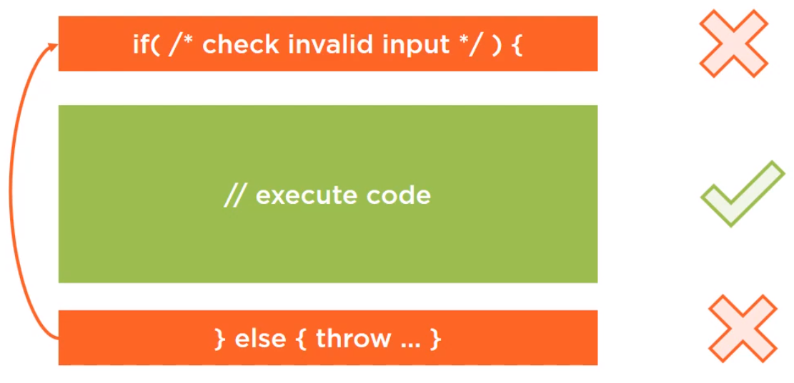
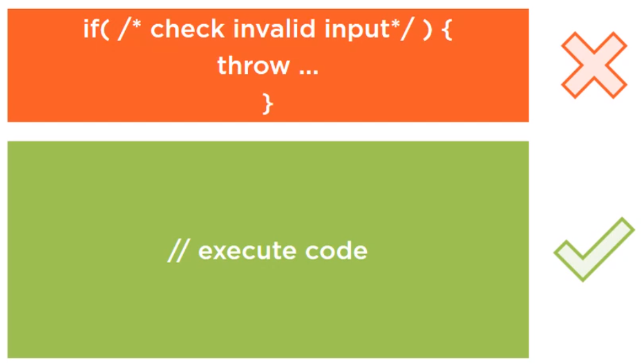

<br>

## Table of contents


<br>

## 


<br>

## Validing method input
1. Guard clause - Fail fast and Return early

With the below guard clause, we have:

```java
if (/* validate input */) {
    // nothing to do    
}
```

Then, we will have three options:
- Return early

    - return false;
    - return;

- Fail fast

    throw new AppropriateException();

- Alternative execution

    - Display a user-friendly message of what went wrong.

--> Place our Guard clauses at the very beginning.

2. Best practices and pitfalls when checking null, Strings, numbers and dates
- Validating null

    ```java
    if (value_type_1 != null) {
        if (value_type_2 != null) {
            ...
            // nothing to do
        }
    }
    ```

    To describe this situation, we have an image:

    

    As we read the code, we start off by seeing that something might be wrong. After that, we read the code that is supposed to run under normal circumstances. And at the end, we again see some code for the scenario if something goes wrong, so we have to mentally mop this code back to the beginning.

    It might seem fairly easy, but it can become a burden when reading more complex and more nested code. And then suddenly we find ourself scrolling up and down, up and down, and that's no good.

    If we put all of our input checking code at the top on throw immediately, then it becomes easier to follow like this:

    

    For example:

    ```java
    public List<String> search(String fromDest, String toDest, String departDate, int passengerNum) {
        if (fromDest == null) {
            throw new IllegalArgumentException("Argument fromDest cannot be null");
        }

        if (toDest == null) {
            throw new IllegalArgumentException("Argument toDest cannot be null");
        }

        if (departDate == null) {
            throw new IllegalArgumentException("Argument departDate cannot be null");
        }

        ...
    } 
    ```

    When we see the above code, we find that inidividual message for each input will be checked at the top method. If we have multiple arguments, then we check like the above code, so, this code looks terribly, not only the size of this method has doubled, it suffers from another problem.
    
    This code tells about one problem at a time, so if we pass search() method three bad inputs, it will tell us that there's a problem with one. We will fix that, send the input again. The code will again reject our input, and we will have to repeat the process multiple times before we get it entirely right on.

    So, the solution for this problem is to combine all of these into a single condition. Now, we can end up with fewer lines of code on a single message.

    

    ```java
    if (fromDest == null || toDest == null || departDate == null) {
        String msg = String.format("You have provided the following arguments, none of them can be null. " + 
                                    "fromDest: %s, toDest: %s, date: %s", fromDest, toDest, departDate);

        
    }
    ```

    Conclustion:
    - If we have one or two inputs, we might as well be specific at the cost off.
    - If we have multiple method arguments acting as inputs, so we decided to go for shorter on more generic version.

3. Preventing propagation of invalid values


<br>

## 


<br>

## 


<br>

## Wrapping up


<br>

Refer:

[Defensive coding in Java](pluralsight.com)