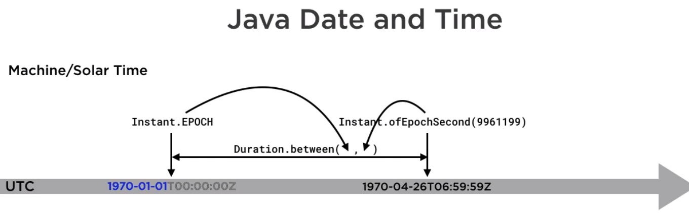

<br>

## Table of contents
- [Basic of the java.time APIs](#basic-of-the-java.time-apis)
- []()
- []()
- [Wrapping up](#wrapping-up)


<br>

## Basic of the java.time APIs



The continuous flow of time is modeled quite closely by the class ```java.time.Instant```, which contains a displacement in seconds and nanoseconds from the so-called UNIX EPOCH, midnight on the first of January 1970.

There are various ways of making a new instant. For example, if we want an instant that corresponds to a particular time in April 1970, we could construct it using the method ```Instant.ofEpochSecond()```.

Supplying a negative number of seconds or nanoseconds when constructing an instant signifies that much time before the EPOCH.

The length of the time between two instant is modeled by a duration like ```Duration.between()```.

A more human-friendly way of representing instants is provided by an atomic time scale called ```UTC```. The letters come from the initials for coordinated universal time. ```UTC``` is a common standard across the world. The international standard for representing dates and times, ISO 8601, denotes midnight on the first of January 1970, under date later that year.

Dates formatted with the ISO standard can be hard to read at first. First comes the year, month, day order, then a separator, then the time, a 24 hour notation, hours, minutes, and seconds. Finally, the Z shows that this is the UTC time. Standard time like UTC is useful for purpose like calculating satellite orbits. But everyday programs are more often concerned with dates and times of particular points on earth. For that, we need to qualify a date and time with a time zone.

ISO 8601 represents zoned date times like ```1969-12-31T19:00:00-05:00```, with a time zone offset replacing the single Z used for UTC.

Reading the ISO representation is helpful to a programmer using java.time, as each component of the ISO notation corresponds to a class java.time.

So an instance of java.time ```LocalDate``` is a date without time zone information - ```1969-12-31```. An instance of LocalTime is a time of day without time zone information - ```19:00:00```, and an instance of ```LocalDateTime``` combines the information in these two - ```1969-12-31T19:00:00```. The ```TimeZoneOffset``` is modeled by an instance of ```ZoneOffset``` - ```05:00```, and all this information can be combined in a single object of type ```ZoneDateTime```.

```ZoneOffset``` is only one kind of time zone identifier. It represents a fixed offset from UTC, but a fixed offset may not be enough to calculate the time at a particular place.

The last important java.time class is period, which encapsulates a fixed number of years, months, and days. A period refers entirely to human time and its duration can vary according to any ajustment being made to the human calendar.

<br>

## APIs in java.time package

|                 java.time              |                  Meaning                |                 Example                |
| -------------------------------------- | --------------------------------------- | -------------------------------------- |
| ``Instant``                            | instant of time                         | timestamp                              |
| ```ZonedDateTime```                    | date-time with time zone information    | start of a conference call             |
| ```LocalDate```                        | date without time zone information      | birthday                               |
| ```Duration```                         | time between two instants               | length of a conference call            |
| ```Period```                           | amount of time in years, months, and days | length of a prison sentence          |

- ```DateTimeFormatter```

    Programs that work with date times often require them to be represented in human readable form and to accept human-formatted strings as input. So, interconversion between Java time objects and strings is an important part of the library. It's mostly implemented by the class ```DateTimeFormatter```.

    ```java.time``` comes with a wide variety of predefined ```DateTimeFormatters```.
    - ```ISO_DATE_TIME``` instance, which converts ```java.time objects``` to and from the ISO format.

    Some methods of DateTimeFormatter:
    - ```parse()``` method - convert a string to a ```java.time object``` called a temporal.

    - ```format()``` method - convert a slightly wider range of objects, temporal accessors, into strings.

    - ```ofLocalizedTime(FormatStyle.SHORT)``` method - take a format style and create a DateTimeFormatter that will produce or parse local specific strings. 

    - ```ofPattern()``` - A wide variety of customized date time formatters can be created using the factory method ```ofPattern()```.

        For example:
        - ```ofPattern("E")``` - means output the day of week in short form, apply it to the same zone date time as before, it produces this output.

<br>

## Benefits and Drawbacks
1. Benefits
- Classes in ```java.time``` package are immutable, which means they can be used without precautions in multithread applications.
- allows caching.
- works well with Java 8 streams and lambdas.
- Methods are designed to allow fluent programming so that statements using them read very naturally.
- The API is type-safe, so that class cast exceptions are usually prevented by detection of type errors at compile time.
- The library's extensible so that features that the designers didn't foresee or that didn't belong in the core API can be added.


<br>

## 


<br>

## Wrapping up


<br>

Refer:

