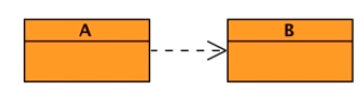
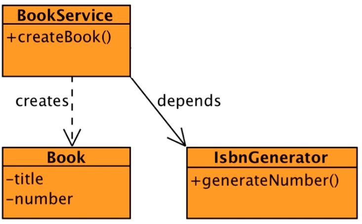
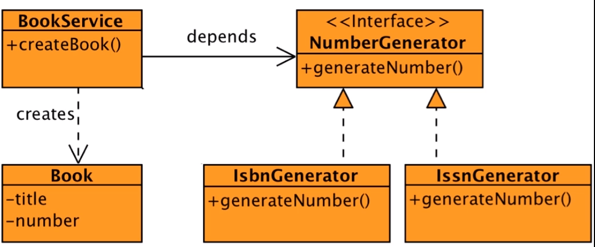
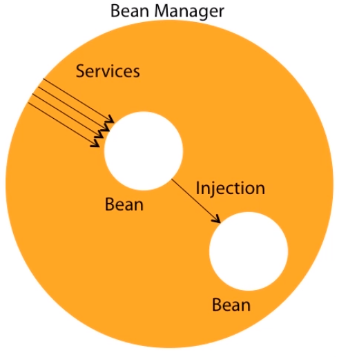
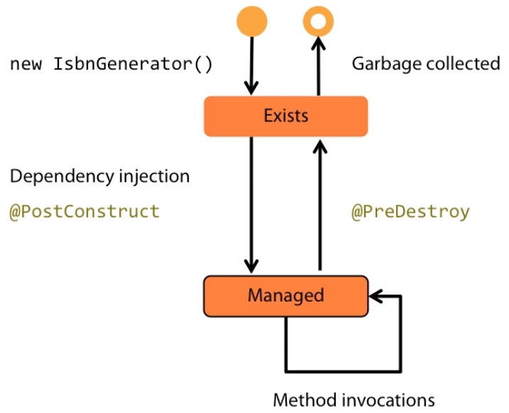
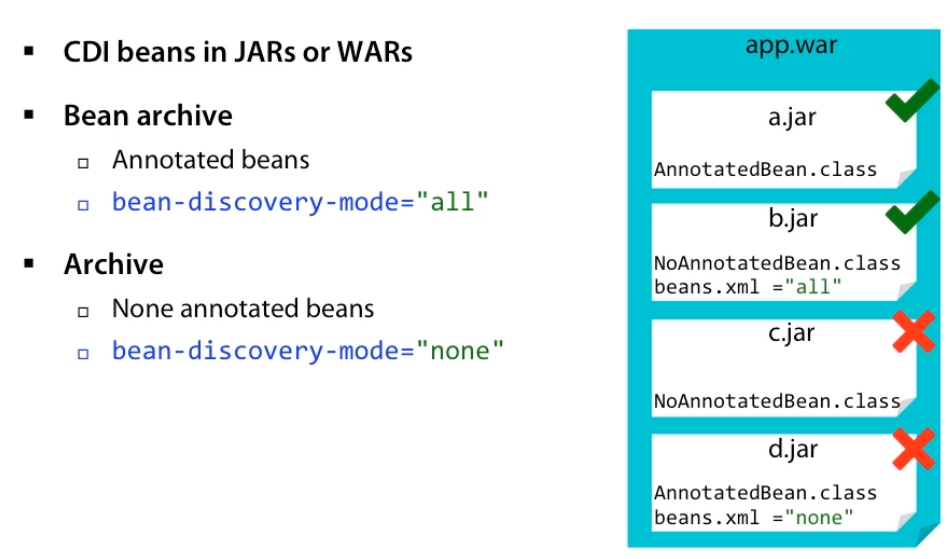

<br>

## Table of contents


<br>

## What is Dependency
In fact, in object-oriented programming all this can be summarized by classes depending on other classes. Whenever class A uses another class B, then it is said that A depends on B. A can not work without B, and A can not be reused without also reusing B. In such a situtation, the class A is called a ```dependent```, and the class B is called a ```dependency```.



These classes are coupled either strongly or loosely, but let's see a concrete example.



Here we have a class, ```BookService```, whose job is to create books. A book is represented by a ```book``` class that contains the title of the book and a number. This number is actually an ISBN number generated by an ```IsbnGenerator``` class, which has a method called ```generateNumber()```.

In the above diagram, ```BookService``` depends on an ```IsbnGenerator``` to create a book. Without an ISBN, the book could not be created. This dependency between classes is typical in object-oriented design. Classes have separate concerns.

1. Strongly coupled dependencies

    Two classes that use each other are called coupled. Decoupling between classes can be loose or tight. Tight coupling leads to strong dependencies between classes. In an above example, IsbnGenerator is a class that has a unique method, generateNumber(), that returns an ISBN as a string. The simplicity will develop a very simple algorithm that generates a random number, starting by 13.

    ```java
    public class IsbnGenerator {
        public String generateNumber() {
            return "13-84356-" + Math.abs(new Random().nextInt());
        }
    }
    ```

    On the other hand, the BookService class is in charge of creating a book object. The createBook() method takes a title as a parameter and returns a Book object.

    ```java
    public class BookService {
        private IsbnGenerator isbn = new IsbnGenerator();

        public Book createBook(String title) {
            return new Book(title, isbn.generateNumber());
        }
    }
    ```

    To complete, the ```Book``` object needs the title, as well as an ISBN number, and for that it delegates the work to the ```IsbnGenerator```  class. As we can see, there is a strong dependency between those two classes. The BookService class depends on the ```IsbnGenerator``` class, but what's wrong with that?

    This type of depdency on the ```IsbnGenerator``` class means that BookService is only capable of creating books with ISBN numbers. It cannot use any other number generator, if needed. We can say that BookService is tightly coupled to the ```IsbnGenerator``` class and thereby the number generator algorithm. It shows the strong coupling between classes can be bad because it decreases reuse. Remember that in OOP code, reuse is the idea that a class written at one time can be used by another class written at a later time.

    Strong coupling reduces reusability and, therefore, development speed, code quality, code readability, and so forth.

2. Loosely coupled Dependencies

    A less tightly couplied solution would help in changing the NumberGenerator implementation at runtime. A way of doing it is through interfaces. Instead of depdending on the IsbnGenerator class, the BookService could depend on a NumberGenerator interface. This interface has one method called generateNumber() and is implemented by IsbnGenerator. If we need to generate ISSN numbers, we just create a new class called IssnGenerator that implements a different NumberGenerator algorithm. The BookService ends up depending on either an IsbnGenerator or an IssnGenerator according to some conditions or environment.

    

    In terms of code, it's quite easy. Everything starts with a Number Generator interface that defines a generateNumber() method. This interface is implemented by the IsbnGenerator, which defines its own NumberGenerator algorithm, here a random number with a prefix starting with 13. To have a different implementation, we create a new class that implements a same NumberGenerator interface and redefines a different NumberGenerator algorithm, this time a number starting with 8.

    ```java
    public interface NumberGenerator {
        String generateNumber();
    }

    public class IsbnGenerator implements NumberGenerator {
        public String generateNumber() {
            return "13-84356-" + Math.abs(new Random().nextInt());
        }
    }

    public class IssnGenerator implements NumberGenerator {
        public String generateNumber() {
            return "8-" + Math.abs(new Random().nextInt());
        }
    }
    ```

    Now that the classes are not directly coupled, how would we connect a BookService to either an ISBN or ISSN implementation? One solution is to pass the implementation to the constructor and leave an external class to choose which implementation is wants to use. So let's refactor our BookService.

    ```java
    public class BookService {
        private NumberGenerator generator;

        public BookService(NumberGenerator generator) {
            this.generator = generator;
        }

        public Book createBook(String title) {
            return new Book(title, generator.generateNumber());
        }
    }

    BookService service = new BookService(new IsbnGenerator());
    ```

    The BookService depends on an interface, not implementation. The implementation is passed as parameter of the constructor. So if we need a BookService that generates an ISBN number, we just pass the IsbnGenerator implementation to the constructor. If we need to generate an ISSN number, we just change the implementation to be IssnGenerator. This is what's called ```Inversion of Control```. The control of choosing the dependency is inverted because it's giving to an external class, not the class itself. But we ends up connecting the dependencies ourselves using the constructor to choose implementation. This is called Constructor injection. Our techniques can be used, but all-in-all is just constructing dependency programmatically by hand, which is not flexible. Instead of constructing depedencies by hand, we can leave an injector to do it, and that's CDI. 

3. Injecting with CDI

    Context independency injection is a standard solution that manages dependency between classes. Injection is made using strongly type annotations, as well as XML configuration if needed. CDI removes boilerplate code by using a very simple API, so we do not have to use construction of dependencies by hand, and CDI brings many other features to dependency injection. To see how this works, let's take back our example.

    Nothing has changed in the above code. What changes is the way BookServices manages its dependencies. Basically it use ```@Injection``` annotation from CDI to inject the implementation of the ```NumberGenerator```. This leaves the constructor useless, and we can just get rid of it. That means that the way of instantiating ```BookService``` has also changed. Instead of calling its constructor, we also need to inject it with CDI. Then to switch implementations, we use annotations and this way get a ```ThirteenDigits``` NumberGenerator, an ```EightDigits``` NumberGenerator or any other one.

    ```java
    @Qualifier
    @Retention(RUNTIME)
    @Target({ FIELD, TYPE, METHOD, PARAMETER })
    public @interface ThirteenDigits {
    }

    public class BookService {
        @Inject
        @ThirteenDigits
        private NumberGenerator generator;

        public Book createBook(String title) {
            return new Book(title, generator.generateNumber());
        }
    }

    @Inject
    BookService bookService;
    ```
    
    CDI is a managed environment where the container uses a type-safe approach to inject the right dependency. 


<br>

## Understanding Context and Dependency Injection
1. What is Dependency Injection

    Simply put, instead of having our objects creating their own dependencies, someone else does. Objects could delegate these tasks to factories, or we could pass the needed dependencies to constructors or via property setters. All-in-all, this task of setting the dependencies involves a lot of programming and can actually be quite complex if an object has an entire graph of dependencies. Instead, these tasks can be delegated to a dependency injector, also called container or provider.

    A container is a runtime environment that manages components and provides them with certain services. These services could be life-cycle management, dependency injection, interception, concurrency, security, and so on. So here we have the container providing these services. The component does not have to create these services. It just uses them. This is the concept of inversion of control meaning that the container takes control of our business code and provides technical services. A container is a managed environment where components or beans are managed. So, basically, a managed bean is just a bean that is managed by a container.
    
    In Java SE, we already deal with this concept because our objects are executed inside a JVM. The JVM can be seen as a container, which gives certain services to this object, such as class loading, garbage collection, exception handling, and so on. Managed beans are executed inside higher-level containers that give other services. For example, Java EE has servlets, which are a type of managed bean executed in a servlet container. This servlet container supplies some services such as HTTP handling, pooling, security, transaction, and so on. Java EE has other types of managed beans such as servlet filters, REST web services, JPA entities, or enterprise java beans.

2. What is Context and Dependency Injection

    CDI also has a runtime environment called a Bean Manager. The Bean Manager manages what's called CDI Beans or Beans for short.

    

    In terms of code, a CDI Bean is just a Java class with optional annotations. This container brings a certain set of services, one of them being dependency injection. CDI is built on the concept of loose coupling and strong typing, meaning that beans are loose coupled, but in a strongly typed way. The container's job is to inject references into these loosely coupled beans. Decoupling goes further by bringing interceptors, decorators, events and context management to these beans.

    It is also important to understand what CDI is not. CDI is not a full Java EE container. This means that we cannot run servlets or REST web services inside a CDI container, for example. Each container brings a certain set of services. A servlet container brings some services and CDI other services. For example, a CDI does not bring any HTTP support or transactional management. The good news is that CDI has an extension API. It's a way to extend the container capabilities in a portable way.

    - A brief of history of CDI

        In fact, depedency injection solutons have been around for a long time, even before Java. There were all sorts of commercial and open source products in the Java ecosystem such as Spring, JBoss Seam, Guice. All these frameworks where successful, but were never standardized. In 2009, CDI 1.0 (Java EE 6) was born with a very strongly typed approached and adopted many JBoss Seam design principles. It was bundled in Java EE 6. Since then CDI has been updated to 1.1 to be included in Java EE 7 and had a maintaince release in 2014. Today, the specification of CDI 2.0 has just started and will be bundled into Java EE 8.

        But what is CDI?
        - First of all, it's a specification. It means that it went through the Java Community Process to be standardized. It's what we call a Java specification request, a document that specifies what CDI is and how it should work. In the case of CDI 1.1, it's the JSR 346, and it can be found on the JCP website. But of course CDI can not just be a specification in an API. It needs a runtime, which implements the specifications, so we can actually use it in our applications. 
        
        - Now, CDI has three implementations, Weld, also called the reference implementation, Apache OpenWebBeans, and CanDI. The three implement the specification and are interchangeable. We can use one or the other. That's one good thing with standards. There is no vendor locking. At this point, it's worth mentioning DeltaSpike. DeltaSpike is not an implementation of CDI. It's an open source project from Apache that enriches the CDI ecosystem with a number of portable extensions. With this toolbox, we get extra services such as security, configuration, scheduling, declarative queries for JPA and so on. All these build on top of CDI.

    Coming back to CDI and its API, all these classes, interfaces, and annotations leaving several packages.

    |              Package            |                    Description                 |
    | ------------------------------- | ---------------------------------------------- |
    | javax.inject                    | Core dependency injection API                  |
    | javax.enterprise.inject         | Core CDI API                                   |
    | javax.enterprise.context        | Scopes and contextual APIs                     |
    | javax.enterprise.event          | Events and observers APIs                      |
    | javax.interceptor               | Interceptor APIs                               |
    | javax.decorator                 | Decorator APIs                                 |
    | javax.enterprise.util           | CDI utility package                            |

    It's important to say that these implementations and APIs can be used in both Java SE and Java EE.

3. Managing Injection with CDI

    When we talk about a CDI bean, we just mean a Java class that follows certain patterns and this managed by a CDI container. A CDI bean must be a concrete class and must have a default constructor. It can, but does not need to implement any specific interface, extends a specific class, or be annotated.
    
    A CDI bean can have optional:
    - qualifiers
    - scopes
    - expression language name
    - interceptor bindings

    In fact, with a few exceptions, potentially every Java class that has a default constructor is a CDI bean. For example, this IsbnGenerator class does not extend anything, is not annotated, but is a CDI bean when the CDI container manages it. Then, we can add optional CDI annotations to bring a type-safe dependency injection, interception, decoration, or to use a CDI bean in expression language. CDI beans have another particularity, their lifecycle. The lifecycle of a POJO is pretty simple. As Java developers, we create an instance of a class using the new keyword and wait for the garbage collector to get rid of it and free some memory. It is slightly different with CDI beans though. CDI beans run inside a container and are managed by this container. The container is the one creating the instance with a new keyword, not us. It also gets rid of this instance. 

    The container manages the lifecycle of the CDI bean and gives us a handle after constructing an instance and before destroying it.

    - Lifecycle of a CDI bean

        

        The state diagram shows the life cycle of a CDI bean. When we invoke a method, the container creates a new instance of the bean. It then exists in memory, but we can't use it yet, and the method is not invoked yet. If the newly created instance uses dependency injection, the container injects all the needed resources. If the instance has a method annotated with ```@PostConstruct```, the container invokes this annotated method. That's where we can add initializing code, if needed. Finally, the bean instance processes the method invocation. When the container does not need the instance anymore, it invokes the method annotated with ```@PreDestroy```, if any, and ends the lifecycle of the bean instance. These annotations are called Callback annotations.

    - Callback annotations

        CDI beans may use the PostConstruct and PreDestroy annotations to identify methods to be called back by the container at the appropriate points in the bean's lifecycle. These annotations can be added to public, private, protected, or package-level access method, but must not be static or final. If something goes wrong while executing the business logic, these methods can throw unchecked exceptions, but not checked exceptions.

        ```java
        public class IsbnGenerator {

            private int postfix;

            @PostConstruct
            private void init() {
                this.postfix = Math.abs(new Random().nextInt());
            }

            public String generateNumber() {
                return "13-84356-" + postfix++;
            }

        }
        ```

        With above code, we have init() method is annotated with @PostConstruct, it means that the init() method will get called just after the container has constructed a bean and before the generateNumber() method is invoked.

        Now that we have a CDI bean, how do we inject it into another one? That's pretty easy. Take any other CDI bean, like a BookService, whose job is to create a book. BookService needs an implemenation of a NumberGenerator interface to generate a number. Because both classes are treated as CDI beans, we can just use the annotation @Inject to inject a reference of NumberGenerator. The attribute annotated with @Inject becomes an injection point. The CDI runtime will then do all the plumbing of dependency injection, but the NumberGenerator is just an interface. To inject a reference of IsbnGenerator, we might think that @Inject would take a string to differentiate between the ISBN or ISSN implementations. This is not the case. Instead of using strings, CDI prefers a more type-safe approach using annotations, also called qualifiers.
        
        ```java
        @Qualifier
        @Retention(RUNTIME)
        @Target({ FIELD, TYPE, METHOD, PARAMETER })
        public @interface ThirteenDigits {
        }

        public class BookService {
            @Inject
            @ThirteenDigits
            private NumberGenerator generator;

            public Book createBook(String title) {
                return new Book(title, generator.generateNumber());
            }
        }

        @Inject
        BookService bookService;
        ```

        Nearly every Java EE specification has an optional XML deployment descriptor. It usually describes how a component module or application should be configured. With CDI, the deployment descriptor is called beans.xml and is also optional. It can be used to configure certain functionalities, such as alternatives, decorators, or interceptors.

    - Bean discovery

        When an application is started, the CDI container performs Bean Discovery. This is the moment where the container searches for beans in all bean archives in the application classpath. During bean discovery, the container detects definition errors and deployment problems. If any exception is raised, the deployment is cancelled, and the application is unavailable. If no problem is found, all the injection points are referenced and the application is up  and running.
        
        

        There is another important concept to understand here. It's that bean discovery is only made in bean archives. CDI does not define any special deployment archive. We can package CDI beans in JARs or WARs, however, CDI discovers beans that are packaged following certain rules. We call that a bean archive. A bean archive is any archive that packages Java classes annotated with CDI annotations. For example, if a.jar packages a class that contains a CDI annotations, this class is said to be an annotated bean. Therefore, a.jar is said to be a bean archive. The another case is when we have a bean XML deployment descriptor with the bean discovery-mode set to all.

        Here b.jar packages a non-annotated bean, but because there is a beans XML file, b.jar is said to be a bean archive. On the other hand, any other packaging is said to be an archive. The common case is when the archive does not contain any annotated beans and has no beans XML descriptor. Here c.jar does not contain any of those. It is not a bean archive. The last scenario is when the bean-discover-mode is set to none, meaning that we tell CDI is no to discover any beans in this archive.

        Here d.jar can package CDI beans, but if we explicitly set the discovery-mode to none, then d.jar would not be considered archive.

4. Where can we use CDI

<br>

## 


<br>

## Benefits and Drawbacks
1. Benefits
- CDI dependecy injection is the ability to inject classes into others in a type-safe way using annotations, also called qualifiers.
- Managed environment.
- Do not construct depedencies by hand, but can leave the container to inject a reference for us.
- No boiler plate code.
- A simple @Inject annotation on the property informs the container that it has to inject a reference.
- CDI is very powerful.
- More features.


<br>

## 


<br>

## Wrapping up
- In fact, CDI can be used anywhere we need to inject classes into other other classes. From single data types to more complex components, CDI can be used in Java SE, Java EE, in the Cloud if we past provider runs Java, or Android.

- Version of CDI

    - CDI 1.0 in 2009 (Java EE 6)
    - CDI 1.1 in 2013 (Java EE 7)
    - CDI 1.2 in 2014
    - CDI 2.0 in Java EE 8

<br>

Refer:

