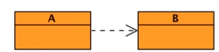

<br>

## Table of contents
- [What is Dependency](#what-is-dependency)
- [Introduction to Dependency Injection](#introduction-to-dependency-injection)
- [Some techniques to implement Dependency Injection](#some-techniques-to-implement-dependency-injection)
- [Dependency Injection with CDI of Java EE](#dependency-injection-with-cdi-of-java-ee)
- [Advantages](#advantages)
- [Wrapping up](#wrapping-up)

<br>

## What is Dependency
In fact, in object-oriented programming all this can be summarized by classes depending on other classes. Whenever class A uses another class B, then it is said that A depends on B. A can not work without B, and A can not be reused without also reusing B. In such a situtation, the class A is called a ```dependent```, and the class B is called a ```dependency```.



These classes are coupled either strongly or loosely, but let's see a concrete example.


Here we have a class, ```BookService```, whose job is to create books. A book is represented by a ```book``` class that contains the title of the book and a number. This number is actually an ISBN number generated by an ```IsbnGenerator``` class, which has a method called ```generateNumber()```.

In the above diagram, ```BookService``` depends on an ```IsbnGenerator``` to create a book. Without an ISBN, the book could not be created. This dependency between classes is typical in object-oriented design. Classes have separate concerns.

1. Strongly coupled dependencies

    Two classes that use each other are called coupled. Decoupling between classes can be loose or tight. Tight coupling leads to strong dependencies between classes. In an above example, IsbnGenerator is a class that has a unique method, generateNumber(), that returns an ISBN as a string. The simplicity will develop a very simple algorithm that generates a random number, starting by 13.

    ```java
    public class IsbnGenerator {
        public String generateNumber() {
            return "13-84356-" + Math.abs(new Random().nextInt());
        }
    }
    ```

    On the other hand, the BookService class is in charge of creating a book object. The createBook() method takes a title as a parameter and returns a Book object.

    ```java
    public class BookService {
        private IsbnGenerator isbn = new IsbnGenerator();

        public Book createBook(String title) {
            return new Book(title, isbn.generateNumber());
        }
    }
    ```

    To complete, the ```Book``` object needs the title, as well as an ISBN number, and for that it delegates the work to the ```IsbnGenerator```  class. As we can see, there is a strong dependency between those two classes. The BookService class depends on the ```IsbnGenerator``` class, but what's wrong with that?

    This type of depdency on the ```IsbnGenerator``` class means that BookService is only capable of creating books with ISBN numbers. It cannot use any other number generator, if needed. We can say that BookService is tightly coupled to the ```IsbnGenerator``` class and thereby the number generator algorithm. It shows the strong coupling between classes can be bad because it decreases reuse. Remember that in OOP code, reuse is the idea that a class written at one time can be used by another class written at a later time.

    Strong coupling reduces reusability and, therefore, development speed, code quality, code readability, and so forth.

2. Loosely coupled Dependencies

    A less tightly couplied solution would help in changing the NumberGenerator implementation at runtime. A way of doing it is through interfaces. Instead of depdending on the IsbnGenerator class, the BookService could depend on a NumberGenerator interface. This interface has one method called generateNumber() and is implemented by IsbnGenerator. If we need to generate ISSN numbers, we just create a new class called IssnGenerator that implements a different NumberGenerator algorithm. The BookService ends up depending on either an IsbnGenerator or an IssnGenerator according to some conditions or environment.

    

    In terms of code, it's quite easy. Everything starts with a Number Generator interface that defines a ```generateNumber()``` method. This interface is implemented by the ```IsbnGenerator```, which defines its own ```NumberGenerator``` algorithm, here a random number with a prefix starting with 13. To have a different implementation, we create a new class that implements a same ```NumberGenerator``` interface and redefines a different ```NumberGenerator``` algorithm, this time a number starting with 8.

    ```java
    public interface NumberGenerator {
        String generateNumber();
    }

    public class IsbnGenerator implements NumberGenerator {
        public String generateNumber() {
            return "13-84356-" + Math.abs(new Random().nextInt());
        }
    }

    public class IssnGenerator implements NumberGenerator {
        public String generateNumber() {
            return "8-" + Math.abs(new Random().nextInt());
        }
    }
    ```

    Now that the classes are not directly coupled, how would we connect a ```BookService``` to either an ISBN or ISSN implementation? One solution is to pass the implementation to the constructor and leave an external class to choose which implementation is wants to use. So let's refactor our ```BookService```.

    ```java
    public class BookService {
        private NumberGenerator generator;

        public BookService(NumberGenerator generator) {
            this.generator = generator;
        }

        public Book createBook(String title) {
            return new Book(title, generator.generateNumber());
        }
    }

    BookService service = new BookService(new IsbnGenerator());
    ```

    The ```BookService``` depends on an interface, not implementation. The implementation is passed as parameter of the constructor. So if we need a ```BookService``` that generates an ISBN number, we just pass the ```IsbnGenerator``` implementation to the constructor. If we need to generate an ISSN number, we just change the implementation to be ```IssnGenerator```. This is what's called ```Inversion of Control```. The control of choosing the dependency is inverted because it's giving to an external class, not the class itself. But we ends up connecting the dependencies ourselves using the constructor to choose implementation. This is called ```Constructor injection```. Our techniques can be used, but all-in-all is just constructing dependency programmatically by hand, which is not flexible. Instead of constructing depedencies by hand, we can leave an injector to do it by using some frameworks such as CDI of Java EE, Dependency Injection of Spring framework, or something else.

<br>

## Introduction to Dependency Injection


2. Types of Dependency Injection

    Dependency Injection can be performed by using:
    - Constructor injection

        For example, with using CDI container.

        ```java
        public class DataUtil {

            @Produces
            private RealData data = new RealData();
        }

        public class Notification {

            private RealData realData;

            @Inject
            public Notification(RealData realData) {
                this.realData = realData;
            }

            // ...
        }
        ```

    - Field injection

        For example, with using CDI container.

        ```java
        public class Notification {

            @Inject
            private RealData data;

        }
        ```

    - Method injection

        For example, with using CDI container.

        ```java
        public class Notification {

            private RealData data;

            @Inject
            public void setData(RealData data) {
                this.data =data;
            }

        }
        ```

<br>

## Some techniques to implement Dependency Injection


<br>

## Dependency Injection with CDI of Java EE
1. Setup library to use CDI in our Java project

    CDI is a standard dependency injection framework included in Java EE 6 and later.

    It allows us to manage the lifecycle of stateful components via domain-specific lifecycle contexts and inject components (services) into client objects in a type-safe way.

    - Use javaee-api with version 8.0

        ```xml
        <dependency>
            <groupId>javax</groupId>
            <artifactId>javaee-api</artifactId>
            <version>8.0</version>
            <scope>provided</scope>
        </dependency>
        ```

        To understand about Java EE 8, we can read deeper in this [link](https://javaee.github.io/tutorial/overview008.html).

        To migrate a Java EE 8 project to Jakarta EE 8, replace the following dependency:
        
        ```xml
        <dependency>
            <groupId>javax</groupId>
            <artifactId>javaee-api</artifactId>
            <version>8.0</version>
            <scope>provided</scope>
        </dependency>
        ```

        ...with Jakarta EE 8 API

        ```xml
        <dependency>
            <groupId>jakarta.platform</groupId>
            <artifactId>jakarta.jakartaee-api</artifactId>
            <version>8.0.0</version>
            <scope>provided</scope>
        </dependency>
        ```

    - Use CDI 2.0

        ```xml
        <dependency>
            <groupId>javax.enterprise</groupId>
            <artifactId>cdi-api</artifactId>
            <version>2.0</version>
            <scope>provided</scope>
        </dependency>
        ```

2. Implementation with CDI

    - Use qualifier in CDI

        Context independency injection is a standard solution that manages dependency between classes. Injection is made using strongly type annotations, as well as XML configuration if needed. CDI removes boilerplate code by using a very simple API, so we do not have to use construction of dependencies by hand, and CDI brings many other features to dependency injection. To see how this works, let's take back our example.

        Nothing has changed in the above code. What changes is the way ```BookServices``` manages its dependencies. Basically it use ```@Inject``` annotation from CDI to inject the implementation of the ```NumberGenerator```. This leaves the constructor useless, and we can just get rid of it. That means that the way of instantiating ```BookService``` has also changed. Instead of calling its constructor, we also need to inject it with CDI. Then to switch implementations, we use annotations and this way get a ```ThirteenDigits``` NumberGenerator, an ```EightDigits``` NumberGenerator or any other one.

        ```java
        // Use qualifier to specify which beans will be chosen
        @Qualifier
        @Retention(RUNTIME)
        @Target({ FIELD, TYPE, METHOD, PARAMETER })
        public @interface ThirteenDigits {
        }

        public class BookService {

            @Inject
            @ThirteenDigits
            private NumberGenerator generator;

            public Book createBook(String title) {
                return new Book(title, generator.generateNumber());
            }
        }

        @Inject
        BookService bookService;
        ```

        CDI is a managed environment where the container uses a type-safe approach to inject the right dependency.

    - Use ```@Named``` annotation

        Beside the way that uses qualifier to differentiate many beans with same type, CDI allows us to perform service injection with the ```@Named``` annotation. This method provides a more semantic way of injecting services, by binding a meaningful name to an implementation:

        ```java
        @Named("GiffFileEditor")
        public class GiffFileEditor implements ImageFileEditor {
            // ...
        }

        @Named("JpgFileEditor")
        public class JpgFileEditor implements ImageFileEditor {
            // ...
        }

        @Named("PngFileEditor")
        public class PngFileEditor implements ImageFileEditor {
            // ...
        }
        ```

        At the moment, we will inject one of above beans in ImageFileProcessor class with constructor injection, or field injection, or method injection.

        ```java
        public class ImageFileProcessor {

            // field injection
            // @Inject
            // private @Named("PngFileEditor") ImageFileEditor editor;

            @Inject
            public ImageFileProcessor(@Named("PngFileEditor") ImageFileEditor editor) {
                // ...
            }

            // @Inject
            // public void setEditor(@Named("PngFileEditor") ImageFileEditor editor) {
            //    this.editor = editor;
            // }

        }
        ```

<br>

## Advantages
- Loose coupling
- Easier testing
- Better layering
- Interface-based design
- Dynamic proxies (segue to AOP)

<br>

## Benefits of SOLID code
This is the last section of SOLID principles. So, we will conclude benefits when using SOLID in our code.

- Easy to understand and reason about.

- Changes are faster and have a minimal risk level.

- Highly maintainable over long periods of time.

- Cost effective.

<br>

## Wrapping up


<br>

Thanks for your reading.

<br>

Refer:

[https://keyholesoftware.com/2014/02/17/dependency-injection-options-for-java/](https://keyholesoftware.com/2014/02/17/dependency-injection-options-for-java/)

[https://app.pluralsight.com/library/courses/context-dependency-injection-1-1/table-of-contents](https://app.pluralsight.com/library/courses/context-dependency-injection-1-1/table-of-contents)

[http://olivergierke.de/2013/11/why-field-injection-is-evil/](http://olivergierke.de/2013/11/why-field-injection-is-evil/)

[https://www.baeldung.com/java-ee-cdi](https://www.baeldung.com/java-ee-cdi)

[SOLID Software Design Principles in Java](https://app.pluralsight.com/library/courses/solid-software-design-principles-java/table-of-contents)