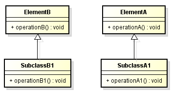
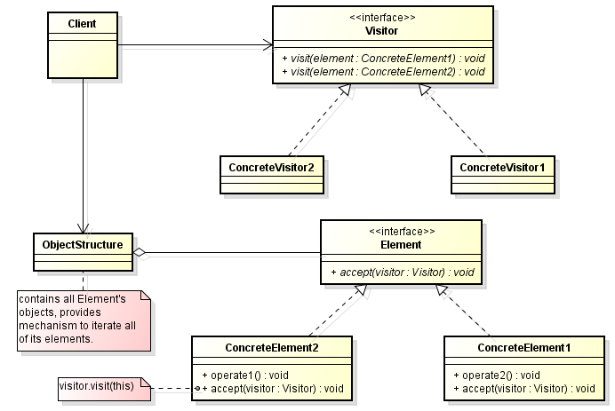

<br>

## Table of contents
- [Given problem](#given-problem)
- [Solution of Visitor Pattern](#solution-of-visitor-pattern)
- [When to use](#when-to-use)
- [Benefits && Drawback](#benefits-&&-drawbacks)
- [Code C++/Java](#code-c++/java)
- [Application && Examples](#application-&&-examples)
- [Wrapping up](#wrapping-up)


<br>

## Given problem





<br>

## Solution of Visitor Pattern

The Visitor pattern states that:

```
Represent an operation to be performed on elements of an object structure. Visitor lets you define a new operation without changing the classes of the elements on which it operates.
```

The nature of the Visitor makes it an ideal pattern to plug into public APIs thus allowing its clients to perform operations on a class using a "visiting" class without having to modify the source.

Below is an UML diagram of Visitor pattern.



- ```Element```: This represents the base class for the object structure. All the classes in the structure are derived from it and they must implement the ```accept()``` method.

- ```ConcreteElement1``` and ```ConcreteElement2```: These are concrete classes to which we want to add external operations implemented in the ```Visitor``` class.

- ```Visitor```: This is the base ```Visitor``` class, which declares a method corresponding to each ```ConcreteElement1```. The name of the method is the same, but each method is differentiated with the same name and different signatures. But if needed, we can declare methods with different names.

- ```ConcreteVisitor1```: This is the implementation of the ``Visitor``. When we need a separate set of operations, we simply create another visitor.


<br>

## When to use
- Similar operations have to be performed on objects of different types grouped in a structure (a collection or a more complex structure).

- There are many distinct and unrelated operations needed to be performed. Visitor pattern allows us to create a separate visitor concrete class for each type of operation and to separate this operation implementation from the object structure.

- The object structure is not likely to be changed but is very probable to have new operations which have to be added. Since the pattern separates the visitor (representing operations, algorithms, behaviors) from the object structure it's very easy to add new visitors as long as the structure remains unchanged.

<br>

## Benefits && Drawback
1. Benefits

    - Makes adding new operations easy

        Because we create a new operation by adding a new subclass to the visitor class hierarchy.

    - Enables visiting elements of different types across inheritance hierarchies

        Visitor can visit elements that do not have a common interface, i.e, it can visit different types of elements (ConcreteElement1, ConcreteElement2, ...) that do not have to be related through inheritance.

    - Makes accumulating state easy

        - Visitor makes it easy to accumulate state while traversing an object structure.

        - It eliminates the need to pass the state to operations that perform the accumulation. The state is accumulated and stored in the visitor object.


2. Drawbacks

    - Requires extending the visitor interface to support new element classes.

        - The visitor interface must be extended to support new element classes in the object structure.

        - Therefore, the Visitor pattern should be used only when the object structure is stable and new element classes aren't added frequently.

    - May require extending the element interfaces

        - The element interfaces may have to be extended to let all visitors do their work and access the needed data and functionality.

    - Introduces additional levels of indirection

        - The pattern achieves flexibility by introducing separate visitor objects and a double-dispatch mechanism, which can complicate a design.


<br>

## Code C++/Java


<br>

## Application && Examples


<br>

## Wrapping up


<br>

Thanks for your reading.

<br>

Refer:

[https://en.wikipedia.org/wiki/Visitor_pattern](https://en.wikipedia.org/wiki/Visitor_pattern)

[https://blogs.oracle.com/javamagazine/the-visitor-design-pattern-in-depth](https://blogs.oracle.com/javamagazine/the-visitor-design-pattern-in-depth)

[https://en.wikibooks.org/wiki/Computer_Science_Design_Patterns/Visitor](https://en.wikibooks.org/wiki/Computer_Science_Design_Patterns/Visitor)

[https://www.oodesign.com/visitor-pattern.html](https://www.oodesign.com/visitor-pattern.html)