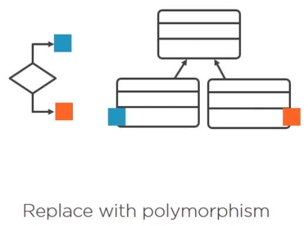
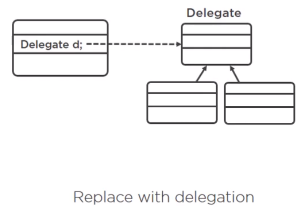

<br>

## Table of contents
- [Introduction to Object oriented Abusers](#introduction-to-object-oriented-abusers)
- [Conditional complexity](#conditional-complexity)
- [Refused request](#refused-request)
- [Temporary field](#temporary-field)
- [Alternative classes with different interfaces](#alternative-classes-with-different-interfaces)
- [Wrapping up](#wrapping-up)


<br>

## Introduction to Object oriented Abusers

Object-oriented abusers means that code that doesn't follow object-oriented programming principles.

<br>

## Conditional complexity

Conditional complexity simply means a complex switch operator or a sequence of if-else statements. So, how bad can an if statement get?

For example, we have conditional complexity.

```java
class SomeClass {
    String doSomething() {
        if(someCondition) {
            if(otherCondition) {
            } else if(){
            }
        } else if() {
        } else {
        }
    }
}
```

1. Complex conditionals ofet mean

    - Missing domain objects.
    - Not using polymorphism.
    - Not using inheritance.

2. Conditional Complexity issues

    - Starts simple, but gradually harder to understand as logic is added.
    - high likelihood of breaking.
    - Breaks the Open/Closed principle.

    For example, the online shop continues getting orders, and as we can see, we are adding wine and cheese to an order.

    ```java
    public static void main(String[] args) {
        Order order = new Order(getUsCustomer());
        order.add(new Wine());
        order.add(new Cheese());

        System.out.println("Items added for US customers: " + order.getItems());
    }
    ```

    As we all know, wine is an age restricted item, we can't just sell it to anyone. We must comply with the law, so we have to check the age of the customer.

    ```java
    poublic class Order {

        private Customer customer;
        private List<Item> items;
        private String voucher;

        public Order(Customer customer) {
            this.items = new ArrayList<>();
            this.customer = customer;
        }

        public Order(List<Item> items, String voucher) {
            this.items = items;
            this.voucher = voucher;
        }

        public boolean add(Item item) {
            if (item.isAgeRestrictedBeverage()) {
                if (customer.getAge() < 21) {
                    System.out.println("Cannot add age restricted item to order");
                    return false;
                }
            }

            return items.add(item);
        }
    }
    ```

    With above add() method of Order class, we are only selling to US customers. The online shop has started to sell broad, this is why we created the Address and Country classes.

    If we look at age restriction in other countries, we will see that it's not simle.

    |          Country          |      Age     |
    | ------------------------- | ------------ |
    | US                        | 21           |
    | EU countries              | 18           |
    | Canada                    | 18 or 19     |

    The legal limit in European countries is 18, and in Canada this depends on the provice, some have the limit of 18, some 19. Now, we will provide some check part for add() method.

    ```java
    public class Order {

        // ...

        public boolean addWithCheck(Item item) {
            Objects.requireNonNull(customer);
            Country country = customer.getAddress().getCountry();

            if (item.isAgeRestrictedBeverage()) {
                int age = customer.getAge();

                if (age < 21 && country.toString().equals("US")) {
                    System.out.println("Cannot add age restricted item to order");
                    return false;
                }

                if (customer.getAge() < 18 && country.toString().equals("France") ||
                    customer.getAge() < 18 && country.toString().equals("Spain")) {
                    System.out.println("Cannot add age restricted item to order");
                    return false;
                }

                if (country.toString().equals("Canada")) {
                    String province = customer.getAddress().getProvince();

                    if (age >= 18 && "Quebec".equalsIgnoreCase(province) || "Alberta".equalsIgnoreCase(province)) {
                        return items.add(item);
                    } else if (age >= 19) {
                        return items.add(item);
                    } else {
                        System.out.println("Sorry, you're under age");
                        return false;
                    }
                }
            }

            return items.add(item);
        }
    }
    ```

    So, when we read the above code, we find that it's really complex. This isn't looking nice, and is going to get quite cumbersome to maintain as we add more and more countries.

3. How to fix Conditional Complexity

    One way is to replace conditionals with polymorphism, and that's what we're going to do.

    

    Instead of writing if-else logic, we are going to let Java find the concrete country for us and execute the necessary codes. Refactoring this can get a little messy, and we find it useful when we have two implementation versions next to each other so we can compare.

    ```java
    public class Order {
        // ...

        public boolean addWithCheck2(Item item) {
            if (item.isAgeRestrictedBeverage()) {
                if (this.customer.getAge() < getLegalAgeFor(this.customer))
            }

            return items.add(item);
        }

        private int getLegalAgeFor(Customer customer) {
            Country country = customer.getAddress().getCountry();
            if (country instanceof Canada) {
                Canada canada = (Canada) country;
                return canada.getLegalDrinkingAge(customer.getAddress().getProvince());
            }

            return country.getMinimumLegalDrinkingAge();
        }

    }

    public class Spain extends Country {
        @Override
        public int getMinimumLegalDrinkingAge() {
            return 18;
        }
    }

    public class France extends Country {
        @Override
        public int getMinimumLegalDrinkingAge() {
            return 18;
        }
    }

    public class US extends Country {
        @Override
        public int getMinimumLegalDrinkingAge() {
            return 21;
        }
    }

    public class Canada extends Country {
        @Override
        public int getMinimumLegalDrinkingAge() {
            return 18;
        }

        public int getLegalDrinkingAge(String province) {
            if (liberalProvince(province)) {
                return getMinimumLegalDrinkingAge();
            }

            return 19;
        }

        private static boolean liberalProvince(String province) {
            return "Quebec".equalsIgnoreCase(province) ||
                   "Alberta".equalsIgnoreCase(province);
        }
    }
    ```

    And there are many, many more ways to refactor conditional complexity. So, we only provide the specific way - replace with delegation, which is simply implementing the strategy pattern.

    


4. Benefits achieved

    - Each piece of logic encapsulated.

    - Much lower chance of breaking existing code when adding more related logic.


<br>

## Refused request


<br>

## Temporary field


<br>

## Alternative classes with different interfaces


<br>

## Wrapping up


<br>

Refer:

