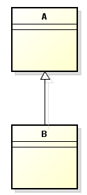
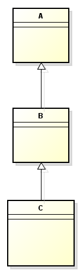
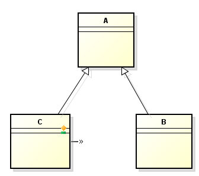
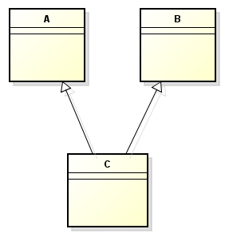

<br>

## Table of contents
- [Programming paradigm](#programming-paradigm)
- [Introduction to Object oriented programming](#introduction-to-object-oriented-programming)
- [Inheritance](#inheritance)
- [Encapsulation](#encapsulation)
- [Abstraction](#abstraction)
- [Polymorphism](#polymorphism)
- [Wrapping up](#wrapping-up)

<br>

## Programming paradigm

According to [wikipedia.com](https://en.wikipedia.org/wiki/Programming_paradigm), we have a definition of programming paradigm:

```
Programming paradigms are a way to classify programming languages based on their features. Languages can be classified into multiple paradigms.
```

```
Some paradigms are concerned mainly with implications for the execution model of the language, such as allowing side effects, or whether the sequence of operations is defined by the execution model. Other paradigms are concerned mainly with the way that code is organized, such as grouping a code into units along with the state that is modified by the code. Yet others are concerned mainly with the style of syntax and grammar.
```


<br>

## Introduction to Object oriented programming


<br>

## History of OOP


<br>

## Inheritance
1. Definition

    Inheritance is a mechanism in which one class can inherit/acquire properties/attributes and behaviors/methods from another classes.

    The relationship between classes is:
    - subclass (derived class): the class that inherit from another class.
    - superclass (base class): the class that is inherited

2. Some types of inheritance

    - Single inheritance

        

        It means that one subclass inherits from one superclass.

    - Multilevel inheritance

        

        It means that one class inherits from one superclass. And this superclass is also a subclass of the another relationship with one superclass.

    - Hierarchical inheritance

        

        It means that one class is a superclass of multiple subclass.

    - Multiple inheritance

        

        It means that one class can have more than one superclass and inherit attributes, methods from all superclasses.

3. Benefits

    - This inheritance property permits code reusability.
    
    - Reusability saves time in software development because we do not define the duplicated code.

    - Extensibility / Polymorphism: New functionality may be easily plugged in without changing existing classes as long the new plug-in classes extend given base classes.

4. Drawbacks

    - subclass and superclass get tightly coupled. Because changing the superclass in an inheritance relationship risks breaking our code.

    - when level of inheritance is increased highly. It is difficult to test, debug, understand where we are.

<br>

## Encapsulation
1. Definition

    Encapsulation is a way to protect our data that is accessed from outside.

2. Benefits

    - better control of class attributes and methods.
    - flexible: developer can change one part of the code without affecting other parts.
    - increased security of data.

<br>

## Abstraction
1. Definition

    Abstraction is a way that we choose some crucial properites or behaviors of something to describe, create our class after getting rid of unnecessary information or complex functionality that we do not need.

2. Benefits

    - makes code reable and easily to understand.

    - reduces the complexity of the design and implementation process of software.

    - allows us to group several related classes as siblings.

<br>

## Polymorphism
1. Definition

    Polymorphism means "many forms", is a way that we can perform a single action in different ways.

2. Some types of polymorphism

    - compile time polymorphism
    - run time polymorphism

        is a process in which a call to an overridden method is resolved at runtime rather than compile time.

3. Benefits

    - 

<br>

## Wrapping up


<br>

Refer:

[Object-Oriented Analysis, Design and Implementation, 2nd Edition]()

[https://www.guru99.com/java-data-abstraction.html](https://www.guru99.com/java-data-abstraction.html)

[https://www.cs.rit.edu/~afb/20012/cs4/slides/contract-08.html](https://www.cs.rit.edu/~afb/20012/cs4/slides/contract-08.html)

[https://www.ianswer4u.com/2017/09/oops-inheritance-advantages.html](https://www.ianswer4u.com/2017/09/oops-inheritance-advantages.html)

[https://www.ianswer4u.com/2017/07/abstraction-oops-advantages-examples.html](https://www.ianswer4u.com/2017/07/abstraction-oops-advantages-examples.html)

[http://erpbasic.blogspot.com/2012/01/inheritance-advantages-and.html](http://erpbasic.blogspot.com/2012/01/inheritance-advantages-and.html)

[https://javarevisited.blogspot.com/2012/03/what-is-encapsulation-in-java-and-oops.html](https://javarevisited.blogspot.com/2012/03/what-is-encapsulation-in-java-and-oops.html)