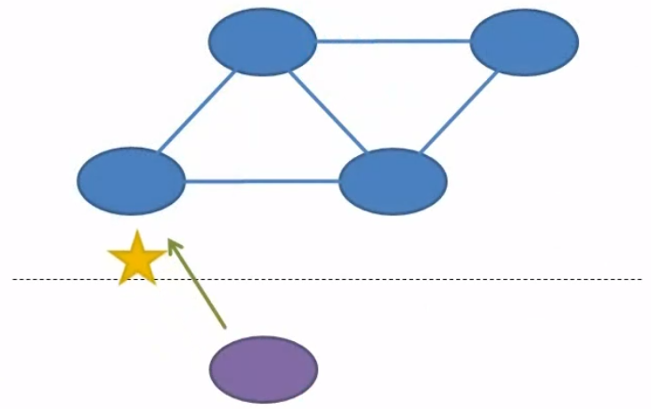
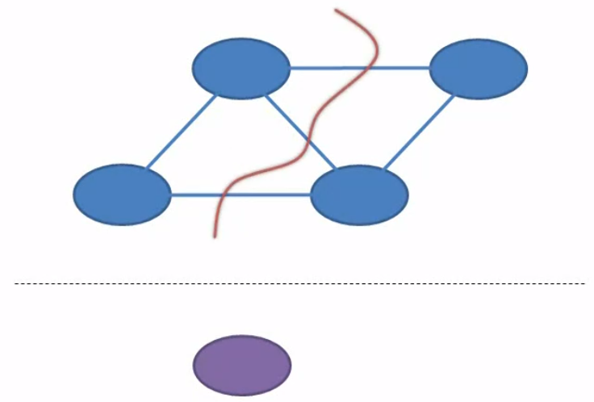

 

## Table of contents
- [Introduction to CAP theorem](#Introduction-to-CAP-theorem)
- [Consistency](#Consistency)
- [Availability](#Availability)
- [Partition Tolerance](#Partition-Tolerance)
- [Wrapping up](#wrapping-up)

 

## Introduction to CAP theorem

1. Distributed system

    It's a collection of interconnected nodes that all share data. A client can write data to a distributed system by talking to any one of these nodes.
    
    

    And then the client can read data from the distributed system by talking to either that same node or a different node.

    

2. CAP theorem

    CAP stands for **Consistency**, **Availability**, and **Partition Tolerance**.

    **CAP theorem**, also named **Brewer's theorem** after the computer scientist **Eric Brewer** postulated this theorem back in the 2000.
    
    This theorem talks about how the system reacts when it gets a write request followed by a read request. The theorem states that for any given pair of requests, a write followed by a read, a distributed system can promise to guarantee only two out of three attributes.

    These attributes contains:
    - Consistency
    - Availability
    - Partition Tolerance

 

## Consistency

It means that the system guarantees to read data that is at least as fresh as what we just wrote. So, whether the client reads from the same node that we just wrote to or from a different node, that node is not allowed to return stale data. So somebody else might have written something newer and the client might see their change, but consistency guarantees that the client will not see older data than what it just wrote.

All nodes see the same data at the same time. Consistency is achieved by updating several nodes.

1. Eventual Consistency

2. Strong Consistency

 

## Availability

It means that a non-failing node will give the client a reasonable response whitin a reasonable amount of time. Now all that's relative, but what that really means is that it won't hang definitely, and it won't return an error. This applies to both the read and to the write request.

So, that means that the write request will acknowldge that the data was actually written, and the read request will return valid data. Neither of these requests can return error, and neither one is allowed to hang indefinitely. So, this attribute only applies to non-failing nodes. A node itself could actually be down, and the system would remain available. If the client is able to get access to any non-failing node and that node responds without an error in a reasonable amount of time, then the availability guarantee is upheld.

 

## Partition Tolerance

Partition tolerance guarantees that a distributed system will continue to function in the face of network partitions. A network partition is a breaking connectivity. It means that nodes within the system cannot communicate with one another. A partition could be isolated to just the connection between two specific nodes or it could run through the entire network.

On the other hand, a partition could be just a temporary loss of connectivity like may be the loss of a single packet due to line noise or a partition could refer to something permanent like a backhoe cutting through a buried cable. But if the distributed system continues to function when the network is partitioned, then it's said to be partition tolerant.

 

## Wrapping up

 

Refer:

[https://en.wikipedia.org/wiki/CAP_theorem](https://en.wikipedia.org/wiki/CAP_theorem)

[https://towardsdatascience.com/cap-theorem-and-distributed-database-management-systems-5c2be977950e](https://towardsdatascience.com/cap-theorem-and-distributed-database-management-systems-5c2be977950e)