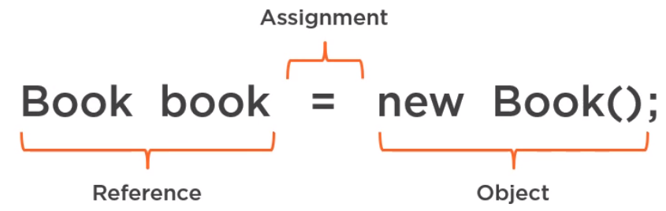
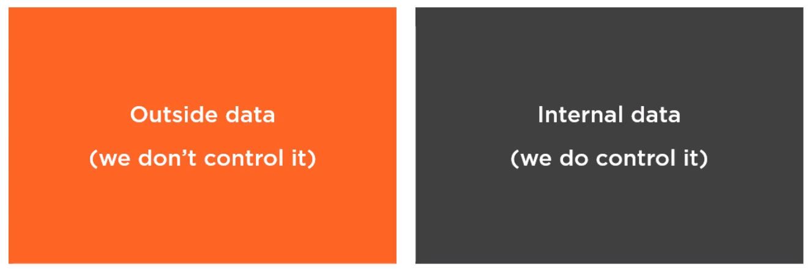

<br>

## Table of contents
- [Working with Reference types and Nulls](#working-with-reference-types-and-nulls)
- [Checking for Null using annotations](#checking-for-null-using-annotations)
- [Using the Null Object pattern](#using-the-null-object-pattern)
- [Using Optional instead of Null](#using-optional-instead-of-null)
- [Wrapping up](#wrapping-up)

<br>

## Working with Reference types and Nulls
1. Null and Reference types  
    In the conference, in 2009, Sir Charles Antony Richard Hoare apologized for introducing null references in the programming language Algol Wz in 1965.

    ```
    I call it my billion-dollar mistake. It was the invention of the null reference in 1965. [...] This has led to innumerable errors, vulnerabilities, and system crashes, which have probably caused a billion dollars of pain and damage in the last forty years.
    ```

    Null Usage:
    - Optional data

        Null is useful concept, it allows modeling optional data. For example, for certain the type of books, ISBN numbers are optional.

    - Unknown data

        Null also allow us to model data that hasn't been entered yet, but it will be available at some point. For example, a book record can be created before the book's finished and the exact number of pages is known.

    - Eager deinitialization

        Null can be used for either the initialization, too. For example, if a class manages its own memory, when an element is free, it should be noted out to avoid memory leaks.

    From a technical point of view, null is a value that indicates that our reference does not refer to an object.

    In assignment statement, it has three parts. The first part declares a reference variable. The second part creates an object of the type book telling the JVM to allocates space for a new book object in memory. Finally, the third part assigns the book object to a reference variable.

    

    We also cannot meet the object creation, and in this case, the reference Book would refer to nothing at all because for all reference types, null is the default value. In other words, these two statements are equivalent.

    ```java
    Book book;
    Book book = null;
    ```

    --> Nulls can be completely avoided in Java.

2. Traditional ways to dealing with Nulls

    The most common ways of checking for Nulls.
    - First, we use assertions.

        ```java
        public boolean isBookReadyForPublication(Book book) {
            assert book != null : "Book is null";
            // ...
        }
        ```

        If we use assertion, Error will be thrown.

    - if/else statements

        ```java
        public boolean isBookReadyForPublication(Book book) {
            if (book != null) {     // null != book
                // ...
            } else {
                // ...
            }
        }
        ```

        In this way, there's no extra benefits, but some people prefer it.

    - ```java.util.Objects``` class

        ```java
        public boolean isBookReadyForPublication(Book book) {
            Objects.requireNonNull(book, "Book is null");

            // or
            if (Objects.isNull(book)) {     // Objects.nonNull(book)
                // book object is null
            } else {
                // do something with book object
            }
        }
        ```

        These methods are concise, readble, standard and prevent any kind of typos. However, something to consider is that the ```Objects.requireNonNull()``` method throws a ```NullPointerException``` is the object is ```null```. So everything seems to lead us to exception, if we do nothing and try to call a method on a Null reference, Java will throw ```NullPointerException```.

    - Try/Catch

        ```java
        public boolean isBookReadyForPublication(Book book) {
            try {
                // use book object
            } catch(NullPointerException ex) {
                // book object was null
            }
        }
        ```

        Use try/catch version will have better performance because there's no checking for null. Exceptions may be a big cheaper in terms of performance. But using exception in this way, it's about practice because it leads to go, hard to understand.

- Best practices for data that we don't control

    We can clarify the data that flows through an application in two types.

    


- Best practice for data that we control


<br>

## Checking for Null using annotations


<br>

## Using the Null Object pattern


<br>

## Using Optional instead of Null


<br>

## Wrapping up


<br>

Refer:

[Working with Nulls in Java](https://app.pluralsight.com/library/courses/working-nulls-java/table-of-contents)