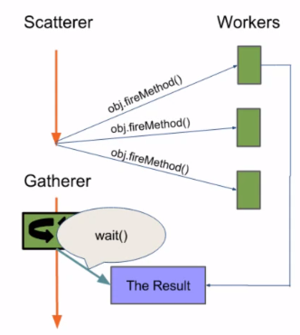

 

## Table of contents
- [The Scatter-Gather pattern](#the-scatter-gather-pattern)
- [Scatter-Gather using Futures]()
- [Scatter-Gather using ExecutorService]()
- [The importance of making aggregations Thread-safe]()
- [Gathering using concurrency primitives]()
- [Gathering using AtomicInteger, ConcurrentHashMap, and LongAdder](#gathering-using-atomicinteger-concurrenthashmap,-and-longadder)
- [Gathering using ReentrantLock](#gathering-using-reentrantlock)
- [Wrapping up](#wrapping-up)

 

## The Scatter-Gather pattern

This pattern shows up often in applications where a form of voting or biding is taking place between independent agents. For example, when evaluating access to a request, or when collecting quotes or prices for a proposed job. It comes up when one task is split into smaller tasks for the purpose of the smaller portions being run on separate agents, and then aggregated into a single result. It even appears in circumstances when specific instructions are duplicated to various agents for the purpose of increasing redundancy or lowering latency.

And while it may be tempting to take naturally splittable work and process it serially, choosing to parallelize the work may afford greater scalability in the same way that having more than one cashier at the supermarket may accelerate the checkout process.

 

## Scatter-Gather using Futures

 

## Scatter-Gather using ExecutorService

- **ExecutorService** and **ExecutorCompletionService** performance

 

## The importance of making aggregations Thread-safe

 

## Gathering using concurrency primitives

 

## Gathering using AtomicInteger, ConcurrentHashMap, and LongAdder

 

## Gathering using ReentrantLock

- Max Search using tryLock()

 

## Wrapping up

 

Refer:

[Scaling Java Applications Through Concurrency](https://app.pluralsight.com/library/courses/scaling-java-applications-through-concurrency/table-of-contents)