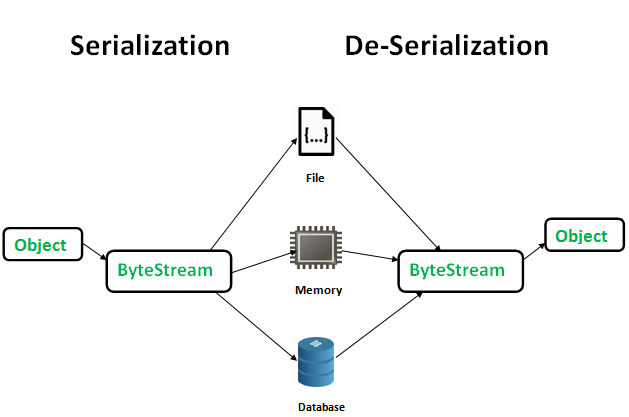

This question is always appeared in my mind, simply because when I've worked with Java web, especially Hibernate to implement with database. And why do we use it?

So, in this article, we will answer these question to remove our concern.

## Table of contents
- [Introduction to serializable](#introduction-to-serializable)
- [Solution](#solution)
- [Wrapping up](#wrapping-up)

<br>

## Introduction to serialization and deserialization
- Serialization is a mechanism of converting the state of an object into a byte stream. 
- Deserialization is the reverse process where the byte stream is used to recreate the actual Java object in memory.

This mechanism is used to persist the object.



The created byte stream is platform independent. So, the object serialized on one platform can be deserialized on a different platform.

Serialization is mainly used in Hibernate, RMI, JPA, EJB, and JMS technologies.

A Java object is serializable if its class or any of its superclasses implements either the ```java.io.Serializable``` interface or its subinterface ```java.io.Externalizable```. 

When an object is serialized, information that identifies its class is recorded in the serialized stream. However, the class's definition ("class file") itself is not recorded. It is the responsibility of the system that is deserializing the object to determine how to locate and load the necessary class files. 

For example, a Java application might include in its classpath a JAR file that contains the class files of the serialized object(s) or load the class definitions by using information stored in the directory.

For a class to be serialized successfully, two conditions must be met:
- The class must implement the ```java.io.Serializable``` interface.
- All of the fields in the class must be serializable. If a field is not serializable, it must be marked **transient**.

Advantages of Serialization:
- To save / persist state of an object.
- To travel an object across a network.

    

<br>

## Solution
To answer the above question, we will begin:
- 


<br>

## Wrapping up
- 


<br>

Thanks for your reading.


Refer:

[https://stackoverflow.com/questions/2020904/when-and-why-jpa-entities-should-implement-serializable-interface](https://stackoverflow.com/questions/2020904/when-and-why-jpa-entities-should-implement-serializable-interface)

[http://www.adam-bien.com/roller/abien/entry/do_jpa_entities_have_to](http://www.adam-bien.com/roller/abien/entry/do_jpa_entities_have_to)

[https://bvaisakh.wordpress.com/2015/03/04/do-jpa-entities-have-to-be-serializable/](https://bvaisakh.wordpress.com/2015/03/04/do-jpa-entities-have-to-be-serializable/)

[https://www.quora.com/Why-does-Java-Entity-need-to-implement-Serializable](https://www.quora.com/Why-does-Java-Entity-need-to-implement-Serializable)

[https://www.baeldung.com/java-serialization](https://www.baeldung.com/java-serialization)

[https://www.geeksforgeeks.org/serialization-in-java/](https://www.geeksforgeeks.org/serialization-in-java/)