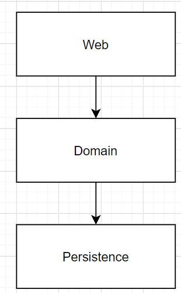

 

## Table of contents
- [Given problem](#given-problem)
- [Solution of Layered architecture pattern](#solution-of-layered-architecture-pattern)
- [Benefits and Drawbacks](#benefits-and-drawbacks)
- [Wrapping up](#wrapping-up)

 

## Given problem

Normally, when we want to make our website, in back-end, we use layer architecture to separate our project into components that each component will be taken on one responsibility.

Below is an commom layer architecture that we usually use in our projects.

- At the top rectangle, we have a **Web layer**, or sometimes, it called as **Ws layer**, which receives requests.

- The second thing that is **Domain layer**, or **Business layer**, requests from **Web layer** will be routed to a service in the **Domain layer**. The service does some business logic and calls components from the **Persistence layer** to implement some queries such as get, update, create, ... with records in database.

- The third thing is **Persistence layer**, that manages the communication between our application and other external devices such as database, redis, elastic search, file, ... Usually, we will use **Repository pattern** (used in Domain Drive Design) and DAO - **Data Access Object pattern**.

 

## Solution of Layered architecture pattern

 

## Benefits and Drawbacks
1. Benefits

2. Drawbacks

 

## Wrapping up

 

Refer:

[Software architecture pattern]()

[Learning modular programming](http://file.allitebooks.com/20170627/Learning%20Modular%20Java%20Programming.pdf)

[https://herbertograca.com/2017/08/03/layered-architecture/](https://herbertograca.com/2017/08/03/layered-architecture/)