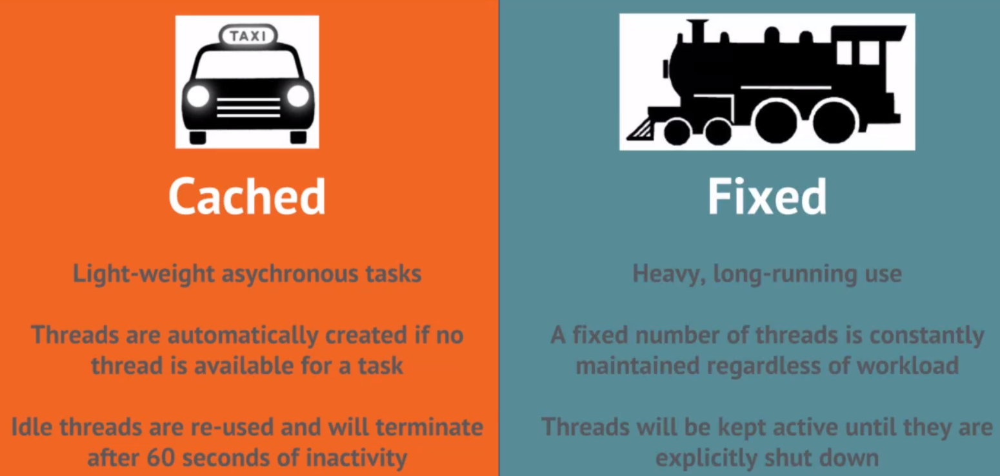

<br>

## Table of contents
- [The Fire-and-Forget pattern](#the-fire-and-forget-pattern)
- [Introducing ThreadPoolExecutor](#introducing-threadpoolexecutor)
- [Implementing Fire-and-Forget using ThreadPoolExecutor](#implementing-fire-and-forget-using-threadpoolexecutor)
- [Introducing ForkJoinPool](#introducing-forkjoinpool)
- [Implementing Fire-and-Forget using ForkJoinPool](#implementing-fire-and-forget-using-forkjoinpool)
- [Introducing Threaded Recursion with ForkJoinPool and BlockingQueue](#introducing-threaded-recursion-with-forkjoinpool-and-blockingqueue)
- [Implementing Fire-and-Forget using Thread Recursion](#implementing-fire-and-forget-using-thread-recursion)
- [Wrapping up](#wrapping-up)

<br>

## The Fire-and-Forget pattern

One of the typical benefits of a single-threaded application is ordering. When a process invokes a method, the ensuring lines in that process aren't run until the invoke method has completed. This natural blocking makes it easier to reason about the state of the process at any given time. It is, of course, expensive.

[](../img/concurrency/java/fire-and-forget-pattern/synchronization-benefits.png)

Consider the scenario where the callee is slow to do its work, but the caller is fast to do its work. Our application pay for this ordering guarantee by slowing the caller down. Indeed, if the caller blocks, then it can never take less time than the callee takes, kind of like being in line at the supermarket, where the caller is standing behind the callee in line. The passing of context back and forth has its costs as well. In the scenario that we are looking at, the originating process doesn't care about the child process's outcomes. When we blocks, we obligate the child process to pass context back in the form of a return statement, which is more then we need to do here. The 

--> We have piece of information that we need to care about:
- Operating on a single-thread bounds the application's performance to the slowest instructions.

- Anticipating a reply doubles the work that needs to be done.

- Fire-and-Forget addesses both.

<br>

## Introducing ThreadPoolExecutor

In this article, we will learn three options to implement the fire-and-forget pattern. Each give us an opportunity to identify important nuances of the problem, and the potential tradeoffs that each approach offers.
- Using ```ThreadPoolExecutor```.
- Using ```ForkJoinPool```.
- Using ```Thread Recursion```.

The ```ThreadPoolExecutor``` is one of many classes that implements the ```ExecutorService``` interface.

```java
// each instance an appropriately configured instance of ThreadPoolExecutor
ExecutorService pool = Executors.newCachedThreadPool();

ExecutorService pool = Executors.newFixedThreadPool(3);

ExecutorService pool = Executors.newSingleThreadExecutor();
```

The purpose of this interface is to provide an abstraction layer around the management of asynchronous tasks. It addresses several pain points.
- The first pain point is using threads that they are expensive to spawn. Overtime, responding a new thread for the same task each time we need to perform, it will take as much as four times as long as reusing a single thread to perform the same task over and over.

    Thus, what the ```ThreadPoolExecutor``` does is maintains a pool of threads available for rapid reuse. When a thread allocated by the ```ThreadPoolExecutor``` completes, it holds onto the reference for a specific period of time, during which another submission can be made against the same thread. This saves time, similar in concept to the way that a database connection pool can save time.

- The second pain point is thread API abuse. It's unsavory to extends a thread in order to make a task concurrent, and it's flat out incorrect to call the ```run()``` method instead of the ```start()``` method on the thread class. These mistakes are very easy to make and have been the subject of many a code review over the years.

    Perhaps more importantly though, this abstraction elevates our focus to ```runnable``` and ```callable```, which are much easier to work with, requiring the developer to commit to less at implementation time, and allowing different layers of the application to reason about the tasks themselves, independent from how or when they will be executed.

- The last pain point is regarding pipelining. ```ExecutorService``` makes it easy to reason about results of asynchronous tasks via Java ```Futures```, something originally unwieldy in the original thread API.

    Futures can be blocked on, ignored, or delegated to other layers of the application. 

- Note that the instances of ```ThreadPoolExecutor``` created via the executor static factory will not block on task submission, even if no threads are currently available. This is because in the background they maintain a queue from which tasks can be plucked as threads do become available.

    The executor static factory affords coders a lot of options for the kind of thread pool they could construct, but which is better for what situation? Two of the main options are whether to use a cached thread pool or a fixed thread pool.

    Using a cached thread thread pool is like commissioning a taxi service. A taxi service is best when there are several ad hoc, short trips, and the pool of resources may need to grow or shrink along with demand. Likewise, ```a cache to that pool is helpful for lightweight asynchronous tasks```.
    - When a task is submitted to a cached thread pool, if there is no currently available thread, a new one is spawned immediately.
    - Available threads are reused until they sit idle for 60 seconds, at which point the threads are killed and the memory is reallocated.

    The train service is different from a taxi service in that the intent is for regular and heavier loads. Trains may operate on a schedule independent from the needs of the consumer, and if a train isn't currently at the station, consumers will need to wait in line. Likewise, a fixed thread pool is helpful for heavy, long running use. These thread pools begin at a configured size and remain the way until the pool is explicitly shut down, regardless of load. If a thread is available when a task is submitted, the task is added to queue.

    

<br>

## Implementing Fire-and-Forget using ThreadPoolExecutor

Let's look at the following source code:

```java
public class IdentityPipeline {

    public void process(InputStream input) {
        Identity i;
        while ((i = readIdentity(input)) != null) {
            final Identity identity = i;
            try {
                validateAddresses(identity);

                phoneNumberFormatter.format(identity);
                emailFormatter.format(identity);

                if (!identityService.persistOrUpdateBestMatch(identity)) {
                    statsLedger.recordEntry(new StatsEntry(identity));
                }
            } catch (Exception e) {
                malformed.addIdentity(identity, e.getMessage);
            }
        }
    }
}
```

With the above code, we will apply the fire-and-forget pattern to send requests to the error queue. The original interface is ```MalformedIdentityRepository```, and an instance of it is invoked at the end of while loop, in catch block.

To keep the code focused on concurrency, the actual implementation of this interface is just a step that waits for a configurable amount of time. In the unit test that executes this code, the wait time for each call to the repository is 1 second in order to make the concurrency gains obvious over very small data sets.

Below we will use ThreadPoolExecutor to implement the fire-and-forget pattern.

```java
public class ThreadPoolExecutorMalformedIdentityRepository implements MalformedIdentityRepository {

    private MalformedIdentityRepository delegate;

    private ExecutorService pool = Executors.newCachedThreadPool();

    public ThreadPoolExecutorMalformedIdentityRepository(MalformedIdentityRepository delegate) {
        this.delegate = delegate;
    }

    @Override
    public void addIdentity(Identity identity, String reason) {
        // first way
        pool.submit(() -> this.delegate.addIdentity(identity, reason));

        // second way
        new Thread(() -> this.delegate.addIdentity(identity, reason)).start(); // SLOWER
    }

    @Override
    public void addIdentity(InputStream message, String reason) {
        pool.submit(() -> this.delegate.addIdentity(message, reason));
    }

}
```

<br>

## Introducing ForkJoinPool

ForkJoinPool is new implementation that was introduced in Java 7 to address the concern of unscheduled idle threads. A common misconception in the threading world is that launching something in a separate thread implies that there's no blocking happening. Indeed, a parent process may block on the results of an asynchronous tasked launched in some descended process. In this situtation, the thread that is executing the parent process is idle, which is suboptional since technically it could keep itself busy doing other work while it waits.

ForkJoinPool, also known as a work stealing pool, addresses this concern.


<br>

## Implementing Fire-and-Forget using ForkJoinPool


<br>

## Introducing Threaded Recursion with ForkJoinPool and BlockingQueue


<br>

## Implementing Fire-and-Forget using Thread Recursion


<br>

## Wrapping up


<br>

Refer:

[Scaling Java applications through concurrency](https://app.pluralsight.com/library/courses/scaling-java-applications-through-concurrency/table-of-contents)
