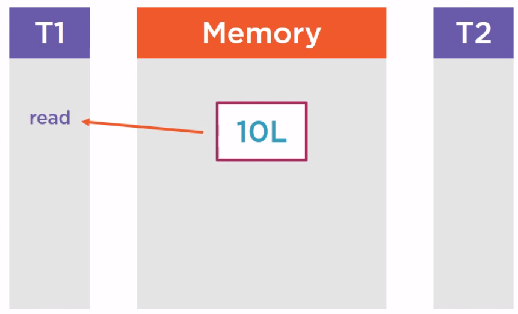
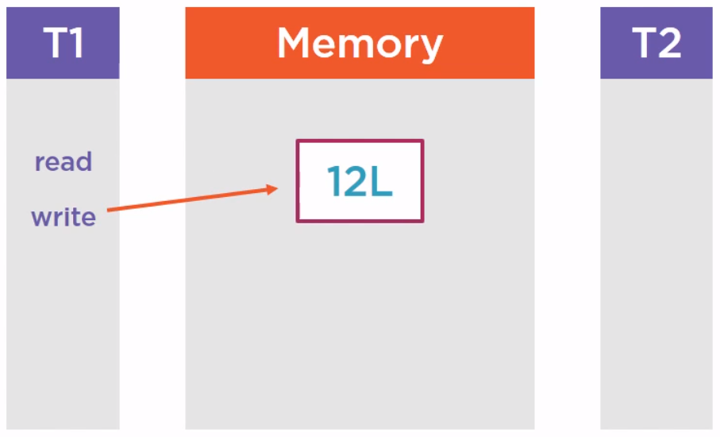
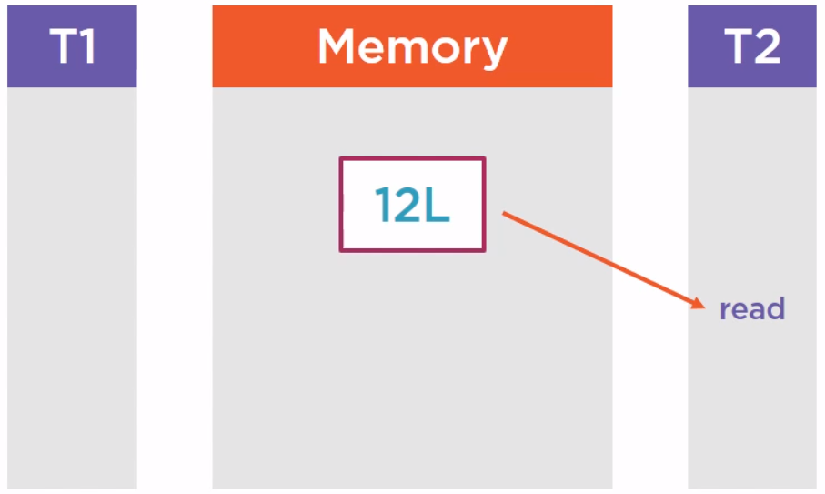
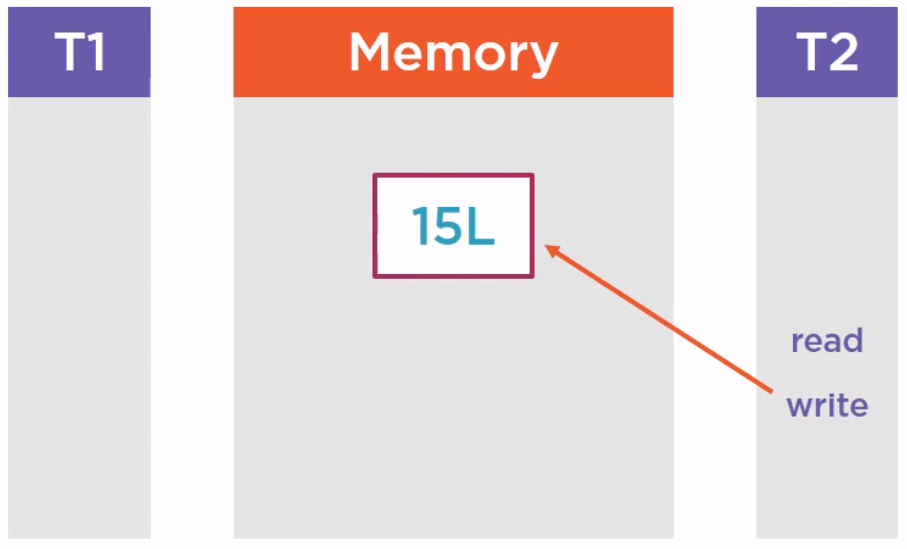

<br>

## Table of contents
- [Understanding about CASing]()
- [Some types of Atomic variable in Java]()
- []()
- [Wrapping up](#wrapping-up)

<br>

## Understanding about CASing

1. Introduction to CASing

    CASing means compare and swap, it is a notion that comes from the CPU, from the assembly language and that is available in the JDK.

    The starting point is a set of assembly instructions that is very low level functionalities given by the CPU. Those low level functionalities have been exposed at the API level in the JDK on the many other languages so that we can leverage them in our applications.

    - Given problem

        The problem it addresses is a classical concurrent programming problem. It is the concurrent access to shared memory. It means that several threads are trying to read and write, so read and modify the same variables of the same objects.

        Normally, we have some tools for this problem are synchronization tools, whether it is the classical synchronized block or the use of the lock interface. It works very well. It prevents several threads from modifying the same portion of memory at the same time. But in certain cases, we have more tools that would prove some efficient. In fact, synchronization has a cost and we can ask how ourselves the question, is it really always essential to use it. In fact, we use it to be sure that our code is correct. But if we didn't use it, are we really use that our code would fail. In fact, there are many cases where people forget to synchronize the modification of memory and  the code still works. What it means is that, in fact, there are many cases where real concurrency is rare.

        Below is a real problem of a portion memory which access has been synchronized. We have a first thread T1 that reads a variable, suppose it is long data type, value is 10.

        

        and we'll modify it.

        

        Then another thread is going to read it after that.

        

        Then, we also modify it.

        

        The purple rectangle on an above image is a shared portion of memory. Since we want to be sure that this memory is correct, we have synchronized its success. But in fact, when our application is running, the thread T1 and T2 are not accessing this portion of memory at exactly at the same time. They are accessing it one after another. So we know that we need to write correct code, we have used a synchronized block to protect this memory. This protection by lock is essential because if we do not do that and the two threads are writing and reading the code at exactly the same time, we will have concurrency issues race conditions.

        But in fact, when our application is running, there is no real concurrency at runtime because in that case, the thread T1 are not accessing this portion of memory at exactly the same time. And this is exactly the case where CASing precisely can be used.

    - Solution with CASing

        Compare and Swap works with three parameters:
        - The first is a location in memory, so basically, an address.
        - The second is the existing value at that location.
        - The third is a new value to replace this existing value.

        If the current value at that address is the expected value, then it is replaced by the new value and returns true. It means that between the last time we read this address and now, no other thread has modified this location. If it is not the case, it means that between the last time we read this location and read the expected value and now, some of the thread has modified this location, so we are observing real concurrency. Since the expected value is not the value at that location, we do not do any modification and we return false. And all this comparison and modification are made uninterruptible, are made in a single atomic assembly instruction.

        So during this time, we are sure that no other thread can interrupt our process. This is essential for the CASing to work.

2. Benefits of CASing

    - CASing is more efficient than synchronization if there is no real concurrency.

<br>

## Some types of Atomic variable in Java

1. AtomicLong class

    AtomicLong is a wrapper on a long. It can be used to create counters.

    ```java
    // Create an atomic long
    AtomicLong counter = new AtomicLong(10L);

    // Safely increment the value
    long newValue = counter.incrementAndGet();
    ```

    Belows are some steps that describe how the above code works.
    - The Java API tries to apply the incrementation.
    - The CASing implementation will tell the calling code if the incrementation failed or not. It just fail if another thread modified the counter in the meantime. If the incrementation fails, then the API is going to try again until this incrementation is accepted by the CASing mechanism.

        So, if we have several threads incrementing the same counter, CASing ensures that no incrementation is lost. If we have 4 threads incrementing a counter 25 times, this counter will hold 100 as a value at the end of the day. The counter part is that more than 100 incrementations will be attempted most probably. Some of them will not be taken into account due to concurrency.

2. AtomicBoolean class

    Some methods of this class:
    - **get()**, **set()** methods.
    - **getAndSet(value)** method returns the current value and update this value to the past value.
    - **compareAndSet(expected, value)** method that is basically CASing method with an expected value and the new value to be set if the expected value is matched.

3. AtomicInteger class

    Some methods of this class.
    - get(), set() methods
    - getAndSet(value)
    - compareAndSet(expected, value) method.
    - getAndUpdate(unaryOp), updateAndGet(unaryOp) methods

        getAndUpdate() method will return the current value and do the update.

        updateAndGet() will do the contrary, first update, then get a new value.

        A unary operator may be implemented using the lambda expression and it is just an operation on the current value that will compute the new value.

    - getAndIncrement(), getAndDecrement() methods

    - getAndAdd(value), addAndGet(value) methods

        addAndGet(value) method will increment the current value with the past value, returns the updated value.

        getAndAdd(value) method returns the existing value, increment the current value.

    - getAndAccumulate(value, binOp), accumulateAndGet(value, binOp)

        They takes a binary operator. This binary operator will operate and the current value at that location and the past value as a parameter to compute the new value to be set in this AtomicInteger or AtomicLong.

4. AtomicReference<V> class


<br>

## 


<br>

## Wrapping up


<br>

Refer:

[Advanced Java Concurrent Patterns by Jose Paumard](https://app.pluralsight.com/library/courses/java-concurrent-patterns-advanced/table-of-contents)

[https://www.softwaretestingclass.com/uses-of-processor-in-jmeter-tutorials-series-day-9/](https://www.softwaretestingclass.com/uses-of-processor-in-jmeter-tutorials-series-day-9/)

[https://www.guru99.com/processor-in-jmeter.html](https://www.guru99.com/processor-in-jmeter.html)