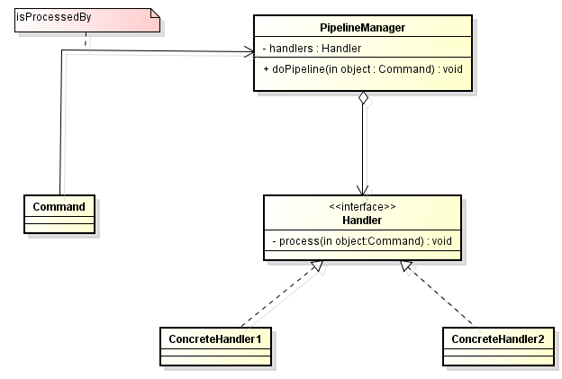

In this article, we will talk about Pipeline pattern, and some interesting information about it such as applying it in which real problems, when to use, how to use, the disadvantages and advantages.

<br>

## Table of contents
- [Given Problem](#given-problem)
- [Solution of Pipeline Pattern](#solution-of-pipeline-pattern)
- [When to use](#when-to-use)
- [Benefits & Drawback](#benefits-&-drawback)
- [Code C++ /Java / Javascript](#code-c++-java-javascript)
- [Relations with other Patterns](#relations-with-other-patterns)
- [Application & Examples](#application-&-examples)
- [Wrapping up](#wrapping-up)


<br>

## Given Problem 
In ```Chain of Responsibility``` pattern, when we have a new handler, 3 operations are required: 
- unlinking an existing handler
- relinking the new handler with its successor
- relinking the existing predecessor to the new handler

So, in some applications, these operations are quite error-prone indeed.

Then, ```Pipeline``` pattern was born to solve this problem.

<br>

## Solution of Pipeline Pattern

The major difference with the **Chain Of Responsibility** pattern is the introduction of the ```PipelineManager``` actor. The flexibility of the **Pipeline** pattern comes from the fact that at any time, a new ```Handler``` can be injected into the pipeline through the ```PipelineManager```.



Then, we will go to the definition and characteristic of pipeline:
- A pipeline is a linear sequence of stages.
- Data flows through the pipeline
    - From stage 1 to the last stage.
    - Each stage performs some task
        - uses the result from the previous stage.
    - Data is thought of as being composed of units (items).
    - Each data unit can be processed separately in pipeline.
- Pipeline computation is a special form of ```producer-consumer``` parallelism.
    - Producer tasks output data ...
    - ... used as input by consumer tasks.

<br>

## When to use
- Commonly used in scenarios where we need to execute the asynchronous tasks in sequence.

- The Pipeline pattern is very useful in parallel design when we can didive an application up into series of tasks to be performed in such a way that each task can run concurrently with other tasks. It is important that the output of each task is in the same order as the input.

    If the order does not matter, then a parallel loop can be performed. When the order matters and we do not want to wait until all items have complete task A before the items start executing task B, then a Pipeline implementation is perfect.

<br>

## Benefits & Drawback


<br>

## Code C++ /C# / Javascript

```C#
public interface ICommandHandlersProvider<TCommand>  
{
    IEnumerable<ICommandHandler<TCommand>> Provide();
}

public interface ICommandHandler<TCommand>
{
    void Execute(TCommand command);
}

public interface IPipeline<TCommand>
{
    void Process(TCommand command);
}

public interface IPipelineConfigurator<TCommand>
{
    Action<TCommand> Configure();
    Func<TCommand, Exception, Exception> ConfigureError();
}

public class PipelineConfigurator<TCommand> : IPipelineConfigurator<TCommand>
{
    private readonly ICommandHandlersProvider<TCommand> _handlersProvider;

    public PipelineConfigurator(ICommandHandlersProvider<TCommand> handlersProvider) 
    {
        _handlersProvider = handlersProvider;
    }

    public Action<TCommand> Configure()
    {
        Action<TCommand> handlingAction = delegate { };
        var commandHandlers = _handlersProvider.Provide();
        foreach (var handler in commandHandlers)
        {
            handlingAction += command => { handler.Execute(command); };
        }
        return handlingAction;
    }

    public Func<TCommand, Exception, Exception> ConfigureError()
    {
        // Exception handling based on policy comes here
        return (command, ex) => 
        { 
            // Logging error and exception transformation(optional) comes here
            return ex; 
        };
    }
}

public class AddCustomerCommand
{
    public AddCustomerCommand(string name)
    {
        Name = name;
    }

    public string Name { get; private set; }
    public string Address { get; set; }
}

public class AddCustomerValidationHandler : ICommandHandler<AddCustomerCommand>
{
    public void Execute(AddCustomerCommand command)
    {
        // Validating adding a new customer comes here
        if (string.IsNullOrWhiteSpace(command.Name))
            throw new ApplicationException("- Customer validation failed because customer name is not provided!");

        Console.WriteLine("+ Customer {0}:{1} validated.", command.Name, command.Address);
    }
}

public class AddCustomerPersistenceHandler : ICommandHandler<AddCustomerCommand>
{
    public void Execute(AddCustomerCommand command)
    {
        // Inserting new customer logic comes here
        Console.WriteLine("+ Customer {0}:{1} persisted.", command.Name, command.Address);
    }
}

public class AddCustomerAuditHandler : ICommandHandler<AddCustomerCommand>
{
    public void Execute(AddCustomerCommand command)
    {
        // Auditing 'add customer command' logic comes here
        Console.WriteLine("+ Customer {0}:{1} audited.", command.Name, command.Address);
    }
}

public class AddCustomerCommandHandlersProvider : ICommandHandlersProvider<AddCustomerCommand>
{
    public IEnumerable<ICommandHandler<AddCustomerCommand>> Provide()
    {
        yield return new AddCustomerValidationHandler();
        yield return new AddCustomerPersistenceHandler();
        yield return new AddCustomerAuditHandler();
    }
}

public class CommandPipeline<TCommand> : IPipeline<TCommand>
{
    private readonly IPipelineConfigurator<TCommand> _pipelineConfigurator;

    public CommandPipeline(IPipelineConfigurator<TCommand> pipelineConfigurator)
    {
        _pipelineConfigurator = pipelineConfigurator;
    }

    public void Process(TCommand command)
    {
        var handler = _pipelineConfigurator.Configure();
        try
        {
            using (var scope = new System.Transactions.TransactionScope())
            {
                handler(command);

                scope.Complete();
            }
        }
        catch (Exception ex)
        {
            var errorHandler = _pipelineConfigurator.ConfigureError();
            var transformedException = errorHandler(command, ex);
            Console.WriteLine(transformedException.Message);
        }
    }
}

public class Program
{
    static void Main(string[] args)
    {
        var addCustomerCommand1 = new AddCustomerCommand("Demo Customer 1") { Address = "202, X street, Big City" };
        var addCustomerCommand2 = new AddCustomerCommand("") { Address = "Invalid!" };
        var addCustomerCommand3 = new AddCustomerCommand("Demo Customer 2") { Address = "101, Y street, Small City" };

        var addCustomerPipeline = new CommandPipeline<AddCustomerCommand>(
            new PipelineConfigurator<AddCustomerCommand>(new AddCustomerCommandHandlersProvider()));
        addCustomerPipeline.Process(addCustomerCommand1);
        addCustomerPipeline.Process(addCustomerCommand2);
        addCustomerPipeline.Process(addCustomerCommand3);

        Console.ReadLine();
    }
}
```

<br>

## Relations with other Patterns
- The **Pipeline pattern** is similar to the **Event-Based Coordination pattern** in that both patterns apply to problems where it is natural to decompose the computation into a collection of semi-independent tasks. 

    The difference is that the **Event-Based Coordination pattern** is irregular and asynchronous where the **Pipeline pattern** is regular and synchronous: In the **Pipeline pattern**, the semi-independent tasks represent the stages of the pipeline, the structure of the pipeline is static, and the interaction between successive stages is regular and loosely synchronous. In the **Event-Based Coordination pattern**, however, the tasks can interact in very irregular and asynchronous ways, and there is no requirement for a static structure. 

- 


<br>

## Application & Examples


<br>

## Wrapping up


<br>

Thanks for your reading.

<br>

Refer:

[https://doanduyhai.wordpress.com/2012/07/08/design-pattern-the-pipeline/](https://doanduyhai.wordpress.com/2012/07/08/design-pattern-the-pipeline/)

[https://matthewdaly.co.uk/blog/2018/10/05/understanding-the-pipeline-pattern/](https://matthewdaly.co.uk/blog/2018/10/05/understanding-the-pipeline-pattern/)

[http://ipcc.cs.uoregon.edu/lectures/lecture-10-pipeline.pdf](http://ipcc.cs.uoregon.edu/lectures/lecture-10-pipeline.pdf)

[https://stackoverflow.com/questions/39947155/pipeline-design-pattern-implementation](https://stackoverflow.com/questions/39947155/pipeline-design-pattern-implementation)

[http://qrman.github.io/posts/2017/02/09/pipeline-pattern-plumber-quest](http://qrman.github.io/posts/2017/02/09/pipeline-pattern-plumber-quest)

[http://www.informit.com/articles/article.aspx?p=366887&seqNum=8](http://www.informit.com/articles/article.aspx?p=366887&seqNum=8)