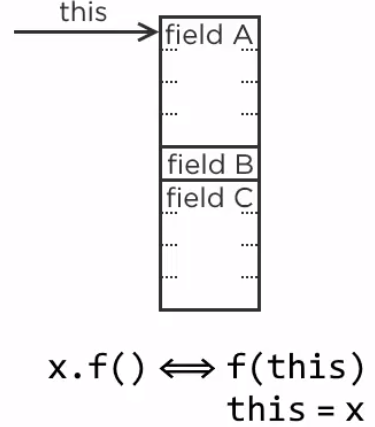
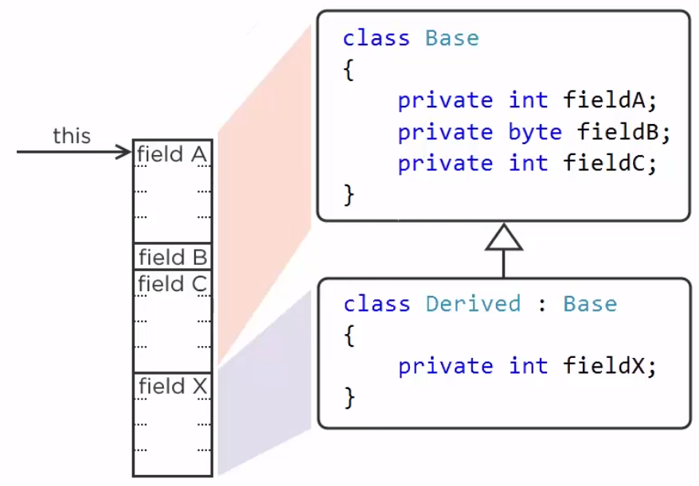
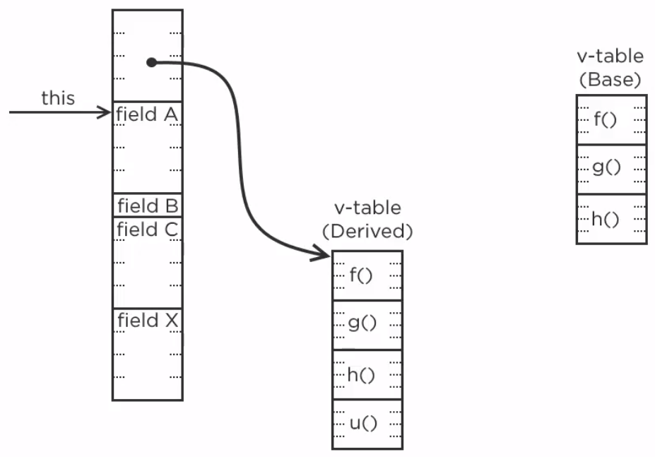
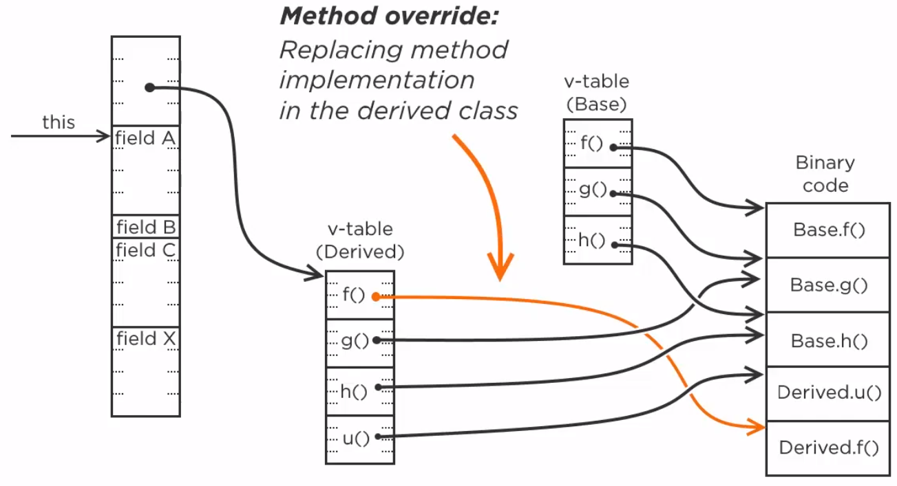
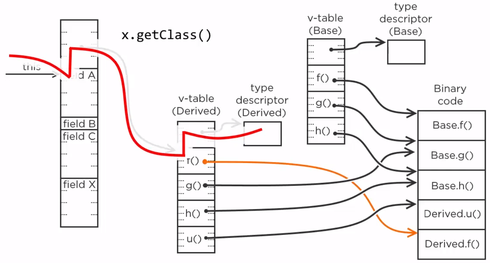
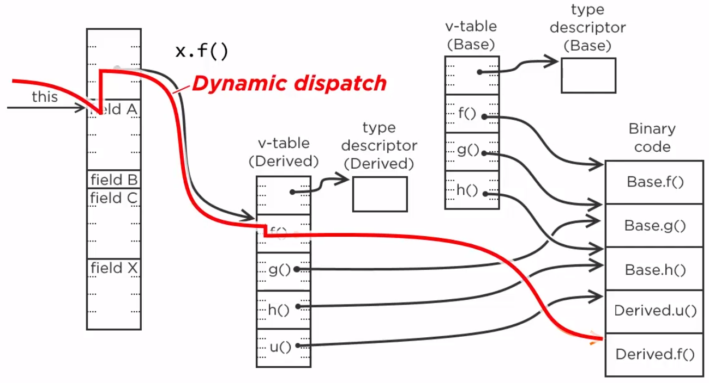
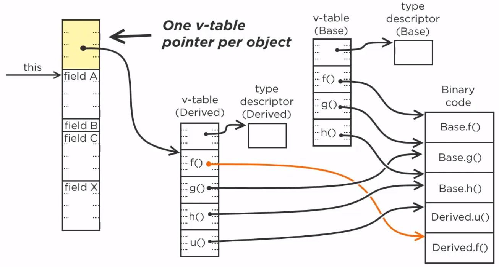

<br>

## Table of contents


<br>

## Attaining extensibility with object-oriented code

When we use OOP, we usually consider only some concepts such as Encapsulation, Polymorphism, Inheritance, Abstraction. But to understand deeper about these concepts, how did they implement in Java code?

We find two fundamental ideas:
- Implicit this reference
- Dynamic dispatch

So, Encapsulation, polymorphism and inheritance, those are the consequences. Now, we will go to understand each above idea.
- Implicit this reference

    When a method is called on an object, the reference to that object is silently passed as ```this```. So that the function has an object on which it operates. That is how we have finally stepped out from global functions.

    

- Dynamic dispatch

    We could inherit the class and the object layout will be expanded to accommodate the added state, but we couldn't care less, because it was the behavior that mattered, not the state.

    

    That was the mind-bending idea. A function could be attached to an object, so that its data become irrelevant, encapsulated if we like. Behavior is what counts. And then the second idea after which nothing will ever be the same, dynamic dispatch.

    Each object will carry metadata about its generating type, including the table of virtual functions, also known as the ```v-table```. The derived types of ```v-table``` would be the copy of the base types of v-table, possibly with some new functions added.

    

    Each entry in the ```v-table``` points to the actual binary code. Derived classes would typically just copy the addresses from the base v-table, so that all functions would be the same, but the derived class also choose to define its own function body for the function f. Its v-table entry would point to a different block of code. That is method overriding.

    

    Each object also has the means to reach the so-called ```type descriptor```. When we call the ```getClass()``` method on an object, the runtime will follow these pointer and return the class object for the precise object.

    

    When we call a virtual function on that object, the runtime will once again follow the reference to v-table, search for the first entry, which is the function f, and execute the code it points to. That is the mechanism known as the dynamic dispatch.

    

    Address of function calls are determined dynamically at runtime rather than statically at compile time. It is important to understand the runtime cost of these additions. There is exactly one v-table and one type descriptor per class, not per object. All objects of the same class will contain the same pointer value, but every object has this pointer added to its layout. In a 64-bit system, that means 8 bytes added to every object. Depending on our coding style, the memory footprint of our program could easily double. Still, with those two changes added to structured programming, the whole world has changed.

    

So, based on two fundamental ideas, we can make object-oriented with C code, assembly code, ...

<br>

## 


<br>

## 


<br>

## Some examples to refactor code

1. 

    ```java
    public class Main {
        public int sum(int[] values) {
            int sum = 0;
            for (int value : values) {
                sum += value;
            }

            return sum;
        }

        public int sum(int[] values, boolean oddNumbersOnly) {
            int sum = 0;
            for (int value : values) {
                if (oddNumbersOnly || value % 2 == 0) { // (1)
                    sum += value;
                }
            }

            return sum;
        }
    }
    ```

    The above code lacks flexibility. Because if we have a new requirement that sum up odd numbers, or sum up numbers at even positions, or sum up even numbers, so we need to change our code to be suitable for this requirement.

    So the solution will grow large and complicated. We will not be able to maintain it.

    The short answer is that it is lacking dynamic dispatch. The selection criteria **(1)** before summation must be dynamic. The current selection criteria is static, hard-coded in the middle of the loop. If a new requirement comes in, this selection criteria does not support the change.

    But we have some advice:
    - Do not change code to modify behavior.
    - Try to substitute an object with a different behavior.

    Below is the solution for our problem:

    ```java
    public class Main {
        public int sum(int[] values) {
            
        }
    }
    ```

2. 

    ```java
    public class Main {
        public void showIt(String data) {
            String upper;
            if (data == null) {
                upper = null;
            } else {
                upper = data.toUpperCase();
            }

            System.out.println(upper);
        }
    }
    ```

<br>

## Wrapping up


<br>

Refer:

