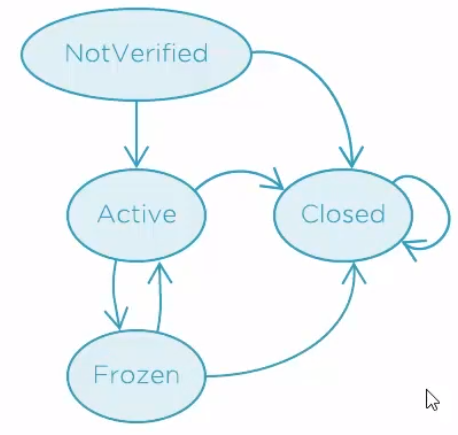
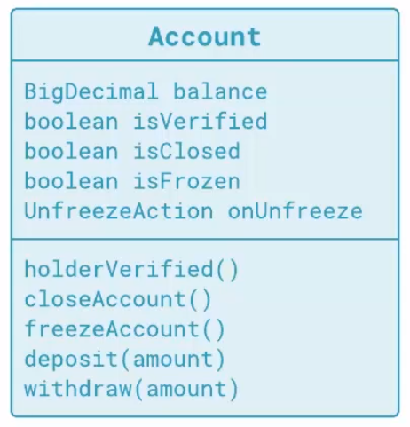
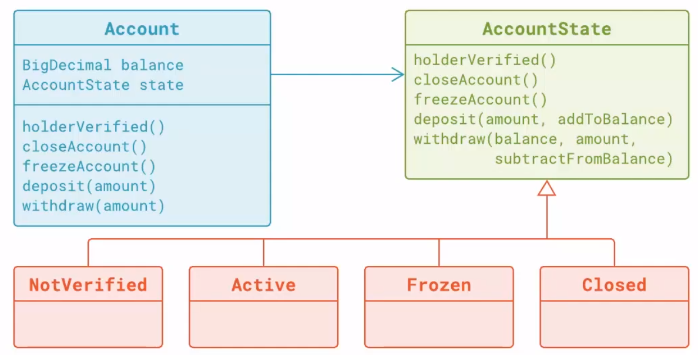
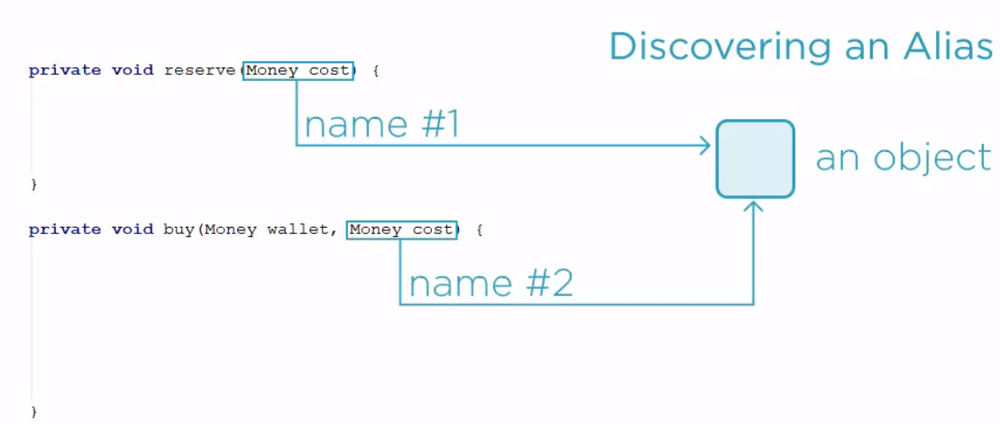
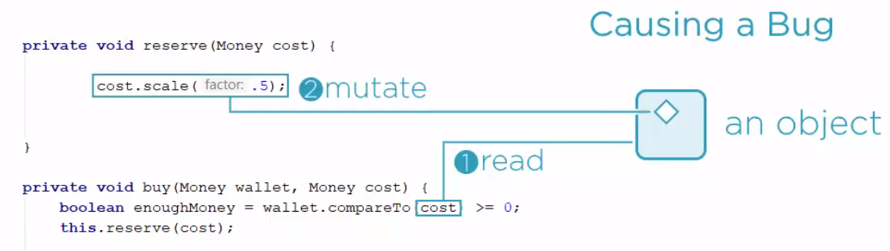

<br>

## Table of contents
- [Attaining extensibility with object-oriented code](#attaining-extensibility-with-object-oriented-code)


<br>

## Attaining extensibility with object-oriented code

When we use OOP, we usually consider only some concepts such as Encapsulation, Polymorphism, Inheritance, Abstraction. But to understand deeper about these concepts, how did they implement in Java code?

We find two fundamental ideas:
- Implicit this reference
- Dynamic dispatch

So, Encapsulation, polymorphism and inheritance, those are the consequences. Now, we will go to understand each above idea.
- Implicit this reference

    When a method is called on an object, the reference to that object is silently passed as ```this```. So that the function has an object on which it operates. That is how we have finally stepped out from global functions.

    

- Dynamic dispatch

    We could inherit the class and the object layout will be expanded to accommodate the added state, but we couldn't care less, because it was the behavior that mattered, not the state.

    

    That was the mind-bending idea. A function could be attached to an object, so that its data become irrelevant, encapsulated if we like. Behavior is what counts. And then the second idea after which nothing will ever be the same, dynamic dispatch.

    Each object will carry metadata about its generating type, including the table of virtual functions, also known as the ```v-table```. The derived types of ```v-table``` would be the copy of the base types of v-table, possibly with some new functions added.

    

    Each entry in the ```v-table``` points to the actual binary code. Derived classes would typically just copy the addresses from the base v-table, so that all functions would be the same, but the derived class also choose to define its own function body for the function f. Its v-table entry would point to a different block of code. That is method overriding.

    

    Each object also has the means to reach the so-called ```type descriptor```. When we call the ```getClass()``` method on an object, the runtime will follow these pointer and return the class object for the precise object.

    

    When we call a virtual function on that object, the runtime will once again follow the reference to v-table, search for the first entry, which is the function f, and execute the code it points to. That is the mechanism known as the dynamic dispatch.

    

    Address of function calls are determined dynamically at runtime rather than statically at compile time. It is important to understand the runtime cost of these additions. There is exactly one v-table and one type descriptor per class, not per object. All objects of the same class will contain the same pointer value, but every object has this pointer added to its layout. In a 64-bit system, that means 8 bytes added to every object. Depending on our coding style, the memory footprint of our program could easily double. Still, with those two changes added to structured programming, the whole world has changed.

    

So, based on two fundamental ideas, we can make object-oriented with C code, assembly code, ...

<br>

## Rendering branching over Boolean Flags obsolete

1. Given problem

    Supposed that we have an Account class that allows deposits and withdraws.

    Below is requirements that the customer need to do.
    - Client can always deposit money.
    - Client can withdraw only after the account holder has been verified (E.g. by showing an ID card once).

        --> With this requirement, we use isVerified boolean to check it.

    Source code for this Account class.

    ```java
    public class Account {
        private boolean isVerified;

        public void holderVerified() {
            this.isVerified = true;
        }

        public void deposit(BigDecimal amount) {
            // nothing to do
        }

        public void withdraw(BigDecimal amount) {
            if (!this.isVerified) {
                return;
            }

            // withdraw money
        }
    }
    ```

    Then, we have a new requirement:
    - Client can close the account --> we need to use isClosed boolean to check whether this account closed or not.

        If an account is closed, the user cannot deposit and withdraw money.

        We add more branches to our code.

        ```java
        public class Account {
            private boolean isVerified;
            private boolean isClosed;
            private BigDecimal balance;

            public Account() {
                this.balance = BigDecimal.ZERO;
            }

            public void holderVerified() {
                this.isVerified = true;
            }

            public void closeAccount() {
                this.isClosed = true;
            }

            public void deposit(BigDecimal amount) {
                if (this.isClosed) {
                    return;
                }

                // deposit money
                this.balance = this.balance.add(amount);
            }

            public void withdraw(BigDecimal amount) {
                if (!this.isVerified) {
                    return;
                }

                if (this.isClosed) {
                    return;
                }

                // withdraw money
                this.balance = this.balance.subtract(amount);
            }
        }
        ```

    The problem with this solution is that the code which is testing the account state is explicit. The explicit condition tests are making our code complicated.

    Some advice for this case:
    - Never model money as just the amount.
    - Define some Money type with amount and currency.

    With the above deposit() method, we need to two test cases. There are three test cases for withdraw() method. So it takes five tests to demonstrate that these two methods of the Account class are working as expected.

    If we have a new requiement such as Banks often put some accounts on ice, especially to indicate that the account was not actively used for some period of time. So we will use isFrozen boolean to overcome it.

    Then, we also need to define callback functions when these accounts get liquid again.

    ```java
    private AccountUnfrozen onUnfrozen;

    public Account(AccountUnfrozen onUnfrozen) {
        this.balance = BigDecimal.ZERO;
        this.onUnfrozen = onUnfrozen;
    }

    public void freezeAccount() {
        if (!this.isClosed) {
            return;
        }

        if (!this.isVerified) {
            return;
        }

        this.isFrozen = true;
    }

    public void deposit(BigDecimal amount) {
        if (this.isClosed) {
            return;
        }

        if (this.isFrozen) {
            this.isFrozen = false;
            this.onUnfrozen.handle();
        }

        this.balance = this.balance.add(amount);
    }

    public void withdraw(BigDecimal amount) {
        if (!this.isVerified) {
            return;
        }

        if (this.isClosed) {
            return;
        }

        if (this.isFrozen) {
            this.isFrozen = false;
            this.onUnfrozen.handle();
        }

        this.balance = this.balance.subtract(amount);
    }
    ```

    Finally, when we have new requirements, we will add new branches into our code. It makes the number of test cases become huge. The more the requirements are added, the more effort that we will use to test all cases.

2. Solution

    In this section, we will use State pattern.

3. Turning branching into a Function

    Before doing that, we will refactor the repeated code. We will find that in the above source code, the code that check whether it is frozen or not is repeated in **withdraw()** and **deposit()** method. So we will extract a new method which will only deal with the unfreezing logic.

    ```java
    public void deposit(BigDecimal amount) {
        if (this.isClosed) {
            return;
        }

        this.ensureUnfrozen();
        this.balance = this.balance.add(amount);
    }

    public void withdraw(BigDecimal amount) {
        if (!this.isVerified) {
            return;
        }

        if (this.isClosed) {
            return;
        }

        this.ensureUnfrozen();
        this.balance = this.balance.subtract(amount);
    }

    private void ensureUnfrozen() {
        if (this.isFrozen) {
            this.isFrozen = false;
            this.onUnfrozen.handle();
        } else {
            // do nothing
        }
    }
    ```

    Use if/else branch in this case will make the implementation symmetrical. There is a huge between if and if/else instructions.
    - Plain if can be used as a so-called guard clause like the below code.

        ```java
        private void ensureUnfrozen() {
            // guard clause
            if (!this.isFrozen) {
                return;
            }

            this.isFrozen = false;
            this.onUnfrozen.handle();
        }
        ```

        This coding style is more convenient, as it makes the meaning of branching more obvious.

        The method now begins with a guard,
        - testing whether preconditions for this method are satisfied.
        - terminates the method early if it does not apply.

        Preconditioned to remove the frozen status is that the account is frozen. If it is not, just get out of the method and do nothing.

    - Using if/else instruction

        From the above if/else instruction, we have:

        ```java
        private void ensureUnfrozen() {
            if (this.isFrozen) {
                this.isFrozen = false;
                this.onUnfrozen.handle();
            } else {
                // do nothing
            }
        }
        ```

        Now we can make it explicit that if/else branches are leading to seperate blocks of code.

        ```java
        private void ensureUnfrozen() {
            if (this.isFrozen) {
                this.unfreeze();
            } else {
                this.stayUnfrozen();
            }
        }

        private void unfreeze() {
            this.isFrozen = false;
            this.onUnfrozen.handle();
        }

        private void stayUnfrozen() {
            // do nothing
        }
        ```

        It makes surprise because we are pulling out any empty method from an empty else branch. In the ensureUnfrozen() method, we are invoking the stayUnfrozen() method --> what if it was supplied through an object?

        Then, we will add an interface with that name.

        ```java
        public interface EnsureUnforzen {
            void execute();
        }
        ```

        The trick is to imagine that **EnsureUnforzen** is a seperate entity. And a concrete object carrying a concrete implementation will be stored in a below field.

        ```java
        public class Account {
            private boolean isVerified;
            private boolean isClosed;
            private boolean isFrozen;
            private BigDecimal balance;

            private AccountUnfrozen onUnfrozen;
            private EnsureUnfrozen ensureUnfrozen;

            public Account() {
                this.balance = BigDecimal.ZERO;
            }

            public Account(AccountUnfrozen onUnfrozen) {
                this.balance = BigDecimal.ZERO;
                this.ensureUnfrozen = this::stayUnfrozen;
                this.onUnfrozen = onUnfrozen;
            }

            public void holderVerified() {
                this.isVerified = true;
            }

            public void closeAccount() {
                this.isClosed = true;
            }

            public void freezeAccount() {
                if (this.isClosed) {
                    return;
                }

                if (!this.isVerified) {
                    return;
                }

                this.isFrozen = true;
                this.ensureUnfrozen = this::unfreeze;
            }

            public void deposit(BigDecimal amount) {
                if (this.isClosed) {
                    return;
                }

                this.ensureUnfrozen.execute();
                this.balance = this.balance.add(amount);
            }

            public void withdraw(BigDecimal amount) {
                if (!this.isVerified) {
                    return;
                }

                if (this.isClosed) {
                    return;
                }

                this.ensureUnfrozen.execute();
                this.balance = this.balance.subtract(amount);
            }

            private void ensureUnfrozen() {
                if (this.isFrozen) {
                    this.unfreeze();
                } else {
                    this.stayUnfrozen();
                }
            }

            private void unfreeze() {
                this.isFrozen = false;
                this.onUnfrozen.handle();
                this.ensureUnfrozen = this::stayUnfrozen;
            }

            private void stayUnfrozen() {
                // do nothing
            }
        }
        ```

        After using EnsureUnforzen interface to act as freezing account, we can remove some reduncancy code such as isFrozen boolean variable, the ensureUnfrozen() method.

        So, when encountering if/else branches, we need to try to branch by selecting an object, not a block of code.

    Some advices for this case:
    - Either guard against a non-applicable case.
    - Implement both the positive and negative branch.

    So, the below is source code after using EnsureUnforzen interface.

    ```java
    public class Account {
        private boolean isVerified;
        private boolean isClosed;
        private BigDecimal balance;

        private AccountUnfrozen onUnfrozen;
        private EnsureUnfrozen ensureUnfrozen;

        public Account() {
            this.balance = BigDecimal.ZERO;
        }

        public Account(AccountUnfrozen onUnfrozen) {
            this.balance = BigDecimal.ZERO;
            this.ensureUnfrozen = this::stayUnfrozen;
            this.onUnfrozen = onUnfrozen;
        }

        public void holderVerified() {
            this.isVerified = true;
        }

        public void closeAccount() {
            this.isClosed = true;
        }

        public void freezeAccount() {
            if (this.isClosed) {
                return;
            }

            if (!this.isVerified) {
                return;
            }

            this.ensureUnfrozen = this::unfreeze;
        }

        public void deposit(BigDecimal amount) {
            if (this.isClosed) {
                return;
            }

            this.ensureUnfrozen.execute();
            this.balance = this.balance.add(amount);
        }

        public void withdraw(BigDecimal amount) {
            if (!this.isVerified) {
                return;
            }

            if (this.isClosed) {
                return;
            }

            this.ensureUnfrozen.execute();
            this.balance = this.balance.subtract(amount);
        }

        private void unfreeze() {
            this.onUnfrozen.handle();
            this.ensureUnfrozen = this::stayUnfrozen;
        }

        private void stayUnfrozen() {
            // do nothing
        }
    }
    ```

4. Turning a Function into an Object

    The EnsureUnforzen object is doing the right thing whenever the account should be unfrozen, but the core problem remains, as the Account class still thinks about when and how to invoke the operation. The time has come to remove that logic from the class entirely.

    Then, let's define a seperate type which will deal with these aspects of freezing. The purpose of this interface will be to think about how the freezing state changes, but not when that happens.

    Some advices for this case:
    - Let the interface implemenation know how something happens.
    - Leave it to the caller to tell when.

    ```java
    public interface Freezable {

        void deposit();

        void withdraw();

        // turn Active state into Frozen
        void freezeAccount();
    }
    ```

    This interface almost defines a state. Below is the source code for concrete states.

    ```java
    public class FreezableActive implements Freezable {
        @Override
        public void deposit() {

        }

        @Override
        public void withdraw() {

        }

        @Override
        public void freezeAccount() {

        }
    }
    ```

    For example, an active account would be implemented by the **FreezableActive** class. It would do nothing special in the **deposit()** and **withdraw()** methods, because it already models the active state of the account, but the **freezeAccount()** operation would cause us troubles, as the state would have to become frozen.

    An object cannot change its own runtime type though. When we have such a need, then we normally return a new object to tell the caller that current object must be substituted. Another type would model the frozen state and that object would have to turn itself into active state when deposit or withdraw is invoked.

    ```java
    public Freezable freezeAccount() {
    }
    ```

    That is how we come to design in which every method of a state is returning the next state.

    ```java
    public interface Freezable {
        Freezable deposit();

        Freezable withdraw();

        Freezable freezeAccount();
    }
    ```

    The first two methods will be trivial to complete because we have nothing to do when the account is already active. Simply the current state will remain, but the freeAccount() method will cost us some thinking. For now, it will remain simple as we only want to turn the state into frozen.

    ```java
    public class FreezableActive implements Freezable {
        @Override
        public Freezable deposit() {
            return this;
        }

        @Override
        public Freezable withdraw() {
            return this;
        }

        @Override
        public Freezable freezeAccount() {
            return new FreezableFrozen();
        }
    }
    ```

    This new class will be another implementation of the Freezable interface.
    
    ```java
    public class FreezableFrozen implements Freezable {
        private AccountUnfrozen onUnfrozen;

        public FreezableFrozen(AccountUnfrozen onUnfrozen) {
            this.onUnfrozen = onUnfrozen;
        }

        @Override
        public Freezable deposit() {
            return this.unfreeze();
        }

        @Override
        public Freezable withdraw() {
            return this.unfreeze();
        }

        private Freezable unfreeze() {
            this.onUnfrozen.handle();
            return new FreezableActive();
        }

        @Override
        public Freezable freezeAccount() {
            return this;
        }
    }
    ```

    This is where that logic regarding account unfreezing will move in. It will have to know about the callback we used before, and it will effectively call it from the deposit and withdraw before telling the caller that the state has changed to active.

    The **freezeAccount()** method, however, will have nothing to do because the account is already frozen. Even though the frozen state looks done, it has caused an error in the active state. In order to be able to advance the frozen state, the active state also has to know about that mandatory callback.

    ```java
    public class FreezableActive implements Freezable {
        private AccountUnfrozen onUnfrozen;

        public FreezableActive(AccountUnfrozen onUnfrozen) {
            this.onUnfrozen = onUnfrozen;
        }

        @Override
        public Freezable deposit() {
            return this;
        }

        @Override
        public Freezable withdraw() {
            return this;
        }

        @Override
        public Freezable freezeAccount() {
            return new FreezableFrozen(this.onUnfrozen);
        }
    }
    ```

    Then, the **unfreeze()** method in **FreezableFrozen** class is also changed because the constructor of **FreezableActive** need a **AccountUnfrozen** class's instance as parameter.

    ```java
    // before version
    private Freezable unfreeze() {
        this.onUnfrozen.handle();
        return new FreezableActive();
    }

    // after changed version
    private Freezable unfreeze() {
        this.onUnfrozen.handle();
        return new FreezableActive(this.unfrozen);
    }
    ```

    Now let's look at the Account class.

    ```java
    public class Account {
        private boolean isVerified;
        private boolean isClosed;
        private BigDecimal balance;
        private Freezable freezable;

        public Account(AccountUnfrozen onUnfrozen) {
            this.balance = BigDecimal.ZERO;
            this.freezable = new FreezableActive(onUnfrozen);
        }

        public void holderVerified() {
            this.isVerified = true;
        }

        public void closeAccount() {
            this.isClosed = true;
        }

        public void freezeAccount() {
            if (this.isClosed) {
                return;
            }

            if (!this.isVerified) {
                return;
            }

            this.freezable = this.freezable.freezeAccount();
        }

        public void deposit(BigDecimal amount) {
            if (this.isClosed) {
                return;
            }

            this.freezable = this.freezable.deposit();
            this.balance = this.balance.add(amount);
        }

        public void withdraw(BigDecimal amount) {
            if (!this.isVerified) {
                return;
            }

            if (this.isClosed) {
                return;
            }

            this.freezable = this.freezable.withdraw();
            this.balance = this.balance.subtract(amount);
        }
    }
    ```

    Bottom line at this moment is that we have achieved two important improvements in the Account class.
    - The first removal of any explicit logic that deals with freezing. The entire logic was wrapped in seperate classes.
    - Another improvement is that all other stuff that had to do with freezing and unfreezing is now moved to those other classes, in particular calling the injected behavior when the account is unfrozen.


5. Moving all state-related Functions int State Objects

    Now, what are the responsibilities of Account class? From its state, we can tell the account is managing **balance** and also managing **closing**, **verifying**, and **freezing**. Why not move the responsibilities where freezable state is implemented? We can defined even more states like closed or not verified, like frozen and active, which are there already.

    So, we will rename the **Freezable** interface to **AccountState**.

    ```java
    public interface AccountState {
        AccountState deposit();
        AccountState withdraw();
        AccountState freezeAccount();

        // added methods
        AccountState holderVerified();
        AccountState closeAccount();
    }
    ```

    Then, we will rename the **FreezableActive** class to **Active** class, **FreezableFrozen** class to **Frozen** to represent the **Account** class's states. And we also defined some other states such as **Closed**, **NotVerified**.

    

    Below is the source code of Closed state of an account.

    ```java
    public class Closed implements AccountState {
        @Override
        public AccountState deposit() {
            return this;
        }

        @Override
        public AccountState withdraw() {
            return this;
        }

        @Override
        public AccountState freezeAccount() {
            return this;
        }

        @Override
        public AccountState holderVerified() {
            return this;
        }

        @Override
        public AccountState closeAccount() {
            return this;
        }
    }
    ```

    Below is the source code of NotVerified state of an account.

    ```java
    public class NotVerified implements AccountState {
        @Override
        public AccountState deposit() {
            return this;
        }

        @Override
        public AccountState withdraw() {
            return this;
        }

        @Override
        public AccountState freezeAccount() {
            return this;
        }

        @Override
        public AccountState holderVerified() {
            return this;
        }

        @Override
        public AccountState closeAccount() {
            return new Closed();
        }
    }
    ```

    The trouble is that the account cannot tell whether it accepts or rejects the deposit. There is one technique, callback, will be used in this situation. In Java 8, we will use functional interface to implement it.

    State knows whether the deposit should be accepted or not, but it does not know how to make it happen. We need to change the deposit() method's signature and make it receive a money consumer.

    ```java
    public interface AccountState {
        AccountState deposit(BigDecimal amount, Consumer<BigDecimal> addToBalance);
        AccountState withdraw();
        AccountState freezeAccount();

        // added methods
        AccountState holderVerified();
        AccountState closeAccount();
    }
    ```

    This object addToBalance will be invoked when the situation is right to add money to the balance.

    So, in the NotVerified state, we have:

    ```java
    public class NotVerified implements AccountState {
        private AccountUnfrozen onUnfrozen;

        public NotVerified(AccountUnfrozen onUnfrozen) {
            this.onUnfrozen = onUnfrozen;
        }

        @Override
        public AccountState deposit(BigDecimal amount, Consumer<BigDecimal> addToBalance) {
            addToBalance.accept(amount);
            return this;
        }

        @Override
        public AccountState withdraw() {
            return this;
        }

        @Override
        public AccountState freezeAccount() {
            return this;
        }

        @Override
        public AccountState holderVerified() {
            return this;
        }

        @Override
        public AccountState closeAccount() {
            return new Closed();
        }
    }
    ```

    In the **NotVerified** state, deposit should be accepted and account should remain not verified. Withdraw will not be allowed on the non-verified account, so it only remains on-verified. Freezing will supposedly make no effect on non-verified accounts either. If a customer wanted to change that, we would have to introduce a new state, something like FrozenNotVerified and once the account holder is verified, the state will step to Active.

    ```java
    public class NotVerified implements AccountState {
        @Override
        // The Active's constructor requires that notification object.
        public AccountState holderVerified() {
            return new Active();
        }
    }
    ```

    After changing the signature of deposit() method of AccountState, we also need to change it in the other states. We will do similar things for withdraw() method of states.

    ```java
    public interface AccountState {
        AccountState deposit(BigDecimal amount, Consumer<BigDecimal> addToBalance);
        AccountState withdraw(BigDecimal balance, BigDecimal amount, Consumer<BigDecimal> subtractFromBalance);

        // other states will remain
    }
    ```

    ```java
    public class Active implements AccountState {
        private AccountUnfrozen onUnfrozen;

        public Active(AccountUnfrozen onUnfrozen) {
            this.onUnfrozen = onUnfrozen;
        }

        @Override
        public AccountState deposit(BigDecimal amount, Consumer<BigDecimal> addToBalance) {
            addToBalance(amount);
            return this;
        }

        @Override
        public AccountState withdraw(BigDecimal balance, BigDecimal amount, Consumer<BigDecimal> subtractFromBalance) {
            if (balance.compareTo(amount) >= 0) {
                subtractFromBalance.accept(amount);
            }

            return this;
        }

        @Override
        public AccountState freezeAccount() {
            return new Frozen(this.onUnfrozen);
        }

        @Override
        public AccountState holderVerified() {
            return this;
        }

        @Override AccountState closeAccount() {
            return new Closed();
        }
    }
    ```

    ```java
    public class Frozen implements AccountState {
        private AccountUnfrozen onUnfrozen;

        public Frozen(AccountUnfrozen onUnfrozen) {
            this.onUnfrozen = onUnfrozen;
        }

        @Override
        public AccountState deposit(BigDecimal amount, Consumer<BigDecimal> addToBalance) {
            return this.unfreeze();
        }

        @Override
        public AccountState withdraw(BigDecimal balance, BigDecimal amount, Consumer<BigDecimal> subtractFromBalance) {
            if (balance.compareTo(amount) >= 0) {
                subtractFromBalance.accept(amount);
            }

            return this.unfreeze();
        }

        private AccountState unfreeze() {
            this.onUnfrozen.handle();
            return new Active(this.onUnfrozen);
        }

        @Override
        public AccountState freezeAccount() {
            return this;
        }

        @Override
        public AccountState holderVerified() {
            return this;
        }

        @Override AccountState closeAccount() {
            return new Closed();
        }
    }
    ```

    ```java
    public class NotVerified implements AccountState {
        @Override
        public AccountState withdraw(BigDecimal balance, BigDecimal amount, Consumer<BigDecimal> subtractFromBalance) {
            return this;
        }

        // other methods will be remained.
    }
    ```

    Finally, the Account class remains to be cleaned up.

    ```java
    public class Account {
        private BigDecimal balance;
        private AccountState state;

        public Account(AccountUnfrozen onUnfrozen) {
            this.balance = BigDecimal.ZERO;
            this.state = new Active(onUnfrozen);
        }

        public void holderVerified() {
            this.state = this.state.holderVerified();
        }

        public void closeAccount() {
            this.state = this.state.closeAccount();
        }

        public void freezeAccount() {
            this.state = this.state.freezeAccount();
        }

        public void deposit(BigDecimal amount) {
            this.state = this.state.deposit(amount, this::addToBalance);
        }

        private void addToBalance(BigDecimal amount) {
            this.balance = this.balance.add(amount);
        }

        public void withdraw(BigDecimal amount) {
            this.state = this.state.withdraw(amount);
        }

        public void subtractFromBalance(BigDecimal amount) {
            this.balance = this.balance.subtract(amount);
        }
    }
    ```

    We have the new design for this Account class.

    

    

6. Benefits from turning state into an object

    - Class remains focused on primary role.
    - Other roles delegated to state objects.
    - Each state class also handles one role.

<br>

## Using Immutable Objects and Value Objects

1. Given problem

    Supposed that we are implementing some e-commerce application. We would like to implement the selling feature. We add a buy() method with two arguments, one indicating how much money the buyer has in the vault, and the other indicating the cost of whatever we are selling.

    ```java
    public class Demo {
        private void buy(Money wallet, Money cost) {
            // do nothing
        }

        public void run() {
            // do nothing.
        }
    }
    ```

    Below is the definition of Money class.

    ```java
    public class Money implements Comparable<Money> {
        private BigDecimal amount;
        private Currency currency;

        public Money(BigDecimal amount, Currency currency) {
            this.amount = amount.setScale(2, RoundingMode.HALF_UP);
            this.currency = currency;
        }

        public void scale(double factor) {
            this.amount = this.amount.multiply(new BigDecimal(factor)).setScale(2, RoundingMode.HALF_UP);
        }

        @Override
        public int compareTo(Money other) {
            return this.compareAmountTo(this.currency.compareTo(other.currency), other);
        }

        private int compareAmountTo(int currencyCompare, Money other) {
            return currencyCompare == 0 ? this.amount.compareTo(other.amount) : currencyCompare;
        }

        @Override
        public String toString() {
            return this.amount + " " + this.currency;
        }
    }
    ```

    And the source code of Currency class. It simply wraps a string representing the currency symbol, and it is also comparable.

    ```java
    public class Currency implements Comparable<Currency> {
        private String symbol;

        public Currency(String symbol) {
            this.symbol = symbol;
        }

        public Money zero() {
            return new Money(BigDecimal.ZERO, this);
        }

        @Override
        public int compareTo(Currency other) {
            return this.symbol.compareTo(other.symbol);
        }

        @Override
        public String toString() {
            return this.symbol;
        }
    }
    ```

    The only operation defined on the Money class is the scale() method. It can be used to scale the amount stored in this Money object by a given factor.

    Back to the task of selling goods, we want to reserve an item before selling it.

    ```java
    public class Demo {
        private void reserve(Money cost) {
            System.out.println("Reserving an item costing " + cost);
        }

        // The customer's request is to check whether the buyer has enough Money. Then, we reserve goods.
        private void buy(Money wallet, Money cost) {
            boolean enoughMoney = wallet.compareTo(cost) >= 0;
            this.reserve(cost);

            if (enoughMoney) {
                System.out.println("You will pay " + cost + " with your " + wallet);
            } else {
                System.out.println("You cannot pay " + cost + " with your " + wallet);
            }
        }

        public void run() {
            Currency usd = new Currency("USD");
            Money usd12 = new Money(new BigDecimal(12), usd);
            Money usd10 = new Money(new BigDecimal(10), usd);
            Money usd7 = new Money(new BigDecimal(7), usd);

            this.buy(usd12, usd10);

            System.out.println();
            this.buy(usd7, usd10);
        }
    }
    ```

    Everything works fine. Only there is a weak spot in this implementation. It is assuming that the reserve() method is not going to change its argument. Suppose that the reserve() method is part of some other class possibly hidden behind an abstract interface. What if we didn't have the reserve() method's implementation to read? Then suppose that one implementation of reserve() method starts playing tricks on us.

    Assuming that we have a new requirement that might be to introduce a happy hour. We can use isHappyHour boolean variable to indicate this feature. Now the reserve() method might cut the price to half during the happy hour.

    ```java
    public class Demo {
        private boolean isHappyHour;

        private void reserve(Money cost) {
            if (this.isHappyHour) {
                cost.scale(0.5);
            }

            System.out.println("Reserving an item costing " + cost);
        }

        public void run() {
            Currency usd = new Currency("USD");
            Money usd12 = new Money(new BigDecimal(12), usd);
            Money usd10 = new Money(new BigDecimal(10), usd);
            Money usd7 = new Money(new BigDecimal(7), usd);

            //this.buy(usd12, usd10);

            //System.out.println();
            //this.buy(usd7, usd10);

            //System.out.println();
            this.isHappyHour = true;
            this.buy(usd7, usd10);
        }
    }
    ```

    Then the console will print out like the below.

    ```
    Reserving an item costing 5.00 USD
    You cannot pay 5.00 USD with your 7.00 USD
    ```

    So we can find that this case is strange. Because we have 7 USD but we do not buy something with 5 USD in a happy hour. Now we definitely do have a bug.

2. Solution

    The problem of this kind of defect is that we cannot point to any particular line of code which is defective. Each function alone looks correct. That is how we come to the field of aliasing bugs. Alias means that there are two references to the same object. It is like when the same object can be found under two names. That is why this item alias has been used to define the situation, and then one object starts the foul play.

    

    The first object reads the shared object, then the second object writes the new content into it.

    

    Later, the first object continues doing things based on the earlier assumption. Unfortunately, the state of the shared object is now different. Another read would reveal that, but the object has out of luck. It is not reading anything, it is already advancing in firm steps, and the overall result will be incorrect. That is how aliasing bugs manifest.

    

    Basic technique to avoid them is to not modify shared objects. A method argument is a good example of a shared reference. The cost argument is a reference passed from the outside. The reserve() method has every right to believe that somebody else is still keeping a valid reference to the same object, and to avoid the risk of an aliasing bug, this method must refrain from modifying the argument. This is a slight ambiguity here. Having an alias doesn't mean that there is an aliasing bug around. That is precisely the reason why aliasing bugs are so difficult to find in production code. There is nothing wrong with any part of the system. Only sometimes and only if the system is assembled in some specific way, those seemingly correct parts will not work together as expected.

3. Inventing the Value Objects


4. Turning Immutable objects into Value Objects


5. Completing the Value-typed Equality


6. Using Value Objects as Keys


<br>

## Some examples to refactor code

1. 

    ```java
    public class Main {
        public int sum(int[] values) {
            int sum = 0;
            for (int value : values) {
                sum += value;
            }

            return sum;
        }

        public int sum(int[] values, boolean oddNumbersOnly) {
            int sum = 0;
            for (int value : values) {
                if (oddNumbersOnly || value % 2 == 0) { // (1)
                    sum += value;
                }
            }

            return sum;
        }
    }
    ```

    The above code lacks flexibility. Because if we have a new requirement that sum up odd numbers, or sum up numbers at even positions, or sum up even numbers, so we need to change our code to be suitable for this requirement.

    So the solution will grow large and complicated. We will not be able to maintain it.

    The short answer is that it is lacking dynamic dispatch. The selection criteria **(1)** before summation must be dynamic. The current selection criteria is static, hard-coded in the middle of the loop. If a new requirement comes in, this selection criteria does not support the change.

    But we have some advice:
    - Do not change code to modify behavior.
    - Try to substitute an object with a different behavior.

    Below is the solution for our problem:

    ```java
    public class Main {
        public int sum(int[] values) {
            
        }
    }
    ```

2. 

    ```java
    public class Main {
        public void showIt(String data) {
            String upper;
            if (data == null) {
                upper = null;
            } else {
                upper = data.toUpperCase();
            }

            System.out.println(upper);
        }
    }
    ```

    We can find that we have the branches to check null for string type. But it is not object-oriented. Because with OOP, all things are objects. So, to solve our problem, we need to create another object that model our data regardless of null value.

    ```java
    public class Main {
        public void showIt(String data) {
            
        }
    }
    ```

    From this example, we have advices:
    - Do not model a missing object with null.
    - Use an object of a class to model the missing object.


<br>

## Wrapping up


<br>

Refer:

